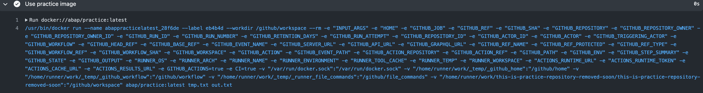
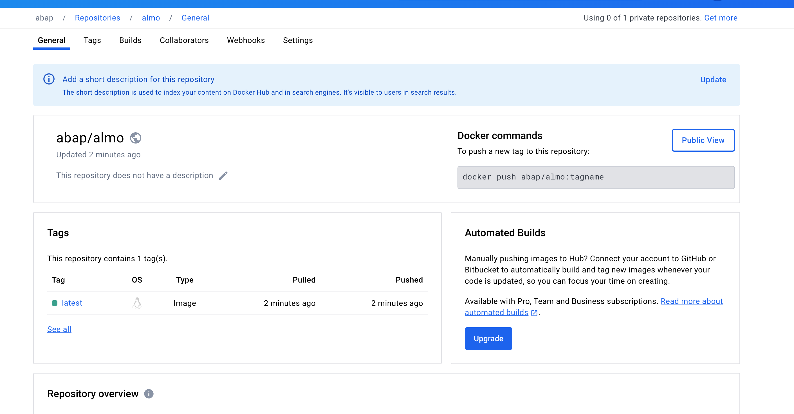

## いろいろ大変リリース作業

<a href="https://github.com/abap34/ALMO"></a>


を毎日たのしく開発しています。

ところで、これは静的サイトジェネレータなので、いろんな人のブログなどに使ってもらうことを想定しています。


となると、 GitHub Actions などでも利用しやすいように環境を整える必要があります。

GitHub Actions では、 `use: docker://hoge/huga:latest` のように指定することで Docker Hub にあるイメージを利用することができます。


そこで、リリースを打つたびに Docker イメージをビルドして、 Docker Hub にアップロードするようにします。作業記録です。

### Docker Hub にイメージをアップロードする

とりあえず Dockerfile を作ります。

```Dockerfile
FROM alpine:latest

RUN apk add --no-cache g++

RUN apk add --no-cache bash

WORKDIR /app

COPY . .

RUN bash build.sh

ENTRYPOINT [ "./docker-entrypoint.sh" ]
```

[Docker Hub](https://hub.docker.com/) で My Account > Security > New Access Token からトークンを取得します。

次にレポジトリの Settings > Security > Secrets and variables > New Repository Secret から `DOCKERHUB_USERNAME` と `DOCKERHUB_TOKEN` を設定します。


あとは以下のように GitHub Actions を設定します。

```yaml
name: Build and push Docker image

on:
  release:
    types: [published]

jobs:
  build:
    runs-on: ubuntu-latest
    steps:
      - name: Checkout code
        uses: actions/checkout@v2

      - name: Login to DockerHub
        uses: docker/login-action@v2
        with:
          username: ${{ secrets.DOCKERHUB_USERNAME }}
          password: ${{ secrets.DOCKERHUB_TOKEN }}

      - name: Build and push Docker image
        uses: docker/build-push-action@v2
        with:
          context: .
          file: ./Dockerfile
          push: true
          tags: ${{ secrets.DOCKERHUB_USERNAME }}/almo:latest
```


注意ポイントとしては、 GitHub Actions からこのイメージを利用するときは `WORKDIR` などが上書きされるみたいなので気をつけて `Dockerfile` と `docker-entrypoint.sh` を作らないとハマります。




これで、リリース時に Docker イメージをビルドして Docker Hub にアップロードすることができるようになりました。



### リリース時にいろんなプラットフォームに対応する

コレは、 GitHub Actions でマトリクスビルドを使うことで簡単に実現できます。

```yaml
name: Release for all platforms

on:
  release:
    types: [published]

jobs:
  build_and_upload:
    runs-on: ubuntu-latest
    strategy:
      matrix:
        os: [ubuntu-latest, windows-latest, macos-14]

    steps:
      - name: Checkout code
        uses: actions/checkout@v2

      - name: Build
        run: bash build.sh

      - name: Upload Release
        uses: actions/upload-release-asset@v1
        with:
          upload_url: ${{ github.event.release.upload_url }}
          asset_path: build/almo
          asset_name: ${{ matrix.os }}
          asset_content_type: application/octet-stream 
        env:
          GITHUB_TOKEN: ${{ secrets.GITHUB_TOKEN }}
```


便利ですね。


### 使用例

Docker Hubにアップロードしたおかげで
誰でも簡単にビルドができるようになりました。

```bash
docker pull abap/almo:latest
```

して、

```bash
docker run abap/almo:latest example.md
```

するだけで利用できます。　便利！


GitHub Actions からも

```yaml
uses: docker://abap/almo:latest
args:
    example.md
```

だけで利用できます。


## 今日の一曲

<iframe width="560" height="315" src="https://www.youtube.com/embed/EJ8lBjQls4w?si=PdBx5TBPvW-z3_ZG" title="YouTube video player" frameborder="0" allow="accelerometer; autoplay; clipboard-write; encrypted-media; gyroscope; picture-in-picture; web-share" referrerpolicy="strict-origin-when-cross-origin" allowfullscreen></iframe>