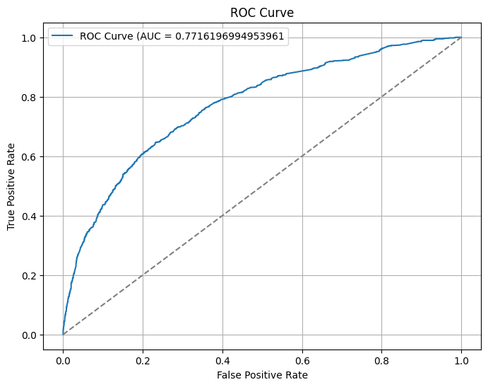

二値分類の代表的な評価指標である ROC-AUC (Receiver Operating Characteristic - Area Under the Curve) について説明します。

## 結論だけ: ROC-AUC とは?

ROC-AUC は二値分類の評価指標で、
モデル $f$ が 正例と負例からそれぞれ一様に選んだ $x^{+}$ と $x^{-}$ について $f(x^{+}) > f(x^{-})$ となる確率のことです。 

つまり、ちゃんと正例の予測確率の順位を負例よりも高い位置に持ってこれているか？という「分離能力」を測る指標といえます。

計算したいときは、scikit-learn の `roc_auc_score` を使うと便利です！

```python
>>> from sklearn.metrics import roc_auc_score
>>> roc_auc_score([0, 1, 1, 0], [0.4, 0.2, 0.9, 0.1]) 
np.float64(0.75)
```


## 定義と計算方法

### 定義

ROC-AUC は正解ラベルの列 $\mathbf{y} \in \{0, 1\}^n$ と予測確率の列 $\mathbf{p} \in [0, 1]^n$ の組 $(\mathbf{y}, \mathbf{p})$ に対して定まる量です。(ただし、$\mathbf{y}$ がすべて同じ値からなる場合は計算できません)

ROC-AUC を計算するには、まずは TPR (True Positive Rate,真陽性率) と FPR (False Positive Rate, 偽陽性率) を理解する必要があります。

TPR と FPR は

正解ラベルの列 $\mathbf{y} \in \{0, 1\}^n$ と予測ラベルの列 $\mathbf{\hat{y}} \in \{0, 1\}^n$ に対して以下の用に定義されます。

| 予測/正解 | 1 | 0 |
| --- | --- | --- |
| 1 | TP | FP |
| 0 | FN | TN |

として、

$$
\begin{aligned}
\text{TPR} &= \frac{\text{TP}}{\text{TP} + \text{FN}} \\
\text{FPR} &= \frac{\text{FP}}{\text{FP} + \text{TN}}
\end{aligned}
$$

です。日本語で書けば

$\text{TPR} :=$ 真の正例のうち、正例と予測されたものの割合 (見落とさなかった率)

$\text{FPR} :=$ 真の負例のうち、誤って正例と予測されたものの割合 (誤検知率)

(多分こっちの方がわかりやすいですね)

ところでこれをするには予測も確率でなくラベルになっている必要があるわけですが、
閾値 $t$ を設定して分けることにとります。

なので、正解ラベルの列 $\mathbf{y} \in \{0, 1\}^n$ と予測確率の列 $\mathbf{p} \in [0, 1]^n$ に対して、 $t$ を $-\infty$ から $\infty$ まで動かすことで、各 $t$ に設定したときの TPR と FPR の値、$\text{TPR}_t$ と $\text{FPR}_t$ が定まります。


これをプロットして得られるののが ROC曲線です。



この ROC曲線と 直線 $x = 1$, $y = 0$ で囲まれる面積が ROC-AUC です！
上の曲線の「下」の面積ということですね。
(ROC 曲線を 0 から 1 まで積分した値, といってもいいです)

### ROC 曲線を書く + 直感的な解釈 ①

※ ここからは与太話です。

ここでは実際に ROC 曲線を書く方法を考えます。

閾値は $-\infty$ から $\infty$ まで動かすといっても $\text{TPR}$ と $\text{FPR}$ が変化するのは $t$ が $\mathbf{p}$ の要素の値を超えるときだけですから、高々 $n$ 個の閾値を考えれば十分です。

実装するとしたらこんな感じでしょうか。

```python
def rate(y_true: list[int], y_pred_binary: list[int], y:int, y_hat:int) -> float:
    n = len(y_true)
    return sum([1 for i in range(n) if y_true[i] == y and y_pred_binary[i] == y_hat]) / n


def roc_curve(y_true: list[int], y_pred: list[float]) -> tuple[list[float], list[float]]:
    n = len(y_true)
    thresholds = sorted(set(y_pred), reverse=True)
    tpr = []
    fpr = []
    for t in thresholds:
        y_pred_binary = [int(y >= t) for y in y_pred]
        tp = rate(y_true, y_pred_binary, 1, 1)
        fn = rate(y_true, y_pred_binary, 1, 0)
        fp = rate(y_true, y_pred_binary, 0, 1)
        tn = rate(y_true, y_pred_binary, 0, 0)
        tpr.append(tp / (tp + fn))
        fpr.append(fp / (fp + tn))
    return tpr, fpr

def roc_auc_score(y_true: list[int], y_pred: list[float]) -> float:
    tpr, fpr = roc_curve(y_true, y_pred)
    return sum([(tpr[i] + tpr[i - 1]) * (fpr[i] - fpr[i - 1]) / 2 for i in range(1, len(tpr))]) 
```

なお, これは $\Theta(n \log n + n^2)$ のアルゴリズムの実装ですが簡単に $\Theta(n \log n)$ にできます。(別に $t$ を明示的に計算しなくてもいいことを使うといいです)


直感的な解釈を書きます。

$t$ を $0$ から $0.1$ に変えたとき、一つの予測が
$1$ から $0$ にかわったとします。

このとき、

1. 真の値が $1$ だったとき (つまり、正解が不正解になったとき)
   1. $\text{TP}$ は 1 減る
   2. $\text{FN}$ は 1 増える
   3. $\text{TPR}$ は 減少
   4. $\text{FPR}$ は 変化しない
2. 真の値が $0$ だったとき (つまり、不正解が正解になったとき)
   1. $\text{FP}$ は 1 減る
   2. $\text{TN}$ は 1 増える
   3. $\text{TPR}$ は 変化しない
   4. $\text{FPR}$ は 減少

となります。

したがって, $(1, 1)$ から始まって閾値を動かしていき、

- 不正解に変化  $\rightarrow \frac{1}{TP + FN}$ だけ $y$ 軸正の向きに進む
- 正解に変化 $\rightarrow \frac{1}{FP + TN}$ だけ $x$ 軸正の向きに進む

というのを繰り返していくわけです。

ここで、面積を大きくしたければ最初になるべく $y$ 軸負の向きに動かないのがいいですが、このことは **正例の予測確率の順位上位である** ことと対応しています。


したがって ROC-AUC は直感的には 正例を上位に, 負例を下位に固められているか？を調べる指標といえます。

## 直感的な解釈 ②

このことをよりはっきり示す、最初に書いた事実:

ROC-AUC は 正例 $x^{+}$ と負例 $x^{-}$ を一様に選んだとき$f(x^{+}) > f(x^{-})$ となる確率のこと。

について書いておきます。

色々と進んだ結果もあるみたいなのですが [^1]

ここでは簡単に有限のサンプルに対してこれを示します。

正例のサンプル数を $n_+$, 負例のサンプル数を $n_-$ として、
$x_i^{+}$ を正例の $i$ 番目のサンプル, $x_i^{-}$ を負例の $i$ 番目のサンプルとします。

ここで、次の事実が成り立ちます:

$$
\text{AUC} = \dfrac{1}{n_-} \sum_{i=1}^{n_-} \text{TPR}_{f(x^{-}_i)}
$$

このことは $x$ 軸負の向きに $\dfrac{1}{n_-}$  だけ進み、そのときの「高さ」は $\text{TPR}_{f(x^{-}_i)}$  なることからわかります。

ここで、$\text{TPR}$ の定義から

$$
\text{TPR}_{f(x^{-}_i)} = \dfrac{1}{n_+} \mid \{ j \mid f(x^{+}_j) > f(x^{-}_i) \} \mid
$$

です。

なので結局

$$
\begin{aligned}
\text{AUC} &= \dfrac{1}{n_-} \sum_{i=1}^{n_-} \dfrac{1}{n_+} \mid \{ j \mid f(x^{+}_j) > f(x^{-}_i) \} \mid \\
&= \dfrac{1}{n_+ n_-} \sum_{i=1}^{n_-} \sum_{j=1}^{n_+} \mathbb{I}(f(x^{+}_j) > f(x^{-}_i))
\end{aligned}
$$

となります。これが示したいことでした。

[^1]: Mason, S. J., Graham, N. E. (2002). Areas beneath the relative operating characteristics (ROC) and relative operating levels (ROL) curves: Statistical significance and interpretation. Quarterly Journal of the Royal Meteorological Society (128): 2145–2166.