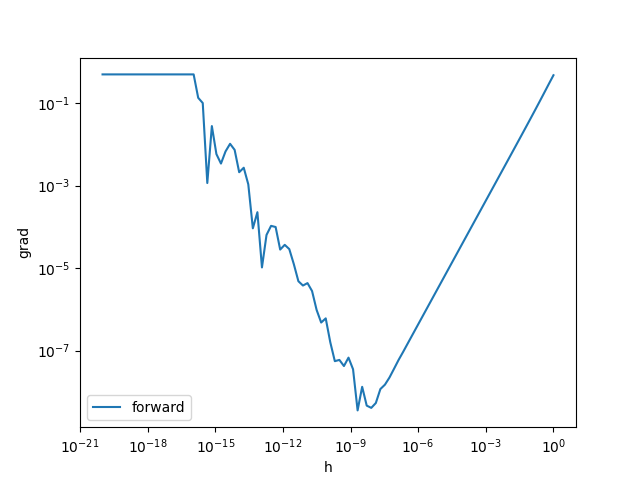
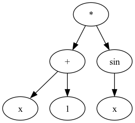
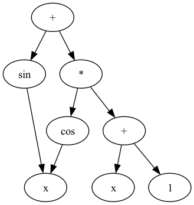

$$
\newcommand{\argmin}{\mathop{\rm arg~min}\limits}
$$

:::loadlib
numpy
matplotlib
:::

## はじめに　
ブログのリニューアル記念に、せっかくなので何か記事を書くことにしました。
何を書いてもよかったのですが、最近人に機械学習の話をすることが結構あり、その中でしていた自動微分の話が割とウケがよかったのでそれについて記事を書くことにしました。

**この記事は書きかけです。**


## 微分を求める技術
昨今は機械学習、特に深層学習が大流行りし、世界中の性能の良い計算機がせっせと損失を小さくするパラメータを探しています。


問題になるのは、損失を小さくするパラメータをどう探索するかということですが、

もっぱら確率的勾配降下法(stochastic gradient descent, SGD)が使われています。


そして、勾配法を使っているからには当然パラメータの損失に対する勾配を計算する必要がありますが、

深層学習のような非常に複雑なモデルの勾配を人間の手で求めることは非常に困難です。

すると当然、これをコンピュータに計算させようという需要が生まれてくるわけですが、

特に深層学習モデルの訓練では、
「自動微分」と呼ばれる方法によって勾配を計算し、パラメータを最適化します。


本記事は、そんな自動微分をはじめとした、コンピュータで自動で微分を求める方法についてまとめたものです。

<!-- 
### 求めたいもの
ひとくちに「微分の計算」といっても
- ある関数 $f$ の勾配 $\nabla f$ を求める
- ある点 $\boldsymbol{x}$ における関数 $f$ の勾配の**値** $\nabla f(\boldsymbol{x})$ を求める

という二つの意味があります。

当然 $\nabla f$ が手に入れば $\nabla f(\boldsymbol{x})$ も計算できますが、
特に最適化の文脈では、$\nabla f$ を陽に求める必要はなく、
$\nabla f(\boldsymbol{x})$ の値があれば十分なことが多いです。


(例えば $f: \mathbb{R} \to \mathbb{R}$ を勾配降下法で最小化したいとき、
$x_{n+1} = x_n - \eta f'(x_n)$という更新式にしたがって更新されるわけですが、
実際に必要なのは $f'(x_n)$ であって、 $f'$ ではありません。) -->

本記事で紹介する代表的な手法は三つあり、それぞれ

- 数値微分(numerical differentiation)
- 数式微分(symbolic differentiation)
- 自動微分(automatic differentiation)

と呼ばれています。

このように区別していることからわかるように、自動微分(automatic differentiation)は

**「自動で微分を行う技術の総称」** ではなく、自動で微分を行う技術のうち一手法であることに注意してください。 $^1$


それでは、それぞれの手法について詳しく見ていきます。

## 数値微分
### 数値微分のアイデア
まずは、最も単純な方法である数値微分について説明します。

みなさんご存知のように、
関数 $f(x)$ の $x$ における微分係数 $f'(x)$ は、

$$
f'(x) = \lim_{h \to 0} \frac{f(x+h) - f(x)}{h}
$$

と定義されます。 
問題はこれをどう計算するかということですが、極限を取る操作を直接コンピュータ上で表現するのは簡単でありません。

そこで、実際に小さい値 $h$ をとってこれを近似しようというのが数値微分のアイデアです。

例えば、 $f(x) = \sin(x)$ の $x = \dfrac{\pi}{3}$ における微分係数を数値微分で求めてみます。

真の値は $f'(x) = \cos(x)$ なので $\cos\left(\dfrac{\pi}{3}\right) = \dfrac{1}{2}$ です。

$h = 0.001$ とします。

手元の電卓で計算すると、

$$
\begin{align}
\sin\left(\dfrac{\pi}{3} + 0.001\right) &= 0.8665249706884394 \\
\sin\left(\dfrac{\pi}{3}\right) &= 0.8660254037844386
\end{align}
$$

でした。

よって、数値微分で計算した微分係数は

$$
\frac{0.8665249706884394 - 0.8660254037844386}{0.01} = 0.49956690400077
$$

となり、 $0.5$ に近い値が得られました。

ではこれを計算するpythonのコードを書いてみます。

:::code
import numpy as np

def numerical_diff(f, x, h):
    return (f(x+h) - f(x)) / h

def f(x):
    return np.sin(x)

print(numerical_diff(f, np.pi/3, 1e-1))
print(numerical_diff(f, np.pi/3, 1e-2))
print(numerical_diff(f, np.pi/3, 1e-3))
:::


そこそこいい感じに計算できていますね。
また、$h$ を小さくするほど徐々に真の値に近づいていることがわかります。

とはいえ真の値とは差があります。　

ここからは、この誤差について評価を与えることを考えてみます。

### 数値微分の2つの誤差
先ほどの微分の定義で出てきた、

$$
\dfrac{f(x+h) - f(x)}{h}
$$
について考えます。
$f(x+h)$ をテイラー展開すると、

$$
\begin{align}
f(x+h) &= f(x) + f'(x)h + \frac{1}{2}f''(x)h^2 + \cdots \\
&= f(x) + f'(x)h + O(h^2)
\end{align}
$$

なので、　

$$
\begin{align}
\dfrac{f(x+h) - f(x)}{h} &= \dfrac{f(x) + f'(x)h + O(h^2) - f(x)}{h} \\
&= f'(x) + O(h)
\end{align}
$$

となります。　したがって近似を使ったことによる誤差は $O(h)$ と評価できます。

では $h$ を小さくすればするほど全体の誤差は常に小さくなるのでしょうか。

実はこれはとてもよく知られている事実ですが、 $h$ を小さくしすぎるとかえって全体の誤差が大きくなります。

:::code
import matplotlib.pyplot as plt

import matplotlib
matplotlib.use("module://matplotlib_pyodide.html5_canvas_backend")


import numpy as np

h = np.logspace(0, -20, num=100)
grad_forward = numerical_diff(f, np.pi/3, h)
grad_true = np.cos(np.pi/3)

error_forward = np.abs(grad_forward - grad_true)

plt.plot(h, error_forward, label='forward')
plt.xscale('log')
plt.yscale('log')
plt.xlabel('h')
plt.ylabel('grad')
plt.legend()
plt.show()
plt.close()
:::

<!--  -->


上のグラフのように、誤差は $h = 10^{-8}$ あたりまでは減少していきますが、それ以降は $h$ を小さくしても誤差は大きくなっていきます。

これは浮動小数点数の誤差によるものです。

(浮動小数点について知らない人は、 末尾の付録: 浮動小数点数 をみてください)

#### 桁落ち
$h$ を小さくしていけばしていくほど、$f(x+h)$ と $f(x)$ の差が小さくなっていきます。


すると、「桁落ち」と呼ばれる現象が起き、誤差が大きくなります。


具体的に説明します。


例えば、 $f(x+h) = 31.606961258558215\cdots, f(x) = 31.622776601683793\cdots$ であったとしましょう。($\sqrt{999}$と$\sqrt{1000}$です)

これを適当な規格の浮動小数点数に直したとき $f(x+h) = 3.16069612 \times 10^1, f(x) = 3.16227766 \times 10^1$ となったとします。

すると、
$$
\begin{align}
f(x+h) - f(x) &= 3.16069612 \times 10^1 - 3.16227766 \times 10^1 \\
&= 0.00158154 \times 10^1 \\
&= 1.58154\textcolor{red}{000} \times 10^{-3}
\end{align}
$$

となってしまい、なんと有効桁が減ってしまいました。(末尾の$000$は埋められた桁でなんの情報もありません。)


このように、同じくらいの数を引き算するときに、演算結果の有効桁が非常に小さくなってしまう現象を桁落ちと呼びます。


したがって、$h$ を小さくしていくと、はじめは極限の近似が正確になっていくことで全体の誤差が小さくなりますが、


ある程度以上小さくなると、桁落ちによる効果が上回り、全体の誤差が大きくなっていきます。


### 数値微分の誤差の改善
ここからは全体の誤差を改善する方法を考えます。
まず簡単な方法は、浮動小数点をより正確な表現が可能なものに変えることでしょう。

もう一つの簡単で有効な方法は、中心差分を使うことです。

我々は、
$$
\dfrac{f(x+h) - f(x)}{h}
$$
を計算していましたが、これを

$$
\dfrac{f(x+h) - f(x-h)}{2h}
$$

に改めます。　実はこうするだけで、近似式の誤差は $O(h^2)$ になります。


同じようにテイラー展開すると、
$$
\begin{align}
f(x+h) &= f(x) + f'(x)h + \frac{1}{2}f''(x)h^2 + \frac{1}{6}f'''(x)h^3 + \cdots \\
      &= f(x) + f'(x)h + f''(x)\frac{h^2}{2} + O(h^3) \\ 
f(x-h) &= f(x) - f'(x)h + f''(x)\frac{h^2}{2} - \frac{1}{6}f'''(x)h^3 + \cdots \\
      &= f(x) - f'(x)h + f''(x)\frac{h^2}{2} + O(h^3) \\
\end{align}
$$

となるので、

$$
\begin{align}
\dfrac{f(x+h) - f(x-h)}{2h} &= \dfrac{f(x) + f'(x)h + f''(x)\frac{h^2}{2} + O(h^3) - f(x) + f'(x)h - f''(x)\frac{h^2}{2} + O(h^3)}{2h} \\
&= f'(x) + O(h^2)
\end{align}
$$

となります。 したがって誤差は $O(h^2)$ と評価できます。


実際に中心差分についても調べてグラフを書いてみます。

:::code
import matplotlib.pyplot as plt
import numpy as np

import matplotlib
matplotlib.use("module://matplotlib_pyodide.html5_canvas_backend")

def numerical_diff(f, x, h):
    return (f(x+h) - f(x)) / h

def numerical_diff_center(f, x, h):
    return (f(x+h) - f(x-h)) / (2*h)

def f(x):
    return np.sin(x)

h = np.logspace(0, -20, num=100)
grad_forward = numerical_diff(f, np.pi/3, h)
grad_center = numerical_diff_center(f, np.pi/3, h)
grad_true = np.cos(np.pi/3)

error_forward = np.abs(grad_forward - grad_true)
error_center = np.abs(grad_center - grad_true)

plt.plot(h, error_forward, label='forward')
plt.plot(h, error_center, label='center')
plt.xscale('log')
plt.yscale('log')
plt.xlabel('h')
plt.ylabel('grad')
plt.legend()
plt.show()
plt.close()
:::


中心差分を取ることでより正確に計算できたようです。

さて、極限の近似がより正確になったため、桁落ちによる効果が $h$ がより大きい段階から発生するようになり、
最も正確な値となる $h$ が $10^{-5}$ くらいに変化しました。このように 最適な $h$ は状況によって変化していきます。


一応計算によってもこのくらいの数字になることを確かめておきます。


まず、$f(x)$ をコンピュータ上で計算した結果を $\hat{f}(x)$ とします。

$\hat{f}(x)$ には浮動小数点などで計算したことによる誤差が発生しています。　

これが $\varepsilon$ だったとします。

さて、中心差分を使って微分係数を計算したとします。

すると、このとき発生する全体の誤差は

$$
\begin{align}
f'(x) - \frac{\hat{f}(x+h) - \hat{f}(x-h)}{2h} &\approx f'(x) - \frac{f(x+h) - f(x-h) +  2\varepsilon}{2h} \\
&= \left\{ f'(x) - \frac{f(x + h) - f(x - h)}{2h} \right\} - \frac{\varepsilon}{h}  \\
\end{align}
$$

ここで、 $f(x + h), \ f(x - h)$ の計算の誤差も $\varepsilon$ となるだろうということを使っています。

一つ目の項は中心差分の誤差で、テイラーの定理からある $c \in (x - h, x + h)$ が存在して、
$$
f'(x) - \frac{f(x + h) - f(x - h)}{2h} = -\frac{f'''(c)}{6}h^2
$$

を満たします。

したがって、誤差が最小になる $h$ は

$$
E(h) = \frac{\varepsilon}{h} + \frac{f'''(c)}{6}h^2
$$

を最小にする $h$ です。

$$
\frac{dE}{dh} = -\frac{\varepsilon}{h^2} + \frac{f'''(c)}{3}h = 0
$$

を解けば、

$$
h = \left(\frac{3\varepsilon}{f'''(c)}\right)^{\frac{1}{3}}
$$

が最適な $h$ となります。

問題は残った $\varepsilon$ と $f'''(c)$ です。

$\varepsilon$ は、ふつうの計算であれば使っている浮動小数点のマシンイプシロンくらいのオーダーになるでしょう。

例えば今回使っている倍精度の浮動小数点数では、$2^{-52} \approx 2.2 \times 10^{-16}$ くらいです。

上の式で $h$ を計算します。　ここで $c \in (x - h, x + h)$ で、かつ $h$ はある程度小さいと予想できるので
$f'''(c) \approx f'''(x)$ とすると、 $f'''(x) = 0.8660\cdots$ くらいなので、結局最適な $h$ は

$$
h = \left(\frac{3 \times 2.2 \times 10^{-16}}{0.8660\cdots}\right)^{\frac{1}{3}} \approx 9.134 \times 10^{-6}
$$

となり、先ほどのグラフとほぼ同じ値になりました。


### n 次精度 k 階中心差分の導出
$O(h)$ から $O(h^2)$ に改善されたわけですが、では任意の $n \in \mathbb{N}$ に対して $O(h^n)$ で計算する方法が存在するでしょうか。

これは、これまで同様に $f$ の色々な点での評価の重み付き和を考えることで実現できます。

ここではそのような重みの計算と、ついでに $k$ 階微分への拡張を考えます。


結論から言うと、


$p = \dfrac{n}{2}$ として、

$$
A = \begin{pmatrix}
1 & 1  & \cdots & 1 & 1 & 1 & \cdots & 1 & 1 \\
-p & (-p + 1) & \cdots & 1  & 0 &  1 & \cdots & (p-1) & p \\
(-p)^2 & ((-p + 1))^2 & \cdots & (-1)^2  & 0 & 1^2 & \cdots & ((p-1))^2 & (p)^2 \\
\vdots & \vdots & \ddots & \vdots & \vdots & \vdots & \ddots & \vdots & \vdots \\
(-p)^{n} & ((-p + 1))^{n} & \cdots & (-1)^{n}  &0 &  (1)^{n} & \cdots & ((p-1))^{n} & (p)^{n} \\
\end{pmatrix} \in \mathbb{R}^{(n+1) \times (n+1)}
$$

$$
\boldsymbol{f}(h) = \left(
    \begin{array}{c}
    f(x - ph) \\
    f(x + (-p + 1)h) \\
    \vdots \\
    f(x - h) \\
    f(x) \\
    f(x + h) \\
    \vdots \\
    f(x + (p-1)h) \\
    f(x + ph) \\
    \end{array}
    \right) \in \mathbb{R}^{n+1}
$$

としたとき

$$
A \boldsymbol{w} = \boldsymbol{e}_{2}
$$

なる $w$ がただひとつ存在して

$$
\boldsymbol{w}\boldsymbol{f}(h) = f'(x) + O(h^n)
$$

を満たします。 (ただし $h > 0$)　


#### 証明

まず、$f(x + kh)$ をテイラー展開すると

$$
f(x + kh) = f(x) + khf'(x) + \frac{(kh)^2}{2!}f''(x) + \cdots + \frac{(kh)^n}{n!}f^{(n)}(x) + O(h^{n+1})
$$

となります。

これを通常の(?) 中心差分 のときのように、

$k = -p, -p + 1, \cdots, - 1, 1, \cdots, p - 1, p$ まで重み付きで足し合わせて $f'(x)$ 以外の項を消せば良いです。

したがって、

$$
\begin{pmatrix}
1 & 1  & \cdots & 1 & 1 & 1 & \cdots & 1 & 1 \\
-p & (-p + 1) & \cdots & 1  & 0 &  1 & \cdots & (p-1) & p \\
(-p)^2 & (-p + 1)^2 & \cdots & (-1)^2  & 0 & 1^2 & \cdots & (p-1)^2 & (p)^2 \\
\vdots & \vdots & \ddots & \vdots & \vdots & \vdots & \ddots & \vdots & \vdots \\
(-p)^{n} & (-p + 1)^{n} & \cdots & (-1)^{n}  &0 &  (1)^{n} & \cdots & (p-1)^{n} & (p)^{n} \\
\end{pmatrix} \in \mathbb{R}^{(n+1) \times (n+1)}
$$

を $A$  としたとき、

$$
A\boldsymbol{w} = \boldsymbol{e}_2 \in \mathbb{R}^{n+1}
$$

なる $\boldsymbol{w} \in \mathbb{R}^{(n+1)}$ が存在すれば良いです。  

($e_2$ は $2$ 番目の要素が $1$ でそれ以外が $0$ のベクトルです。)

実は、 $A$ のような各列が等比数列のような形になっている正方行列は、*ヴァンデルモンド行列*と呼ばれており、
全く同じ列が存在しないとき正則であることが知られています。$^5$

今回の場合、 $h \neq 0$ なので、 各列は異なり、 $A$ は正則です。

したがって、$A$ は正則で、

$$
\boldsymbol{w} = A^{-1}\boldsymbol{e}_2
$$

として定まる $w$ が存在してただひとつに定まります。

さらに、 今回は一階微分を求めたかったため $\boldsymbol{e}_2$ との積を考えましたが、 $k$ 階微分を求めたい場合は $\boldsymbol{e}_{k+1}$ との積を考えれば良いです。
#### 実装

:::code
import numpy as np

def central_weight(n, k):
    p = n // 2
    A = np.zeros((n+1, n+1), dtype=float)
    r = np.array([i for i in range(-p, p+1)], dtype=float)
    
    for i in range(n+1):
        for j in range(n+1):
            A[i, j] = r[j]**i

    e_k = np.zeros(n+1, dtype=float)
    e_k[k] = 1

    w = np.linalg.solve(A, e_k)
    return w

print('O(n^2):', central_weight(2, 1))
print('O(n^4):', central_weight(4, 1))
print('O(n^6):', central_weight(6, 1))
:::

<!-- ```
O(n^2): Matrix([[-1/2], [0], [1/2]])
O(n^4): Matrix([[1/12], [-2/3], [0], [2/3], [-1/12]])
O(n^6): Matrix([[-1/60], [3/20], [-3/4], [0], [3/4], [-3/20], [1/60]])
``` -->

となり、 $n$ 次精度の中心差分の係数が得られました。

これを使って、 $n$ 次精度 $k$ 階中心差分を実装します。

:::code
from math import *

def central_diff(f, x, n, k, h=1e-3):
    w = central_weight(n, k)
    p = n >> 1
    _x = x + (np.arange(-p, p + 1) * h)
    return sum([w[i] * f(_x[i]) for i in range(n+1)]) / h ** k

f = lambda x: sin(x)
x = pi / 3
print('O(n^2):', central_diff(f, x, 2, 1))
print('O(n^4):', central_diff(f, x, 4, 1))
print('O(n^6):', central_diff(f, x, 6, 1))
:::


どうやら正しそうな式が得られています。

最後に最適な $h$ の変化についても確かめておきます。


:::code
import matplotlib.pyplot as plt
import numpy as np

import matplotlib
matplotlib.use("module://matplotlib_pyodide.html5_canvas_backend")

n_points = range(2, 12, 2)
h = np.logspace(0, -20, 100)
label = [f'n={n}' for n in n_points]

err = np.zeros((len(n_points), len(h)))
for i, n in enumerate(n_points):
    for j, hh in enumerate(h):
        err[i, j] = abs(central_diff(f, x, n, 1, hh) - cos(x))

plt.figure()
for i in range(len(n_points)):
    print(i)
    plt.loglog(h, err[i], label=label[i])
plt.legend()
plt.xlabel('h')
plt.ylabel('error')
plt.show()
plt.close()
:::


### 多変数関数への拡張
$f : \mathbb{R}^n \to \mathbb{R}$ の勾配 $\nabla f(\boldsymbol{x})$ は
各 $x_i$ についてそれ以外の変数を固定して計算すればOKです。

:::code
def numerical_nabla(f, x, h):
    n = len(x)
    nabla = np.zeros(n)
    for i in range(n):
        x_i = x[i]
        x[i] = x_i + h
        f_plus = f(*x)
        x[i] = x_i - h
        f_minus = f(*x)
        nabla[i] = (f_plus - f_minus) / (2*h)
        x[i] = x_i
    return nabla


def f(x, y):
    return x**2 + y**2

x, y = 1.0, 2.0

print(numerical_nabla(f, np.array([x, y]), 1e-3))
:::


出力が複数のときも容易です。
$f: \mathbb{R}^n \to \mathbb{R}^m$ のヤコビアン行列 $J_f$ は

:::code
import numpy as np

def numerical_jacobian(f, x, h=1e-5):
    n = len(x)
    m = len(f(*x))
    jacobian = np.zeros((m, n))
    
    for i in range(n):
        x_i = x[i]
        x[i] = x_i + h
        f_plus = f(*x)
        x[i] = x_i - h
        f_minus = f(*x)
        jacobian[:, i] = (f_plus - f_minus) / (2 * h)
        x[i] = x_i
    
    return jacobian

def f(x, y):
    return np.array([x**2 + y**2, x*y])

x, y = 1.0, 2.0

print(numerical_jacobian(f, np.array([x, y])))
:::

となり、正しく計算できています。

### 数値微分の計算量
数値微分は中心差分の一変数関数であれば2回の関数評価で微分を計算することができます。

$\mathbb{R}^n \to \mathbb{R}^m$ の関数のヤコビアン行列を求める場合は、 $\Theta(nm)$ 回の評価が必要です。

### 数値微分の長所
なんと言っても実装が非常に簡単です。

数値微分では $f$ が何であろうと $f(x + h)$ と $f(x)$ さえ計算できれば
結果がもとまります。

(もちろんそれが正しいという保証はありませんが)　

したがってたとえ特殊な関数でもほとんど準備なく微分を計算することができます。


そのため、後述の自動微分などを実装する際には数値微分を用いてテストを行うことが多いです。


### 数値微分の短所
後述の自動微分などと比較すると誤差が大きくなります。

また、入力と出力の両方の次元に比例した計算量がかかるため、
入力または出力の次元が大きい場合は計算量が大きくなります。

## 数式微分
### 数式微分のアイデア
数式微分は、我々が普段微分を行うときと同じように、陽に導関数を求めます。

つまり、数値微分のアルゴリズムは、

(関数, 微分係数を求めたい点) → (微分係数の値)

でしたが、数式微分は

(関数) → (導関数)

というアルゴリズムになります。

数式微分では、微分したい式を木あるいはDAGとして表現し、
この木構造への操作を行い、導関数となる木を得るような実装が一般的です。

例えば、 

$$
(x + y) \times \sin(x)
$$

という式は、


のように表現できます。


### 数式微分の実装
実装の一例を示そうと思います。

ここでは、簡単のために三角関数と足し算、掛け算からなる式を数式微分する実装を書きました。

ソースコードは長いですがほとんどが同じような定義が続くだけなので、そこまで大変ではないと思います。

少しだけ解説を加えておきます。

- `Expression` は式全体を保持します。 `root` に最後に評価されるノードが入ります。
- `Node` はノードの抽象クラスです。 これを継承して、各ノードのクラスを定義します。
- あとは木構造のノードになりうる、演算子、変数、定数を表すクラスを定義しています。
- `__call__` は特殊メソッドです。 クラス `A` のインスタンス `a` に対して `a()` と書くと `a.__call__()` が呼ばれます。
  - `__call__` が呼ばれるとルートから葉ノードまで順番に `__call__` が呼ばれていき、葉ノード (必ず `Constant` か `Variable` です) からルートに向けて順番に値が返されていきます。
- `diff` も同じです。
- `pydot` というライブラリを使って木を式をプロットします。


```python
import pydot
import numpy as np


class Expression:
    def __init__(self, root):
        self.root = root
    
    def __call__(self, x):
        return self.root(x)
    
    def __repr__(self):
        return str(self.root)
    
    def plot(self):
        G = pydot.Dot(graph_type='digraph')
        self.root._plot(G)
        return G
    
    def diff(self):
        new_expr = Expression(self.root.diff())
        return new_expr
        
class Node:
    def __init__(self):
        self.children = []

    def __call__(self, x):
        raise NotImplementedError

    def __repr__(self):
        raise NotImplementedError

    def _plot(self, G):
        node = pydot.Node(id(self), label=self._label())
        G.add_node(node)
        for child in self.children:
            G.add_edge(pydot.Edge(node, pydot.Node(id(child), label=child._label())))
            child._plot(G)

    def diff(self):
        raise NotImplementedError


class Variable(Node):
    def __init__(self):
        super().__init__()
    
    def __call__(self, x):
        return x
    
    def _label(self):
        return 'x'
    
    def __repr__(self):
        return 'x'
    
    def diff(self):
        return Constant(1)
    
    
class Constant(Node):
    def __init__(self, value):
        super().__init__()
        self.value = value

    def __call__(self, x):
        return self.value
    
    def _label(self):
        return str(self.value)
    
    def __repr__(self):
        return str(self.value)
    
    def diff(self):
        return Constant(0)
    
class Add(Node):
    def __init__(self, x, y):
        super().__init__()
        self.children = [x, y]

    def __repr__(self):
        return '(' + str(self.children[0]) + ' + ' + str(self.children[1]) + ')'
    
    def _label(self):
        return '+'
    
    def __call__(self, x):
        return self.children[0](x) + self.children[1](x)
    
    def diff(self):
        return Add(self.children[0].diff(), self.children[1].diff())
    
class Mul(Node):
    def __init__(self, x, y):
        super().__init__()
        self.children = [x, y]

    def __repr__(self):
        return '(' + str(self.children[0]) + ' * ' + str(self.children[1]) + ')'
    
    def _label(self):
        return '*'
    
    def __call__(self, x):
        return self.children[0](x) * self.children[1](x)
    
    def diff(self):
        return Add(Mul(self.children[0].diff(), self.children[1]), Mul(self.children[0], self.children[1].diff()))
    
class Sin(Node):
    def __init__(self, x):
        super().__init__()
        self.children = [x]

    def __repr__(self):
        return 'sin(' + str(self.children[0]) + ')'
    
    def _label(self):
        return 'sin'
    
    def __call__(self, x):
        return np.sin(self.children[0](x))
    
    def diff(self):
        return Mul(Cos(self.children[0]), self.children[0].diff())
    
class Cos(Node):
    def __init__(self, x):
        super().__init__()
        self.children = [x]

    def __repr__(self):
        return 'cos(' + str(self.children[0]) + ')'
    
    def _label(self):
        return 'cos'
    
    def __call__(self, x):
        return np.cos(self.children[0](x))
    
    def diff(self):
        return Mul(Constant(-1), Mul(Sin(self.children[0]), self.children[0].diff()))
```


実際に動かしてみましょう。

ここでは式を可視化する便利な関数 `plot` を用意しています。

まずは式を定義します。

```python
f = Expression(Mul(Add(Variable(), Constant(1)), Sin(Variable())))
```

これは、

$$
(x + 1) \times \sin(x)
$$

という式です。


```
print(f)
```

すると、

```
((x + 1) * sin(x))
```

となります。

 `plot` で可視化すると、

```
f.plot().write_png('fig/expr.png')
```



というふうな木として保持されていました。

では、この式を微分してみましょう。

```python
df = f.diff()
```

すると、

```
print(df)
```

```
(((1 + 0) * sin(x)) + ((x + 1) * (cos(x) * 1)))
```

という導関数が得られました。
実際に数値微分の結果と比較して確かめてみます。

```
x = np.random.random()
print(df(x))
print(numerical_diff(f, x, 1e-5))
```

```
1.8300012766059257
1.830005971548143
```

どうやら正しそうです。****

ですが、得られた式は明らかに非常に冗長です。

例えば `1 + 0` という部分は `1` になるべきですし、 `cos(x) * 1` という部分も `cos(x)` になるべきです。


そこでこの式を簡単にすることを試みます。

### 簡約化
メソッド `simplify` を追加します。


例えば `Mul` については

```
class Mul(Node):
    def __init__(self, x, y):
        super().__init__()
        self.children = [x, y]

    ...

    def simplify(self):
        if isinstance(self.children[0].simplify(), Constant) and self.children[0].simplify().value == 0:
            return Constant(0)
        elif isinstance(self.children[1].simplify(), Constant) and self.children[1].simplify().value == 0:
            return Constant(0)
        elif isinstance(self.children[0].simplify(), Constant) and self.children[0].simplify().value == 1:
            return self.children[1].simplify()
        elif isinstance(self.children[1].simplify(), Constant) and self.children[1].simplify().value == 1:
            return self.children[0].simplify()
        else:
            return Mul(self.children[0].simplify(), self.children[1].simplify())
```


やや冗長ですが、このようにして 定数の `0` とかけあわせたり `1` とかけあわせたりしたときのノードを置き換えます。

これを `diff` のあとに呼び出すことで、簡約された式を得ることができます。

```
print(df.simplify())
```

```
(sin(x) + ((x + 1) * cos(x)))
```

```
df.simplify().plot().write_png('fig/expr_diff_simple.png')
```



このように、簡約された式を得ることができました。

このように得られた式を適切な同様の式に変換するのは非常に重要です。

数式微分では、実装が悪い場合には微分した結果の式が非常に冗長になる危険性が高いです。

というのも、いわゆる積の微分の公式

$$
(fg)' = f'g + fg'
$$

からわかるように、積が含まれる式を微分すると、微分した結果の式は元の式よりも長くなります。

これが入れ子になれば項の数は指数的に増えていき、文字通り爆発する場合があります。


### 多変数への拡張
$f: \mathbb{R}^n \to \mathbb{R}$ の勾配 $\nabla f(\boldsymbol{x})$ を数式微分で求めます。

実装は先ほどとほぼ同様で、

- `Variable` は `x` だけでなく、変数名を持てるようにする
- `__call__` の引数を値ではなく、 `{'x': 1, 'y': 2}` のような辞書に変更
- `diff` の引数に偏微分する変数を追加
- `Expression` に 全ての変数を列挙する `all_variables` メソッドを追加
- 全ての変数をループして `diff` を計算する `grad` を追加

という変更を加えました。

```python
import pydot
import numpy as np


class Expression:
    def __init__(self, root):
        self.root = root
    
    def __call__(self, args: dict[str, any]):
        return self.root(args)
    
    def __repr__(self):
        return str(self.root)
    
    def plot(self):
        G = pydot.Dot(graph_type='digraph')
        self.root._plot(G)
        return G
    
    def diff(self, d_var):
        new_expr = Expression(self.root.diff(d_var))
        return new_expr
    
    def all_variable(self):
        return self.root.all_symbols(set())
    
    def grad(self, symplify=False):
        symbols = self.all_variable()
        result = {}
        for symbol in symbols:
            df = self.diff(symbol)
            if symplify:
                df = df.simplify()
            result[symbol] = df
        return result
    
            
    
    def simplify(self):
        new_expr = Expression(self.root.simplify())
        return new_expr
        
class Node:
    def __init__(self):
        self.children = []

    def __call__(self, args: dict[str, any]):
        raise NotImplementedError

    def __repr__(self):
        raise NotImplementedError

    def _plot(self, G):
        node = pydot.Node(id(self), label=self._label())
        G.add_node(node)
        for child in self.children:
            G.add_edge(pydot.Edge(node, pydot.Node(id(child), label=child._label())))
            child._plot(G)

    def diff(self, d_var):
        raise NotImplementedError
    
    def all_symbols(self, symbols: set[str]):
        for child in self.children:
            child.all_symbols(symbols)
        return symbols


class Variable(Node):
    def __init__(self, name):
        super().__init__()
        self.name = name
    
    def __call__(self, args: dict[str, any]):
        return args[self.name]
    
    def _label(self):
        return self.name
    
    def __repr__(self):
        return self.name
    
    def diff(self, d_var):
        if self.name == d_var:
            return Constant(1)
        else:
            return Constant(0)

    def simplify(self):
        return self
    
    def all_symbols(self, symbols: set[str]):
        symbols.add(self.name)
        return symbols

    
    
class Constant(Node):
    def __init__(self, value):
        super().__init__()
        self.value = value

    def __call__(self, args: dict[str, any]):
        return self.value
    
    def _label(self):
        return str(self.value)
    
    def __repr__(self):
        return str(self.value)
    
    def diff(self, d_var):
        return Constant(0)
    
    def simplify(self):
        return self
    
    def all_symbols(self, symbols: set[str]):
        return symbols
    
class Add(Node):
    def __init__(self, x, y):
        super().__init__()
        self.children = [x, y]

    def __repr__(self):
        return '(' + str(self.children[0]) + ' + ' + str(self.children[1]) + ')'
    
    def _label(self):
        return '+'
    
    def __call__(self, args: dict[str, any]):
        return self.children[0](args) + self.children[1](args)
    
    def diff(self, d_var):
        return Add(self.children[0].diff(d_var), self.children[1].diff(d_var))
    
    def simplify(self):
        if isinstance(self.children[0].simplify(), Constant) and self.children[0].simplify().value == 0:
            return self.children[1].simplify()
        elif isinstance(self.children[1].simplify(), Constant) and self.children[1].simplify().value == 0:
            return self.children[0].simplify()
        else:
            return Add(self.children[0].simplify(), self.children[1].simplify())
        
    
    
class Mul(Node):
    def __init__(self, x, y):
        super().__init__()
        self.children = [x, y]

    def __repr__(self):
        return '(' + str(self.children[0]) + ' * ' + str(self.children[1]) + ')'
    
    def _label(self):
        return '*'
    
    def __call__(self, args: dict[str, any]):
        return self.children[0](args) * self.children[1](args)
    
    def diff(self, d_var):
        return Add(Mul(self.children[0].diff(d_var), self.children[1]), Mul(self.children[0], self.children[1].diff(d_var)))
    
    def simplify(self):
        if isinstance(self.children[0].simplify(), Constant) and self.children[0].simplify().value == 0:
            return Constant(0)
        elif isinstance(self.children[1].simplify(), Constant) and self.children[1].simplify().value == 0:
            return Constant(0)
        elif isinstance(self.children[0].simplify(), Constant) and self.children[0].simplify().value == 1:
            return self.children[1].simplify()
        elif isinstance(self.children[1].simplify(), Constant) and self.children[1].simplify().value == 1:
            return self.children[0].simplify()
        else:
            return Mul(self.children[0].simplify(), self.children[1].simplify())
    
class Sin(Node):
    def __init__(self, x):
        super().__init__()
        self.children = [x]

    def __repr__(self):
        return 'sin(' + str(self.children[0]) + ')'
    
    def _label(self):
        return 'sin'
    
    def __call__(self, args: dict[str, any]):
        return np.sin(self.children[0](args))
    
    def diff(self, d_var):
        return Mul(Cos(self.children[0]), self.children[0].diff(d_var))
    
    def simplify(self):
        return Sin(self.children[0].simplify())
    
    
class Cos(Node):
    def __init__(self, x):
        super().__init__()
        self.children = [x]

    def __repr__(self):
        return 'cos(' + str(self.children[0]) + ')'
    
    def _label(self):
        return 'cos'
    
    def __call__(self, args: dict[str, any]):
        return np.cos(self.children[0](args))
    
    def diff(self, d_var):
        return Mul(Constant(-1), Mul(Sin(self.children[0]), self.children[0].diff(d_var)))
    
    def simplify(self):
        return Cos(self.children[0].simplify())
```

```
f = Expression(
        Mul(
            Add(
                Variable('x'),
                Variable('y')
            ),
            Sin(
                Variable('x')

            )
        )
    )

print('f             :', f)
print('f(x=1, y=2)   :', f({'x': 1, 'y': 2}))
print('∇f            :', f.grad())
print('∇f (simple)   :', f.grad(symplify=True))
```

実行すると、

```
f             : ((x + y) * sin(x))
f(x=1, y=2)   : 2.5244129544236893
∇f            : {'y': (((0 + 1) * sin(x)) + ((x + y) * (cos(x) * 0))), 'x': (((1 + 0) * sin(x)) + ((x + y) * (cos(x) * 1)))}
∇f (simple)   : {'y': sin(x), 'x': (sin(x) + ((x + y) * cos(x)))}
```

となり、正しく計算できました。

実行できるものはこちらです。

:::code
import numpy as np


class Expression:
    def __init__(self, root):
        self.root = root
    
    def __call__(self, args: dict[str, any]):
        return self.root(args)
    
    def __repr__(self):
        return str(self.root)
    
    def diff(self, d_var):
        new_expr = Expression(self.root.diff(d_var))
        return new_expr
    
    def all_variable(self):
        return self.root.all_symbols(set())
    
    def grad(self, symplify=False):
        symbols = self.all_variable()
        result = {}
        for symbol in symbols:
            df = self.diff(symbol)
            if symplify:
                df = df.simplify()
            result[symbol] = df
        return result
            
    
    def simplify(self):
        new_expr = Expression(self.root.simplify())
        return new_expr
        
class Node:
    def __init__(self):
        self.children = []

    def __call__(self, args: dict[str, any]):
        raise NotImplementedError

    def __repr__(self):
        raise NotImplementedError

    def diff(self, d_var):
        raise NotImplementedError
    
    def all_symbols(self, symbols: set[str]):
        for child in self.children:
            child.all_symbols(symbols)
        return symbols


class Variable(Node):
    def __init__(self, name):
        super().__init__()
        self.name = name
    
    def __call__(self, args: dict[str, any]):
        return args[self.name]
    
    def _label(self):
        return self.name
    
    def __repr__(self):
        return self.name
    
    def diff(self, d_var):
        if self.name == d_var:
            return Constant(1)
        else:
            return Constant(0)

    def simplify(self):
        return self
    
    def all_symbols(self, symbols: set[str]):
        symbols.add(self.name)
        return symbols

    
    
class Constant(Node):
    def __init__(self, value):
        super().__init__()
        self.value = value

    def __call__(self, args: dict[str, any]):
        return self.value
    
    def _label(self):
        return str(self.value)
    
    def __repr__(self):
        return str(self.value)
    
    def diff(self, d_var):
        return Constant(0)
    
    def simplify(self):
        return self
    
    def all_symbols(self, symbols: set[str]):
        return symbols
    
class Add(Node):
    def __init__(self, x, y):
        super().__init__()
        self.children = [x, y]

    def __repr__(self):
        return '(' + str(self.children[0]) + ' + ' + str(self.children[1]) + ')'
    
    def _label(self):
        return '+'
    
    def __call__(self, args: dict[str, any]):
        return self.children[0](args) + self.children[1](args)
    
    def diff(self, d_var):
        return Add(self.children[0].diff(d_var), self.children[1].diff(d_var))
    
    def simplify(self):
        if isinstance(self.children[0].simplify(), Constant) and self.children[0].simplify().value == 0:
            return self.children[1].simplify()
        elif isinstance(self.children[1].simplify(), Constant) and self.children[1].simplify().value == 0:
            return self.children[0].simplify()
        else:
            return Add(self.children[0].simplify(), self.children[1].simplify())
        
    
    
class Mul(Node):
    def __init__(self, x, y):
        super().__init__()
        self.children = [x, y]

    def __repr__(self):
        return '(' + str(self.children[0]) + ' * ' + str(self.children[1]) + ')'
    
    def _label(self):
        return '*'
    
    def __call__(self, args: dict[str, any]):
        return self.children[0](args) * self.children[1](args)
    
    def diff(self, d_var):
        return Add(Mul(self.children[0].diff(d_var), self.children[1]), Mul(self.children[0], self.children[1].diff(d_var)))
    
    def simplify(self):
        if isinstance(self.children[0].simplify(), Constant) and self.children[0].simplify().value == 0:
            return Constant(0)
        elif isinstance(self.children[1].simplify(), Constant) and self.children[1].simplify().value == 0:
            return Constant(0)
        elif isinstance(self.children[0].simplify(), Constant) and self.children[0].simplify().value == 1:
            return self.children[1].simplify()
        elif isinstance(self.children[1].simplify(), Constant) and self.children[1].simplify().value == 1:
            return self.children[0].simplify()
        else:
            return Mul(self.children[0].simplify(), self.children[1].simplify())
    
class Sin(Node):
    def __init__(self, x):
        super().__init__()
        self.children = [x]

    def __repr__(self):
        return 'sin(' + str(self.children[0]) + ')'
    
    def _label(self):
        return 'sin'
    
    def __call__(self, args: dict[str, any]):
        return np.sin(self.children[0](args))
    
    def diff(self, d_var):
        return Mul(Cos(self.children[0]), self.children[0].diff(d_var))
    
    def simplify(self):
        return Sin(self.children[0].simplify())
    
    
class Cos(Node):
    def __init__(self, x):
        super().__init__()
        self.children = [x]

    def __repr__(self):
        return 'cos(' + str(self.children[0]) + ')'
    
    def _label(self):
        return 'cos'
    
    def __call__(self, args: dict[str, any]):
        return np.cos(self.children[0](args))
    
    def diff(self, d_var):
        return Mul(Constant(-1), Mul(Sin(self.children[0]), self.children[0].diff(d_var)))
    
    def simplify(self):
        return Cos(self.children[0].simplify())


f = Expression(
        Mul(
            Add(
                Variable('x'),
                Variable('y')
            ),
            Sin(
                Variable('x')

            )
        )
    )

print('f             :', f)
print('∇f            :', f.grad())
print('∇f (simple)   :', f.grad(symplify=True))

:::


### 「ソースコード」からの微分

今回の実装例では直接木を書くことでこのパートを回避しましたが実際はプログラムで普通に(?)書かれた式を変換できると嬉しいです、

例えば

```
def f(x):
    return 2 * x + 1
```

という関数を受け取り、

```
def f′(x):
    return 2
```

に相当するようなオブジェクトを手に入れたいです。

このような変換を実装するのは容易ではないです、

例えば

```
def f(x):
    if x < 0:
        raise ValueError('x must be positive')
    else:
        for i in range(x):
            print(i)
```


## 自動微分

最後に紹介するのが、自動微分(automatic differentiation)です。

自動微分は精度、計算量ともに非常に優れており、最適化などの文脈では非常によく使われています。


## 付録
### 浮動小数点数
前提として、ふつうのコンピュータは有限桁の二進数しか扱えません。


そこで、コンピュータ上で実数(のような見た目をしているもの)は、有限桁の二進数で表現されます。


しかし、すべての実数が有限桁の二進数で表現できるわけではありません。
例えば、$0.1$ は有限桁の二進数で表現することはできません。
($0.1 = 0.00011001100110011\cdots$)


したがって、コンピュータ上で $0.1$ という実数を直接扱うのはむずかしく、近い有限桁の二進数で表現された数値を実際には使うことになります。

この桁数はいくつかのよく使われる規格によって決まりますが、最近の言語ではデフォルトでは倍精度浮動小数点数が使われることが多いです。(Python, Juliaなど)

**ふつうの**$^{2}$倍精度浮動小数点数は、IEEE 754 という規格によって定められていて、符号部1ビット、指数部11ビット、仮数部52ビットという構成になっており、
符号のビット列が表す整数を $sign$、指数部のビット列が表す整数を $exp$ 、仮数部のビット列が表す整数を $frac$ とすると、


$$
v = (-1)^{sign} \times 2^{exp - 1023} \times (1 + frac)
$$

という形式で $v$ を表します。
実数から $v$ への変換(丸め)の方法はいくつかあり、IEEE 754では5つの丸めモードが定義されています。$^3$

デフォルトでは、roundTiesToEvenという丸めモードを使うように求められており、実際広く使われているようです。

<details>
<summary>roundTiesToEvenの定義</summary>
倍精度浮動小数点数で表される数全体の集合を $F$、 $F$ の最大値と最小値をそれぞれ $F_{max}$ と $F_{min}$ とすると、

$x \in [F_{min}, F_{max}]$ となるような $x \in \mathbb{R}$ について、
$v_1 \leq x \leq v_2$ となるような $v_1, v_2 \in F$ が存在します。

ここで、 
$|x - v_1| < |x - v_2|$　であれば $x$ は $v_1$ に丸められ、
$|x - v_1| > |x - v_2|$　であれば $x$ は $v_2$ に丸められます。

そして、$|x - v_1| = |x - v_2|$ であれば、$v_1$ と $v_2$ のうち、最下位ビットが $0$ である方に丸められます。


$x > F_{max}$ であれば、$x$ は $\infty$ に丸められ、
$x < F_{min}$ であれば、$x$ は $-\infty$ に丸められます。$^4$
</details>


<hr>
 


<footer>

#### 脚注・参考文献

[1] 記事内でも言及がありますが、数式微分と自動微分はやや境界があいまい(数式微分とも自動微分ともいえそうな感じの例が考えられるし、実際にある)と考えています。
とはいえ自動で微分が求まっているならば全て自動微分だ！というのは誤りと思います。


[2] [倍精度浮動小数点数 | Wikipedia](https://ja.wikipedia.org/wiki/%E5%80%8D%E7%B2%BE%E5%BA%A6%E6%B5%AE%E5%8B%95%E5%B0%8F%E6%95%B0%E7%82%B9%E6%95%B0) によれば、 <br>
> 昔[いつ?]のFORTRANでは、単精度（REAL型）よりも精度が高ければ倍精度（DOUBLE PRECISION型）を名乗ることができた
ええ...

[3] IEEE 754 2008, §4.3.3

[4] IEEE 754 2008, §7.4

[5] https://mathlandscape.com/vandermonde/

</footer>
