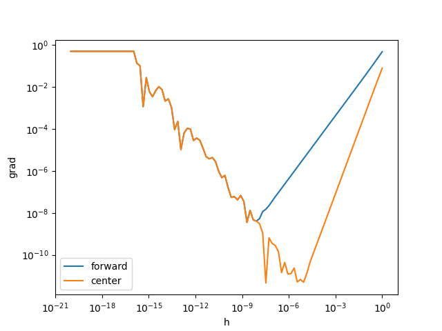

$$
\newcommand{\argmin}{\mathop{\rm arg~min}\limits}
$$

## はじめに　

ブログのリニューアル記念に、せっかくなので何か記事を書くことにしました。
何を書こうかいてもよかったのですが、最近人に機械学習の話をすることが結構あり、その中でしていた自動微分の話が割とウケがよかったのでそれについて記事を書くことにしました。

この記事では、特に機械学習・深層学習への応用を意識しながら、具体的なアルゴリズムについて紹介していきたいと思います。


想定としては、大学一年生レベルの数学がわかっていれば読めるようになっているかと思いますが、
機械学習や最適化について知っているとイメージがつきやすいかもしれません。

### 目次
- 微分を求める技術
  - どういう問題を解きたいか
  - 3つの主要な手法 ~自動微分は自動で微分をするという意味ではないよ~
  - 数値微分と数式微分と自動微分
- 数値微分
  - 数値微分のアルゴリズム
  - 誤差の評価
  - 誤差の改善 $n$次差分
  - 多変数への拡張
  - 数値微分の長所
  - 数値微分の短所
- 数式微分
  - 数式微分のアルゴリズム
  - 数式微分の実装
  - 簡略化
  - 
- 自動微分
  - 自動微分のアルゴリズム forward / reverse モード
  - forward モードの自動微分
  - reverse モードの自動微分
  - 深層学習における自動微分
  - 自動微分フレームワークの発展
- まとめ


## 微分を求める技術

今や微分はありとあらゆるところに登場します。


特に機械学習、とりわけ深層学習においては確率的勾配降下法(SGD)によって誤差を小さくするパラメータが、

世界中のコンピュータでせっせと計算されています。


そして当然のことですが、勾配降下法を使うには最適化したい関数に対する勾配を求める必要があります。

しかし、深層学習に代表されるような、目的関数が非常に複雑なときは導関数を陽に求めることは非常に困難です。

すると当然、これをコンピュータに計算させようという需要が生まれてきます。

本記事は、そのようなコンピュータを使った微分の計算についてまとめたものです。


### どういう問題を解きたいか
ひとくちに「微分の計算」といっても実は
- ある関数 $f$ の勾配 $\nabla f$ を求める
- ある点 $\boldsymbol{x}$ における関数 $f$ の勾配の**値** $\nabla f(\boldsymbol{x})$ を求める

という二つの意味があります。

もちろんそれぞれに必要とされるときがありますが、

特に最適化の文脈では、欲しい情報は $\nabla f$ を陽に求める必要はなく、
$\nabla f(\boldsymbol{x})$ さえあれば十分なことが多いです。

(例えば $f: \mathbb{R} \to \mathbb{R}$ を勾配降下法で最小化したいとき、
$x_{n+1} = x_n - \eta f'(x_n)$という更新式にしたがって更新されるわけですが、
実際に必要なのは $f'(x_n)$ であって、 $f'$ ではありません。)


さらに、これは自動微分の章でも詳しく説明しますが、
特に機械学習では入力の次元が非常に大きく、出力の次元が非常に小さいことが多いです。

例えば[パラメータ数10兆のモデル](https://twitter.com/imai_eruel/status/1671331036830269440?s=46)
が普通に訓練される場合、勾配降下法によって最適化する関数 $f$ は
$\mathbb{R}^{10000000000000} \to \mathbb{R}$ ということになります.


まとめると、

- 「微分の計算」といっても「導関数を求める場合」と「ある点における微分係数を求める場合」がある
- 特に機械学習では、入力の次元が非常に大きく、出力の次元が非常に小さいようなときに自動で微分をしたくなる場合がある

ということになります。


### 3つの主要な手法 ~自動微分は自動で微分をするという意味ではないよ~
さて、本記事で紹介する代表的な手法は三つあり、それぞれ

- 数値微分(numerical differentiation)
- 数式微分(symbolic differentiation)
- 自動微分(automatic differentiation)

と呼ばれています。

このように区別していることからわかるように、自動微分(automatic differentiation)は

**「自動で微分を行う技術の総称」** ではなく、自動で微分を行う技術のうち一手法であることに注意してください。


それぞれの手法について、数値微分と自動微分は関数 $f$ と 点 $x$ を入力として、 $f'(x)$ を出力とします。
そして数式微分は $f$ を入力として、 $f'$ を出力とします。

それぞれ長所・短所がありますが、
機械学習を含め実践的な問題を解く場合は自動微分が最も有効であることが多いです。

それでは、それぞれの手法について詳しく見ていきましょう。

## 数値微分

### 数値微分のアイデア
まずは、最も単純な方法である数値微分について説明します。

みなさんご存知のように、
関数 $f(x)$ の $x$ における微分係数 $f'(x)$ は、

$$
f'(x) = \lim_{h \to 0} \frac{f(x+h) - f(x)}{h}
$$


と定義されます。 
実際に小さい $h$ をとってこれを近似しようというのが数値微分のアイデアです。

例えば、 $f(x) = \sin(x)$ の $x = \dfrac{\pi}{3}$ における微分係数を数値微分で求めてみましょう。

計算してみると、

```python
import numpy as np

def numerical_diff(f, x, h):
    return (f(x+h) - f(x)) / h

def f(x):
    return np.sin(x)

print(numerical_diff(f, np.pi/3, 1e-1))
print(numerical_diff(f, np.pi/3, 1e-2))
print(numerical_diff(f, np.pi/3, 1e-3))
```

結果は以下のようになります。

```
0.45590188541076104
0.4956615757736871
0.49956690400077
```

実際の微分係数は $\cos\left(\dfrac{\pi}{3}\right) = \dfrac{1}{2}$
なので、そこそこいい感じに計算できています。
また、$h$ を小さくするほど徐々に真の値に近づいていることがわかります。

とはいえ真の値とは差があります。　

ここからは、この誤差について評価を与えることを考えてみます。

### 数値微分の2つの誤差
先ほどの微分の定義で出てきた、

$$
\dfrac{f(x+h) - f(x)}{h}
$$
について考えます。
$f(x+h)$ のテイラー級数展開は、

$$
\begin{align}
f(x+h) &= f(x) + f'(x)h + \frac{1}{2}f''(x)h^2 + \cdots \\
&= f(x) + f'(x)h + o(h^2)
\end{align}
$$

なので、　

$$
\begin{align}
\dfrac{f(x+h) - f(x)}{h} &= \dfrac{f(x) + f'(x)h + o(h^2) - f(x)}{h} \\
&= f'(x) + o(h)
\end{align}
$$

となります。　したがって誤差は $o(h)$ と評価できます。

では $h$ を小さくすればするほど全体の誤差は小さくなるのでしょうか。

実はこれはとてもよく知られている事実ですが、 $h$ を小さくしすぎるとかえって全体の誤差が大きくなります。

```python
import matplotlib.pyplot as plt
import numpy as np

h = np.logspace(0, -20, num=100)
grad_forward = numerical_diff(f, np.pi/3, h)
grad_true = np.cos(np.pi/3)

error_forward = np.abs(grad_forward - grad_true)

plt.plot(h, error_forward, label='forward')
plt.xscale('log')
plt.yscale('log')
plt.xlabel('h')
plt.ylabel('grad')
plt.legend()
plt.show()
```


上のグラフのように、誤差は $h = 10^{-8}$ あたりまでは減少していきますが、それ以降は $h$ を小さくしても誤差は大きくなっていきます。

これは浮動小数点数の丸め誤差によるものです。

まずは浮動小数点数について少し説明したいと思います。
(ご存知の方は飛ばしてOKです。)
#### 浮動小数点について
前提として、ふつうのコンピュータは有限桁の二進数しか扱えません。


そこで、コンピュータ上で実数(のような見た目をしているもの)は、有限桁の二進数で表現されます。


しかし、すべての実数が有限桁の二進数で表現できるわけではありません。
例えば、$0.1$ は有限桁の二進数で表現することはできません。
($0.1 = 0.00011001100110011\cdots$)


したがって、コンピュータ上で $0.1$ という実数を直接扱うのはむずかしく、近い有限桁の二進数で表現された数値を実際には使うことになります。


この桁数はいくつかのよく使われる規格によって決まりますが、最近の言語ではデフォルトでは倍精度浮動小数点数が使われることが多いです。


**ふつうの**$^{2}$倍精度浮動小数点数は、IEEE 754 という規格によって定められていて、符号部1ビット、指数部11ビット、仮数部52ビットという構成になっており、
符号のビット列が表す整数を $sign$、指数部のビット列が表す整数を $exp$ 、仮数部のビット列が表す整数を $frac$ とすると、


$$
v = (-1)^{sign} \times 2^{exp - 1023} \times (1 + frac)
$$

という形式で $v$ を表します。
実数から $v$ への変換(丸め)の方法はいくつかあり、IEEE 754では5つの丸めモードが定義されています。$^3$

デフォルトでは、roundTiesToEvenという丸めモードを使うように求められており、実際広く使われているようです。

<details>
<summary>roundTiesToEvenの定義</summary>
倍精度浮動小数点数で表される数全体の集合を $F$、 $F$ の最大値と最小値をそれぞれ $F_{max}$ と $F_{min}$ とすると、

$x \in [F_{min}, F_{max}]$ となるような $x \in \mathbb{R}$ について、
$v_1 \leq x \leq v_2$ となるような $v_1, v_2 \in F$ が存在します。

ここで、 
$|x - v_1| < |x - v_2|$　であれば $x$ は $v_1$ に丸められ、
$|x - v_1| > |x - v_2|$　であれば $x$ は $v_2$ に丸められます。

そして、$|x - v_1| = |x - v_2|$ であれば、$v_1$ と $v_2$ のうち、最下位ビットが $0$ である方に丸められます。


$x > F_{max}$ であれば、$x$ は $\infty$ に丸められ、
$x < F_{min}$ であれば、$x$ は $-\infty$ に丸められます。$^4$
</details>

#### 桁落ち
さて、長々と浮動小数点数について説明しましたが、話を数値微分に戻します。
数値微分では、 $h$ を小さくすることで誤差を小さくすることができるということを述べましたが、
$h$ を小さくしていけばしていくほど、$f(x+h)$ と $f(x)$ の差が小さくなっていきます。


すると、実数を浮動小数点数で表したことが原因の、「桁落ち」と呼ばれる現象が起き、誤差が大きくなります。


具体的に説明します。


例えば、 $f(x+h) = 31.606961258558215\cdots, f(x) = 31.622776601683793\cdots$ であったとしましょう。($\sqrt{999}$と$\sqrt{1000}$です)

これを適当な規格の浮動小数点数に直したとき $f(x+h) = 3.16069612 \times 10^1, f(x) = 3.16227766 \times 10^1$ となったとします。

すると、
$$
\begin{align}
f(x+h) - f(x) &= 3.16069612 \times 10^1 - 3.16227766 \times 10^1 \\
&= 0.00158154 \times 10^1 \\
&= 1.58154\textcolor{red}{000} \times 10^{-3}
\end{align}
$$

となってしまい、なんと有効桁が減ってしまいました。(末尾の$000$は埋められた桁でなんの情報もありません。)


このように、同じくらいの数を引き算するときに、演算結果の有効桁が非常に小さくなってしまう現象を桁落ちと呼びます。


したがって、$h$ を小さくしていくと、はじめは極限の近似が正確になっていくことで誤差が小さくなりますが、


ある程度以上小さくなると、桁落ちによる効果が上回り、全体の誤差が大きくなっていきます。

このようにして上のグラフのような結果になることが説明できました。

### 数値微分の誤差の改善
さて、ではこのような誤差を改善する方法を考えます。
まず簡単な方法は、浮動小数点をより正確な表現が可能なものに変えることでしょう。

もう一つの簡単で有効な方法は、中心差分を使うことです。

我々は、
$$
\dfrac{f(x+h) - f(x)}{h}
$$
を計算していましたが、これを

$$
\dfrac{f(x+h) - f(x-h)}{2h}
$$

に改めます。　実はこうするだけで、誤差は $o(h^2)$ になります。


同じようにテイラー展開すると、
$$
\begin{align}
f(x+h) &= f(x) + f'(x)h + \frac{1}{2}f''(x)h^2 + \frac{1}{6}f'''(x)h^3 + \cdots \\
      &= f(x) + f'(x)h + f''(x)\frac{h^2}{2} + o(h^3) \\ 
f(x-h) &= f(x) - f'(x)h + f''(x)\frac{h^2}{2} - \frac{1}{6}f'''(x)h^3 + \cdots \\
      &= f(x) - f'(x)h + f''(x)\frac{h^2}{2} + o(h^3) \\
\end{align}
$$

となるので、

$$
\begin{align}
\dfrac{f(x+h) - f(x-h)}{2h} &= \dfrac{f(x) + f'(x)h + f''(x)\frac{h^2}{2} + o(h^3) - f(x) + f'(x)h - f''(x)\frac{h^2}{2} + o(h^3)}{2h} \\
&= f'(x) + o(h^2)
\end{align}
$$

となります。 したがって誤差は $o(h^2)$ と評価できます。


実際にコードを書いてみると、

```python
import matplotlib.pyplot as plt
import numpy as np


def numerical_diff(f, x, h):
    return (f(x+h) - f(x)) / h

def numerical_diff_center(f, x, h):
    return (f(x+h) - f(x-h)) / (2*h)

def f(x):
    return np.sin(x)

h = np.logspace(0, -20, num=100)
grad_forward = numerical_diff(f, np.pi/3, h)
grad_center = numerical_diff_center(f, np.pi/3, h)
grad_true = np.cos(np.pi/3)

error_forward = np.abs(grad_forward - grad_true)
error_center = np.abs(grad_center - grad_true)

plt.plot(h, error_forward, label='forward')
plt.plot(h, error_center, label='center')
plt.xscale('log')
plt.yscale('log')
plt.xlabel('h')
plt.ylabel('grad')
plt.legend()
plt.show()
```



このように、中心差分を取ることでより正確に微分を計算することができました。

さらに、極限の近似がより正確になったため、桁落ちによる効果が $h$ がより大きい段階から発生するようになり、
最も正確な値となる $h$ が変化しました。このように 最適な $h$ は状況によって変化していきます。

また、今回は中心差分で2点の情報を使いましたが、 $f(x + 2h), f(x - 2h)$ などもあわせて使うことで、
より正確な計算を行うことができます.

同様にテイラー展開を頑張ることで導出できるので気合いのある方は頑張ってみてください。

### 多変数関数への拡張

$f : \mathbb{R}^n \to \mathbb{R}$ の勾配 $\nabla f$ は
各$x_i$ についてそれ以外の変数を固定して計算すればOKです。

```python
def numerical_nabla(f, x, h):
    n = len(x)
    nabla = np.zeros(n)
    for i in range(n):
        x_i = x[i]
        x[i] = x_i + h
        f_plus = f(*x)
        x[i] = x_i - h
        f_minus = f(*x)
        nabla[i] = (f_plus - f_minus) / (2*h)
        x[i] = x_i
    return nabla


def f(x, y):
    return x**2 + y**2

x, y = 1.0, 2.0

numerical_nabla(f, np.array([x, y]), 1e-3)
```

結果は、

```
array([2., 4.])
```

となり、正しそうです。

出力が複数のときも容易です。
$f: \mathbb{R}^n \to \mathbb{R}^m$ のヤコビアン行列 $J_f$ は

```python
import numpy as np

def numerical_jacobian(f, x, h=1e-5):
    n = len(x)
    m = len(f(*x))
    jacobian = np.zeros((m, n))
    
    for i in range(n):
        x_i = x[i]
        x[i] = x_i + h
        f_plus = f(*x)
        x[i] = x_i - h
        f_minus = f(*x)
        jacobian[:, i] = (f_plus - f_minus) / (2 * h)
        x[i] = x_i
    
    return jacobian

def f(x, y):
    return np.array([x**2 + y**2, x*y])

x, y = 1.0, 2.0

numerical_jacobian(f, np.array([x, y]))
```

結果は、

```
array([[2., 4.],
       [2., 1.]])
```

となり、正しく計算できています。

### 数値微分の計算量
数値微分は一変数関数であれば2回の関数評価で微分を計算することができます。
$\mathbb{R}^n \to \mathbb{R}^m$ の関数のヤコビアン行列を求める場合は、 $\Theta(nm)$ 回の評価が必要です。

### 数値微分の長所
なんと言っても実装が非常に簡単です。

数値微分では $f$ が何であろうと $f(x + h)$ と $f(x)$ さえ計算できれば
結果がもとまります。(もちろんそれが正しいという保証はありませんが)　
したがってたとえ特殊な関数でもほとんど準備なく微分を計算することができます。

そのため、後述の自動微分などを実装する際には数値微分を用いてテストを行うことが多いです。


### 数値微分の短所
後述の自動微分などと比較すると誤差が出やすいです。
また、入力と出力の両方の次元に比例した計算量がかかるため、
入力または出力の次元が大きい場合は計算量が大きくなります。

## 数式微分

### 数式微分のアイデア

数式微分は、我々が普段微分を行うときと同じように、陽に導関数を求める手法です。

つまり、数式微分のアルゴリズムは、

(関数, 微分係数を求めたい点) → 微分係数の値


でしたが、数式微分は

関数 → 導関数を求めます。

数式微分では、微分したい式を木構造あるいはDAG(有向非巡回グラフ)として表現し、
その木構造を根から順番に見ていき、微分の定義に従って微分を計算していきます。

### 数式微分の実装

実際にやってみようと思います。
ここでは、簡単のために三角関数と四則演算からなる式について微分することを目指してみます。

えいやと実装します。
ソースコードは長いですがほとんどが同じような定義が続くだけなので、そこまで大変ではないと思います。

少しだけ解説を加えておきます。

- `Expression` は式全体を保持します。 `root` に式の最も外側の演算子が入っています。
- `AbstractNode` は式のノードを表します。
- あとは木構造のノードになりうる、演算子と変数と定数を表すクラスを定義しています。
- `__call__` は関数として振る舞うためのメソッドです。 再帰的に子ノードを呼び出して計算を行います。
- `diff` も同じように再帰的に子ノードの微分を計算していきます。

```python
import pydot
import numpy as np


class Expression:
    def __init__(self, root):
        self.root = root
    
    def __call__(self, x):
        return self.root(x)
    
    def __repr__(self):
        return str(self.root)
    
    def plot(self):
        G = pydot.Dot(graph_type='digraph')
        self.root._plot(G)
        return G
    
    def diff(self):
        new_expr = Expression(self.root.diff())
        return new_expr
        
class AbstractNode:
    def __init__(self):
        self.children = []

    def __call__(self, x):
        raise NotImplementedError

    def __repr__(self):
        raise NotImplementedError

    def _plot(self, G):
        node = pydot.Node(id(self), label=self._label())
        G.add_node(node)
        for child in self.children:
            G.add_edge(pydot.Edge(node, pydot.Node(id(child), label=child._label())))
            child._plot(G)

    def diff(self):
        raise NotImplementedError


class Variable(AbstractNode):
    def __init__(self):
        super().__init__()
    
    def __call__(self, x):
        return x
    
    def _label(self):
        return 'x'
    
    def __repr__(self):
        return 'x'
    
    def diff(self):
        return Constant(1)
    
    
class Constant(AbstractNode):
    def __init__(self, value):
        super().__init__()
        self.value = value

    def __call__(self, x):
        return self.value
    
    def _label(self):
        return str(self.value)
    
    def __repr__(self):
        return str(self.value)
    
    def diff(self):
        return Constant(0)
    
class Add(AbstractNode):
    def __init__(self, x, y):
        super().__init__()
        self.children = [x, y]

    def __repr__(self):
        return '(' + str(self.children[0]) + ' + ' + str(self.children[1]) + ')'
    
    def _label(self):
        return '+'
    
    def __call__(self, x):
        return self.children[0](x) + self.children[1](x)
    
    def diff(self):
        return Add(self.children[0].diff(), self.children[1].diff())
    
class Mul(AbstractNode):
    def __init__(self, x, y):
        super().__init__()
        self.children = [x, y]

    def __repr__(self):
        return '(' + str(self.children[0]) + ' * ' + str(self.children[1]) + ')'
    
    def _label(self):
        return '*'
    
    def __call__(self, x):
        return self.children[0](x) * self.children[1](x)
    
    def diff(self):
        return Add(Mul(self.children[0].diff(), self.children[1]), Mul(self.children[0], self.children[1].diff()))
    
class Sin(AbstractNode):
    def __init__(self, x):
        super().__init__()
        self.children = [x]

    def __repr__(self):
        return 'sin(' + str(self.children[0]) + ')'
    
    def _label(self):
        return 'sin'
    
    def __call__(self, x):
        return np.sin(self.children[0](x))
    
    def diff(self):
        return Mul(Cos(self.children[0]), self.children[0].diff())
    
class Cos(AbstractNode):
    def __init__(self, x):
        super().__init__()
        self.children = [x]

    def __repr__(self):
        return 'cos(' + str(self.children[0]) + ')'
    
    def _label(self):
        return 'cos'
    
    def __call__(self, x):
        return np.cos(self.children[0](x))
    
    def diff(self):
        return Mul(Constant(-1), Mul(Sin(self.children[0]), self.children[0].diff()))
```


実際に動かしてみましょう。

ここでは式を可視化する便利な関数 `plot` を用意しています。

まずは式を定義します。

```python
f = Expression(Mul(Add(Variable(), Constant(1)), Sin(Variable())))
```

これは、

$$
(x + 1) \times \sin(x)
$$

という式です。
実行すると


```
print(f)
```

```
((x + 1) * sin(x))
```

となります。

これを `plot` で可視化すると、

```python
f.plot().write_png('fig/expr.png')
```


というふうな木構造として保持されていました。

では、この式を微分してみましょう。

```python
df = f.diff()
```

すると、

```
print(df)
```

```
(((1 + 0) * sin(x)) + ((x + 1) * (cos(x) * 1)))
```

果たしてこれは正しいのでしょうか。

実際に数値微分の結果と比較して確かめてみます。

```python
x = np.random.random()
print(df(x))
print(numerical_diff(f, x, 1e-5))
```

```
1.8300012766059257
1.830005971548143
```

どうやら正しそうです！

ですが、得られた式は明らかに非常に冗長です。

例えば `1 + 0` という部分は `1` になるべきですし、 `cos(x) * 1` という部分も `cos(x)` になるべきです。

そこで、この式を簡約するメソッドを追加します。

例えば`Mul` については

```python
class Mul(AbstractNode):
    def __init__(self, x, y):
        super().__init__()
        self.children = [x, y]

    ...

    def simplify(self):
        if isinstance(self.children[0].simplify(), Constant) and self.children[0].simplify().value == 0:
            return Constant(0)
        elif isinstance(self.children[1].simplify(), Constant) and self.children[1].simplify().value == 0:
            return Constant(0)
        elif isinstance(self.children[0].simplify(), Constant) and self.children[0].simplify().value == 1:
            return self.children[1].simplify()
        elif isinstance(self.children[1].simplify(), Constant) and self.children[1].simplify().value == 1:
            return self.children[0].simplify()
        else:
            return Mul(self.children[0].simplify(), self.children[1].simplify())
```

やや冗長ですが、このようにして 定数の `0` とかけあわせたり `1` とかけあわせたりしたときのノードを置き換えます。

これを `diff` のあとに呼び出すことで、簡約された式を得ることができます。

```python
df.simplify()
```

```
(sin(x) + ((x + 1) * cos(x)))
```

```
df.simplify().plot().write_png('fig/expr_diff_simple.png')
```


このように、簡約された式を得ることができました。

ではこれをどんどん行なっていくことでどんな式でも上手く微分をしていけるでしょうか。

結論から言うと、かなり厳しいと言うのが現実です。

いわゆる積の微分と呼ばれる公式は

$$
(f(x)g(x))' = f'(x)g(x) + f(x)g'(x)
$$


でした。つまり、積の微分を行うと項が二つに「分裂」してしまいます。

したがって、 $f, \  g$ にも積が含まれていると、指数オーダーで項の数が増えていっていき、
現実的に扱うことが難しくなります。

このように、最適化などの文脈で数式微分を使うのは難しいです。


## 自動微分

最後に紹介するのが、自動微分(automatic differentiation)です。

自動微分は精度、計算量ともに非常に優れており、最適化などの文脈では非常によく使われています。

### 自動微分のアルゴリズム forward / reverse モード

自動微分は数値微分と同じく、導関数を陽に求めるのではなく、ある点における勾配を計算する手法です。

自動微分の核心的なアイデアは

- 全ての式を基本的な関数の合成に分解する
- 基本的な関数の合成として表した式を、連鎖律(chain rule)を使って微分する

というものです。

具体的にみていきましょう。

$$
z = (x + y)^2
$$

について考えます。

この $f$ は、

$$
a = x + y\\
$$

とすれば、とうぜん

$$
a = add(x, y)\\
z = square(a)
$$


として書くことができます。

では、このようにあらわした式に対して

$$
\frac{\partial f}{\partial a}, \frac{\partial f}{\partial b}
$$

を求めることを考えてみます。

ここで使うのが連鎖律(chain rule)です。

連鎖律とは、

$$
\frac{\partial f}{\partial x} = \frac{\partial f}{\partial g} \frac{\partial g}{\partial x}
$$

という公式のことです。


これを使うと、

$$
\frac{\partial f}{\partial a} = 
$$

となります。

### 二重数とのその性質


### forward モードの自動微分の実装

### backward モードの自動微分の実装

### 計算量の評価

### 応用

### 自動微分のツール


<hr>

<footer>

参考文献


[1] [数値計算における誤差について ─数値微分を例に─](https://na-inet.jp/na/na_error_diff.pdf)

[2] [倍精度浮動小数点数 | Wikipedia](https://ja.wikipedia.org/wiki/%E5%80%8D%E7%B2%BE%E5%BA%A6%E6%B5%AE%E5%8B%95%E5%B0%8F%E6%95%B0%E7%82%B9%E6%95%B0) によれば、 <br>
> 昔[いつ?]のFORTRANでは、単精度（REAL型）よりも精度が高ければ倍精度（DOUBLE PRECISION型）を名乗ることができた
ええ...

[3] IEEE 754 2008, §4.3.3

[4] IEEE 754 2008, §7.4

</footer>
