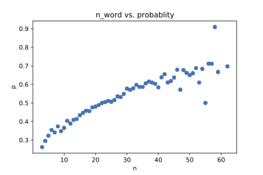

 
## シーザー暗号と頻度分析
シーザー暗号は最も有名な暗号のですよね。

仕組みは単純で、適当に定めた $n$ 個分、アルファベットをずらすだけです。

例えば $n=3$ のとき、 `Hello` は `Khoor` になります。
 

そして当然ですが、暗号化された分は、逆の方向に $n$ 個分ずらすことで復号できます。

したがって、シーザ暗号によって暗号化された文章に対してうまくずらした文字数を推定できれば暗号を突破できます。

その一番有名な方法が頻度分析です。
これは、英語の文章では特定の(Characterの意味で)文字が出現する頻度が高いことを利用します。
例えば、英語の文章では `e` が一番出現頻度が高いです。　したがって、暗号化された文で最も出現頻度が高い文字が
`e` から変換されたものであると考えてずらした幅を推定できます。

というかなり簡素な仕組みの解読法ですが、これがどれくらいうまく行くのか気になるところです。
 
 
チャチャっと調べてみます。

[英語Wikipediaのデータ](https://www.kaggle.com/datasets/mikeortman/wikipedia-sentence) を適当に持ってきて、
10000分くらいを抽出して暗号化　→ 解読というのをやってみます。

横軸にそれぞれの分の単語数、解読の成功率を書いてみます。

という結果が得られました。

こんな感じで、60語くらいの文であればなんと70%くらいはうまく行くようです。

他にも、特定の部分文字列が出現しやすかったり、二番目、三番目に出現しやすい文字を使うことでもっと正確に推定することができるでしょうから、
意外とうまく行くもんだなぁという感想です。

というレポートを1年生の時に書いたのでブログネタとして消費しました。
去年の自分、ありがとうございました。

 
 