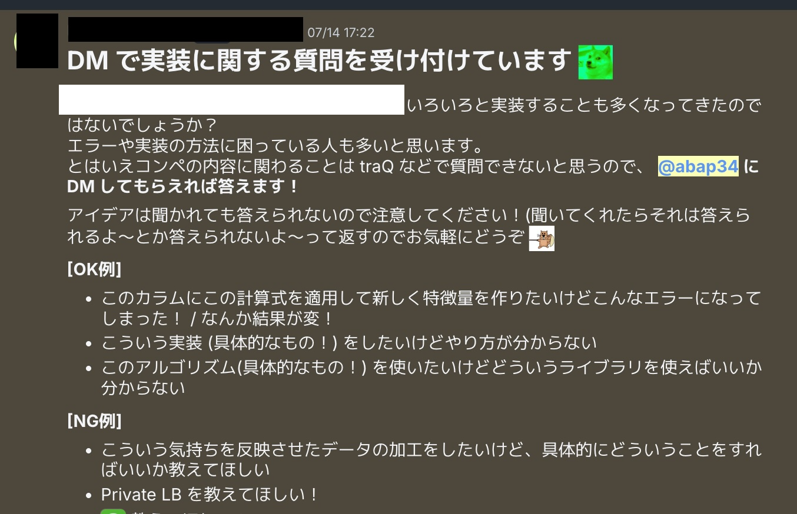
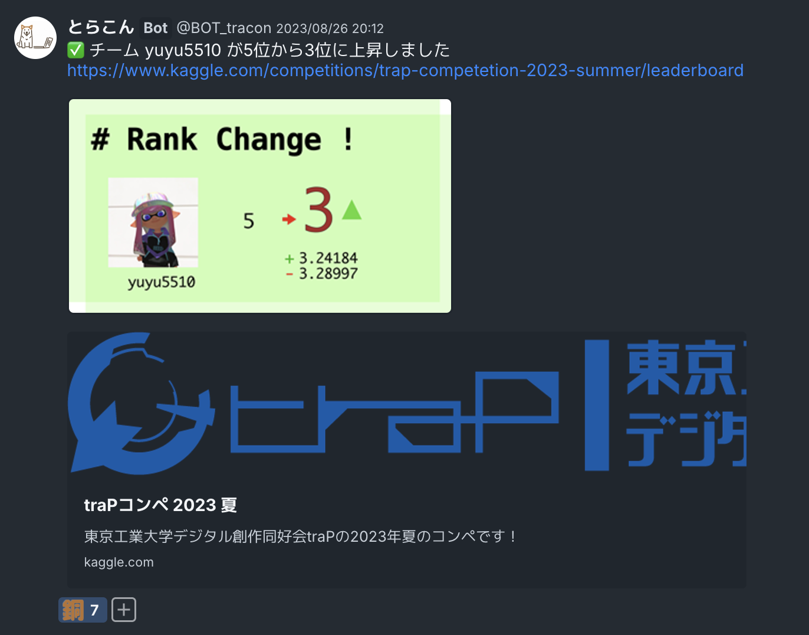
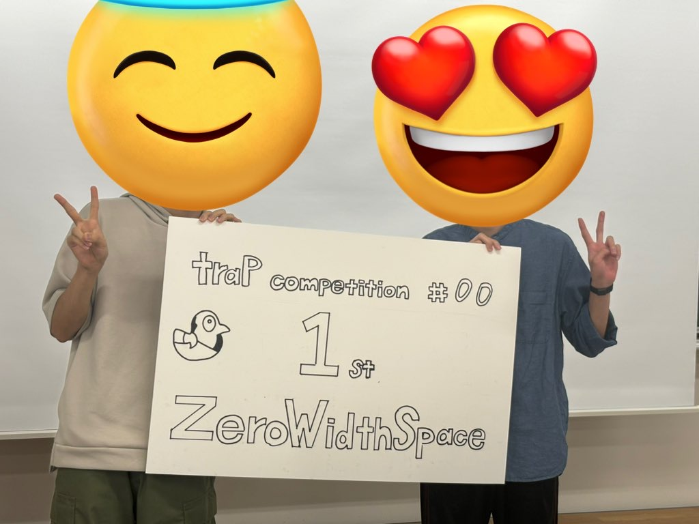

## あらすじ

先月、大学のサークルで運営していた機械学習を勉強するコミュニティを後輩に譲りました: 

<blockquote class="twitter-tweet">
そういえば、大学のサークルの Kaggleコミュニティの長(?) を後輩に譲りました。 (抱えているプロジェクトがあるので、まだまだ色々しますが、一区切り)  2年半いろいろできて楽しかったです！ありがとうございました🙇‍♂️😊<a href="https://t.co/FTj9Ulm7dk">https://t.co/FTj9Ulm7dk</a><a href="https://twitter.com/hashtag/trap1kaggle?src=hash&amp;ref_src=twsrc%5Etfw">#trap1kaggle</a>
&mdash; abap34 (@abap34) <a href="https://twitter.com/abap34/status/1846123877237150005?ref_src=twsrc%5Etfw">October 15, 2024</a></blockquote> 

ここでは だいたい 2年半の期間で、だいたい 半年に一回くらいのペースで 計4回 コンペを主催して運営をしました。

|      | 参加者数 | Sub数    | 期間  | 実施形態          |
| ---- | -------- | -------- | ----- | ----------------- |
| B1夏 | 17人     | 約200件  | 1週間 | オンライン        |
| B2春 | 30人     | 約200件  | 3日   | オンライン        |
| B2夏 | 37人     | 約750件  | 1週間 | オンライン + 対面 |
| B3春 | 114人    | 約1700件 | 1週間 | オンライン + 対面 |

コンペを開催すると、機械学習の実践的な勉強になるのはもちろんですが、not 機械学習のエンジニアの人が参加してくれたり、やはりなんだかんだみんな楽しくやってくれて盛り上がるのでいいなぁと思っています。

ところで、コンペを運営する側の知見はあまり転がっていないので、はじめてコンペをやろうとすると、どういうことに気をつけるべきか、どういう工夫が世の中にあるのか、わからないがちです。

そこで、後輩のためにコンペ運営のコツ、やった方がいいことなどを引き継ぎ資料として残しておこうと思っていたのですが、
特に企業秘密(?)にしておく理由もないのでここに書きたいと思います。

(細い運営記録などは [https://trap.jp/author/abap34/](https://trap.jp/author/abap34/) などに転がっています.)

## Tips 1. データセットの便利な探し方

どんなデータを持ってくるか、そしてどんなタスクを解かせるかは、いうまでもなくコンペの面白さに最も大きく影響します。

〇〇が好きな人が多いから、これをやろう！ ×× な会社だからこれにしよう！ のようにテーマが決まっている場合は特に書くことはないですが、とりあえず面白いコンペをやることだけが決まっていて、データセットの候補が特にない場合は何処かデータセットがまとまっているところから拾ってくることになると思います。

自分の場合、以下のあたりをよく見ていました。

- [Kaggle Datasets](https://www.kaggle.com/datasets)
- [UCI Machine Learning Repository](https://archive.ics.uci.edu/ml/index.php)
- [Google Dataset Search](https://datasetsearch.research.google.com/)

個人的には Kaggle がデータセットのサイズやタスクで絞れたり使いやすいのでお勧めです。

ただ、Kaggle Datasets からとってくるときの注意として、  **権利関係が明らかでないヤバそうなデータセットがちょくちょくあるので、この辺りのチェックが必須です。** 

元ネタであろうデータセットが Credit されていなかったり、そもそも本物なのかすら怪しいものがちょくちょくあります。

本当の本当に身内でやる場合ならともかく、ちゃんとしたい場合は気をつけてください。

なので

1. Kaggle Datasets でいい感じのテーマを見つける (アイデア出しとして使う)
2. そのテーマのちゃんとしたデータセットを拾う

というのが自分のやり方でした。

## Tips 2. 人工データセットを使うことを検討しよう

適当なテーマのデータセットを必ず手に入れる方法として、自前でそれっぽいものを生成してしまうというのもあります。

メリットはライセンスなどを気にしなくていいこと、準備の工数が見積もりやすいこと、難易度含めタスクをいくらでも調整できることなどがあります。

(とくに二つ目はかなり強いです。データ準備の期間を予測するのはかなり難しいです。)

デメリットとしては致命的なリークを生みやすい、タスクの説得力が生まれにくい (**データの生成方法を推定するだけのバトルになってしまうと楽しくない**) などがパッとあがります。

ただ、初心者向けにとりあえず一回やってみる、というような場合はメリットがデメリットを上回ることも結構あると思います。
なので、そのような場合は人工データセットを使うのも一つの手です。

## Tips 3. Starter Notebook を用意して、 Submit までしてもらおう

初心者の人にコンペに取り組んでもらうには、とにかく最初のサブミットをしてもらって順位表に載ってもらうことが大事です。

そこでまずは簡単な Solution を **完全に** 実装した Starter Notebook を作ることをお勧めします。

さらに、その Starter Notebook をほとんどそのまま実行してもらって Submit までやってもらうことも強くお勧めします。
やはり順位表に載って人を抜いたり抜かれたりすることは全ての人に有効なモチベーションになるからです。
(ランダムシードに好きな数字を入れて実行して投稿してみましょう〜　などがおすすめ)

注意点として、初心者の人が多い場合、このような Notebook がコンペの方向性を本当の本当に決定づけてしまうこともあります。
(例えば、 LightGBM を使ったそこそこのスコアの Solution を提供してしまうと、全員が LightGBM のハイパラチューニングを 1週間しちゃうみたいなことがある) (1敗)

Starter Notebook がよい Solution である必要は全くなく、Starter Notebook に工夫の余地を大量に残して、かつ選択肢を提示するのが大事です。

## Tips 4. 質問対応をしよう

pandas でこういう処理をしたいけど分からない, こういうことをしたいけどライブラリを知らない etc などの理由で
改善を諦めてしまうのはもったいないです。

ですが、それをすべて質問できる一般的な形にしてもらって公開の場で質問してもらうのは初心者の人にとっては大変ですし、
毎回細かい話を Discussion にあげるのもハードルを感じる人が多いです。

そこで、実装レベルの話であれば運営が質問に答えますよ、とした方がうまく回るというのが自分の考えです。
(もちろんアイデアの話などはちゃんと Discussion にあげてもらうのがいいです)

## Tips 5. 簡単なサブセットを作ることで難易度を調整しよう

多くの場合、コンペは

- 初心者にとっては 1 Sub しやすく
- 上級者は飽きない

ものであって欲しいです。

そこでおすすめなのは、データのうち処理が簡単なものだけを抜き出したサブセットを作ってあげることです。

例えば

- `train.csv`  　
- `test.csv` 
- `sample_submission.csv` 

のような典型的な構成のコンペでは `train.csv, test.csv` からパッと処理するのが難しい列を除いて、また `train` は行数を少なくして 
`train_tiny.csv`  `test_tiny.csv` のようなファイルを最初から配ってあげ、初心者の人はとりあえずこれを見てやってみてください、とすると良いです。

EDA・学習含めいろいろ処理が早く終わってとっつきやすいというのもありますし、
**初心者の参加者が普段使うソフトウェアで扱えるサイズにしておく** ことで、
データ分析コンペの本質パートであるところの学習データを眺めて性質を考察する、というのを初心者の人でもやってくれて嬉しくなります。

## Tips 6. Disucussion 賞を作ろう

コンペ中に Disucussion や公開カーネルを出す文化は他のプログラムを書く競技ではあまりなく、ハードルを感じる人が多いです。

そこで絶対おすすめなのが Disucussion 賞を作ることです。

単に Upvote数で決めてもいいですし、運営が選ぶ、という方式でもいいです。

前者は客観的で公平ですが、そうすると終盤に Disucussion を出す動機が希薄になってしまうので、
余裕があれば後者も作ってあげると序盤中盤終盤、隙がない Disucussion になるかと思います。

 
## Tips 7. 順位表 bot を作ろう / なろう

SNS で盛り上げることが、ありとあらゆる大会の盛り上がりで役立つことはもはや明らかな事実だと思います。

そこで、順位表 bot を作って順位の変更通知を参加者が主に使う SNS に飛ばすことをとてもお勧めします。

Kaggle であれば Kaggle api で Community Competition でも順位表が取れるので、
これを定期的に回して差分があれば通知を飛ばす、というのが一番簡単かと思います。

また、実装する時間がない場合も、例えば毎日適当な日時に順位表のスクショと上位の人の告知などをするだけでもだいぶ違うかと思います。

また、これは自前プラットフォームを持っているときなどに限られますが、結果などを一発で SNS に共有できる機能があるとかなり便利です。

## Tips 8. 振り返り会をしよう

コンペ終了直後に振り返り会をしましょう！
この時間が一番勉強になりますし、コンペの盛り上がりをコンペを一過性のイベントでなくその後の盛り上がりと勉強に繋げる一番大事なイベントだと思います。(3敗)

コンペ上位の人を表彰したり Solution を発表してもらったりするのはもちろん、やはり参加者同士であれがよかったこれはダメだったと話し合うのが一番大事だと思います。

## Tips 9. チーム戦のすすめ

もし参加者がそれなりに確保できそうなら、チーム戦にすることをおすすめします。

これは、チーム戦も可能ですよとする話ではなく、コンペの最初からチームを結成してやってもらう、ということです。

いくつかメリットがあります。

- コンペの離脱率が格段に下がる
- 同じチームの人と仲良くなるのでコミュニティが育つ
- 単にコンペのレベルが上がる

デメリットとしては

- 参加者数が十分でないと少し順位表が寂しくなる
- 場合によってはチーム内・チーム間の力量差が大きくなりすぎて一部の参加者のモチベーションが下がる

というのがあります。

なので、ある程度人数がいて、レベル感が大体同じなら迷いなくチーム戦前提、というのがうまく回ると思っています。

もちろんソロでもチームでもいいですよ、という形でもいいのですが、特に短期のコンペだとチーム結成までのハードルが高いのでチームができにくく、
チームができて欲しい場合は最初からチーム戦としてやってもらうのがいいかなと思います。

## Tips 10. コンペを健全にするために

コンペを開催すると、どうしても不正する人が現れます。 身内に不正を指摘するのはかなり気が重いですが、
不正をずっとそのままにすると不利益を被るのは他の人なので心を鬼にして検知と指摘をしないといけません。

例えば Private Sharing を検知するには、サブミッションの Correlation Matrix を作ってあげるなどすると良いです。

また、 Solution の公開を義務付けるとか、査収をちゃんとやるよ、とアピールするのも大切だと思います。
(振り返りにもなるので Solution を基本公開は大規模でなければ結構ポジティブな効果が大きいと思います) 

とはいえ、残念ながら完璧に検知することは当然不可能です。
不正をするやつは　😇 、という風潮をうまく作ることが根本的にアプローチする上でやっぱり大事かなと思います。

## おわりに

ほかにも、コンペの終了時刻を設定するときに UTC なことを絶対に忘れない (1大敗) などがあったのですが、 Kaggle ではアップデートで JTC で設定できるようになっていたので削除したりと、
コミュニティでコンペをやる環境は日々良くなっていていい話だなと思います。

コンペ運営は大変ですが、やっぱり自分の設定したお題をみんなが解いているのは見ていて割と楽しいですし、
リークに気をつける力がつくのでオススメです。 (ただ、とくに序盤はとんでもないリークを仕込んでいないか気が気でないですが)

## 今日の一曲

<iframe width="560" height="315" src="https://www.youtube.com/embed/PEnJbjBuxnw?si=9yMCnaCoGeXE5__m" title="YouTube video player" frameborder="0" allow="accelerometer; autoplay; clipboard-write; encrypted-media; gyroscope; picture-in-picture; web-share" referrerpolicy="strict-origin-when-cross-origin" allowfullscreen></iframe>

