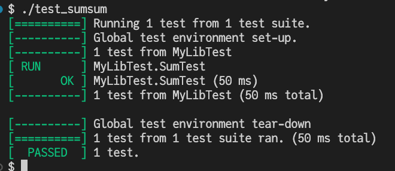
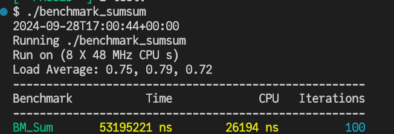
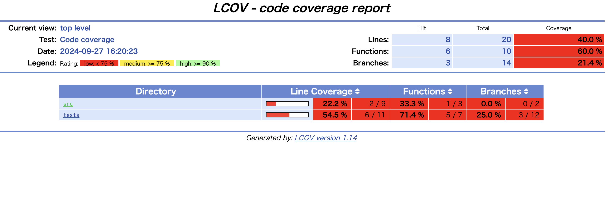
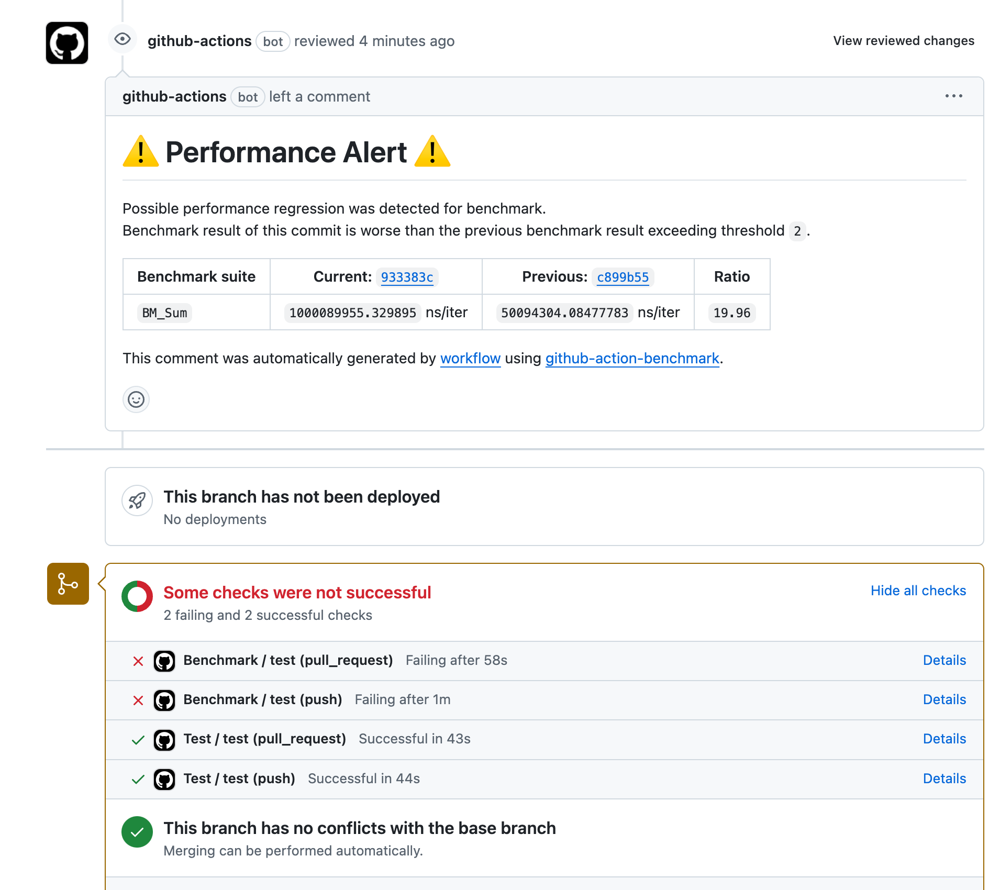
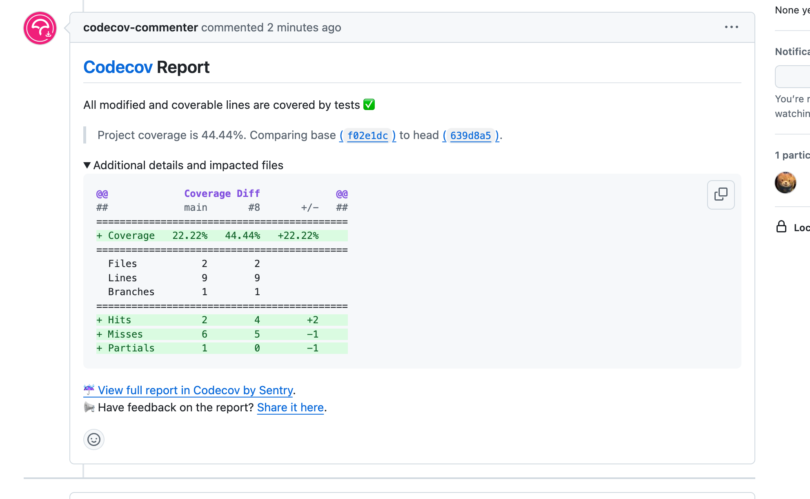

## できるもの



 









## はじめに

> 人類はまだテストを不要とする技術を開発していないので、テストはいるんですね. [^1] 

[^1]: [「自分の未来予測を信じてちょっと意地を張ってみる」 まつもとゆきひろ氏がRubyに型宣言を入れない理由](https://logmi.jp/tech/articles/330373) より.

というわけでテストを書きます。 GitHub で C++ のプロジェクトをやることを想定して、

- Google Test でテストを書く
- Google Benchmark でベンチマークを取る
- それの結果の推移の統計を GitHub Pages でいい感じに表示する
- Codecov でカバレッジを計測する

あたりを整備する手順をまとめます。


今回は Meson というビルドツールを使ってみます。

ドキュメントの先頭にはこんな感じのことが書いてあります。


> Meson is an open source build system meant to be both extremely fast, and, even more importantly, as user friendly as possible.
The main design point of Meson is that every moment a developer spends writing or debugging build definitions is a second wasted. So is every second spent waiting for the build system to actually start compiling code.


user friendry, いいことばですね (ほんとに)


ドキュメントもいちおうあります.　[https://mesonbuild.com/index.html](https://mesonbuild.com/index.html)

正直あまり網羅的には書いてくれていない印象ですが... 😢 


以下の Dockerfile で作った devcontainer で作業しています。


```Dockerfile
FROM ubuntu:22.04

ENV DEBIAN_FRONTEND=noninteractive

RUN apt-get update && apt-get install -y \
    build-essential \
    meson \
    ninja-build \
    gcc \
    g++ \
    lcov \
    gcovr \
    git \
    python3-pip \
    python3-setuptools \
    && apt-get clean
```

とくに Mac の人は devcontainer でやるのがおすすめです。 (400敗)


## ローカルでの環境構築

### サンプルプロジェクト

こんな感じのプロジェクトを作ります。


```
➤ tree .
.
├── LICENSE
└── src
    ├── main.cpp
    ├── mylib.cpp
    └── mylib.hpp
```

`src/mylib.hpp`:

```cpp
#ifndef MYLIB_HPP
#define MYLIB_HPP

int sum(int a, int b, int c);
int try_to_sum(int a, int b, int c);

#endif // MYLIB_HPP
```

`src/mylib.cpp`:

```cpp
#include "mylib.hpp"

int sum(int a, int b, int c) {
    return a + b + c;
}

int try_to_sum(int a, int b, int c) {
    if (a + b + c > 100) {
        return -1;
    }
    return a + b + c;
}
```

`src/main.cpp`:

```cpp
#include <iostream>
#include "mylib.hpp"

int main() {
    std::cout << "Sum: " << try_to_sum(1, 2, 3) << std::endl;
    return 0;
}
```
 
3 つの数の総和を取る (ただし、前 2 つの和が 100 を超える場合は -1 を返す) です。

### Meson の設定

Meson の設定を書きます。　とりあえず `main.cpp` を実行できるとこまで行きます。

設定ファイルは `meson.build` という名前で作ります。


```
project('sumsum', 'cpp',
  version: '0.1.0',
  default_options: ['cpp_std=c++20'])

src = ['src/main.cpp', 'src/mylib.cpp']

executable('sumsum', src)
```


実際にビルドしてみます。


`meson setup {dir}` で `{dir}` にビルドディレクトリが作られます。


そこで `meson compile` でビルドが走ります。
(前までは `ninja` を直接叩くことになっていたようですが、今は `meson compile` で適切にバックエンドを見つけてやってくれるみたいです)


```bash
➤ meson setup builddir && cd builddir
The Meson build system
Version: 1.5.2
...
Build type: native build
Project name: sumsum
Project version: 0.1.0
C++ compiler for the host machine: c++ (clang 14.0.3 "Apple clang version 14.0.3 (clang-1403.0.22.14.1)")
C++ linker for the host machine: c++ ld64 857.1
Host machine cpu family: aarch64
Host machine cpu: aarch64
Build targets in project: 1

Found ninja-1.12.1 at /opt/homebrew/bin/ninja
➤ meson compile

INFO: autodetecting backend as ninja
INFO: calculating backend command to run: /opt/homebrew/bin/ninja
[3/3] Linking target sumsum
```

というわけでビルドが終わると、

```bash
➤ ./sumsum
Sum: 6
```

無事に実行されました！　

### Google Test の導入

まずは `git submodule` で.... もしくは `cmake` の `fetch_content` で... ではなく、 なんと Meson は wrapdb というところにいろんなライブラリを置いてくれていて簡単にとってくることができます。


[https://mesonbuild.com/Wrapdb-projects.html](https://mesonbuild.com/Wrapdb-projects.html)


`meson wrap install {name}` で取れます。

早速 Google Test を取ってきます。


```bash
➤ mkdir subprojects

➤ meson wrap install gtest
Installed gtest version 1.15.0 revision 1
```

すると、 `subprojects/gtest.wrap` というファイルができていて、

```ini
[wrap-file]
directory = googletest-1.15.0
source_url = https://github.com/google/googletest/archive/refs/tags/v1.15.0.tar.gz
source_filename = gtest-1.15.0.tar.gz
source_hash = 7315acb6bf10e99f332c8a43f00d5fbb1ee6ca48c52f6b936991b216c586aaad
patch_filename = gtest_1.15.0-1_patch.zip
patch_url = https://wrapdb.mesonbuild.com/v2/gtest_1.15.0-1/get_patch
patch_hash = 5f8e484c48fdc1029c7fd08807bd2615f8c9d16f90df6d81984f4f292752c925
source_fallback_url = https://github.com/mesonbuild/wrapdb/releases/download/gtest_1.15.0-1/gtest-1.15.0.tar.gz
wrapdb_version = 1.15.0-1

[provide]
gtest = gtest_dep
gtest_main = gtest_main_dep
gmock = gmock_dep
gmock_main = gmock_main_dep
```

ではこれを使ってテストを書きます。


`tests/test_mylib.cpp` を作ります。

```cpp
#include <gtest/gtest.h>
#include "src/mylib.hpp"

TEST(MyLibTest, SumTest) {
    EXPECT_EQ(sum(1, 2, 3), 6);
}

int main(int argc, char **argv) {
    ::testing::InitGoogleTest(&argc, argv);
    return RUN_ALL_TESTS();
}
```

`meson.build` にテストの設定を追加します。

```cmake
project('sumsum', 'cpp',
  version: '0.1.0',
  default_options: ['cpp_std=c++20'])

src = ['src/main.cpp']
lib = ['src/mylib.cpp']
test_src = ['tests/test_mylib.cpp']

sumsum_lib = library('sumsum', lib,
  include_directories: include_directories('src'))

executable('sumsum', src, link_with: sumsum_lib)

gtest = dependency('gtest')

test_exe = executable('test_sumsum', test_src,
  include_directories: include_directories('src'),
  link_with: sumsum_lib,
  dependencies: [gtest]
)

test('test_sumsum', test_exe)
```

`builddir` を一旦消して再度ビルドすると、

```bash
➤ meson compile
INFO: autodetecting backend as ninja
INFO: calculating backend command to run: /opt/homebrew/bin/ninja
[8/8] Linking target test_sumsum

➤ ./sumsum
Sum: 6

➤ meson test
ninja: Entering directory `/Users/yuchi/Desktop/this-is-practice-repository-removed-soon/builddir'
ninja: no work to do.
1/1 test_sumsum        OK              0.22s

Ok:                 1
Expected Fail:      0
Fail:               0
Unexpected Pass:    0
Skipped:            0
Timeout:            0

Full log written to /Users/yuchi/Desktop/this-is-practice-repository-removed-soon/builddir/meson-logs/testlog.txt
```

ヨシ!

### Google Benchmark の導入

Google Benchmark も同様に `meson wrap install` で取ってきます。ありがたい...


```bash
➤ meson wrap install google-benchmark
```

`tests/benchmark_mylib.cpp` を作ります。

```cpp
#include <benchmark/benchmark.h>
#include "src/mylib.hpp"

static void BM_Sum(benchmark::State& state) {
    for (auto _ : state) {
        sum(1, 2, 3);
    }
}

BENCHMARK(BM_Sum);

BENCHMARK_MAIN();
```

`meson.build` にベンチマークの設定を追加します。

```diff
➤ git diff meson.build
diff --git a/meson.build b/meson.build
index c231b3a..5788c5c 100644
--- a/meson.build
+++ b/meson.build
@@ -5,6 +5,7 @@ project('sumsum', 'cpp',
 src = ['src/main.cpp']
 lib = ['src/mylib.cpp']
 test_src = ['tests/test_mylib.cpp']
+bench_src = ['tests/benchmark_mylib.cpp']

 sumsum_lib = library('sumsum', lib,
   include_directories: include_directories('src'))
@@ -20,3 +21,14 @@ test_exe = executable('test_sumsum', test_src,
 )

 test('test_sumsum', test_exe)
+
+gbenchmark = dependency('benchmark')
+
+benchmark_exe = executable('benchmark_sumsum', bench_src,
+  include_directories: include_directories('src'),
+  link_with: sumsum_lib,
+  dependencies: [gbenchmark]
+)
+
+
```

ビルドして実行すると、


```bash
➤ ./benchmark_sumsum
Unable to determine clock rate from sysctl: hw.cpufrequency: No such file or directory
This does not affect benchmark measurements, only the metadata output.
***WARNING*** Failed to set thread affinity. Estimated CPU frequency may be incorrect.
2024-09-27T16:44:58+09:00
Running ./benchmark_sumsum
Run on (8 X 24 MHz CPU s)
CPU Caches:
  L1 Data 64 KiB
  L1 Instruction 128 KiB
  L2 Unified 4096 KiB (x8)
Load Average: 6.87, 5.16, 4.16
-----------------------------------------------------
Benchmark           Time             CPU   Iterations
-----------------------------------------------------
BM_Sum           2.64 ns         2.64 ns    259362043
``` 

無事にベンチマークが取れました！

### カバレッジ計測

最後に、カバレッジの計測をします。


なんと Meson は Meson のレベルでカバレッジをよしなにやってくれます。

順番に見ていきましょう。

まずは、カバレッジ用のビルドを作ります。

```bash
➤ meson setup builddir_cov --buildtype=debugoptimized -Db_coverage=true

➤ meson compile -C builddir_cov
```

すると、例えば 

```bash
➤ tree builddir_cov/libsumsum.dylib.p/
builddir_cov/libsumsum.dylib.p/
├── libsumsum.dylib.symbols
├── src_mylib.cpp.gcno
└── src_mylib.cpp.o
```

のように、 `.gcno` ファイルができています。 


ではテストを実行してみます。

```bash
➤ ./test_sumsum
```

すると、例えば

```bash
➤ tree builddir_cov/libsumsum.dylib.p/
builddir_cov/libsumsum.dylib.p/
├── libsumsum.dylib.symbols
├── src_mylib.cpp.gcda
├── src_mylib.cpp.gcno
└── src_mylib.cpp.o
```

と、 `.gcda` ファイルが無事に生成されています。


そうしたら、カバレッジレポートを生成します。

```bash
➤ ninja -C builddir_cov coverage-html
```

すると、 `meson-logs/coveragereport/index.html` が生成されます。

これを開くと...


無事にカバレッジレポートが生成されました！　(´・ω・｀)🎉

## GitHub Actions で CI する

最後に、これを GitHub Actions で継続的に行うようにします。

(ここから出てくる Action は `on` などは適当なので適宜必要なものに変えてください)

### テスト

まずはテストを走らせるようにします。

依存ライブラリをまとめてインストールするスクリプトを書きます。

```bash
mkdir subprojects
meson wrap install gtest
meson wrap install google-benchmark
```

あとは適当な Action を書きます。

```yaml
name: Test

on: [push, pull_request]

jobs:
  test:
    runs-on: ubuntu-latest

    steps:
    - uses: actions/checkout@v2

    - name: Set up Meson
      run: sudo apt-get install -y meson ninja-build

    - name: Install dependencies
      run: bash install.sh
    
    - name: Build
      run: meson setup builddir && meson compile -C builddir

    - name: Test
      run: cd builddir && ./test_sumsum
```

すると、


これで PR時にはテストが走るようになりました。

### ベンチマーク

続いてべンチマークを走らせるようにします。

[https://github.com/benchmark-action/github-action-benchmark](https://github.com/benchmark-action/github-action-benchmark)

という素晴らしい　Action があるのでこれを使います。

この Action を使うと、

- ベンチマークの結果をコメントに書いてくれる
- ベンチマークの推移を記録して GitHub Pages に表示してくれる

などができます。


README.md にしたがって、このアクションで使えるように結果を吐く、以下のような Action を書きます。


```yaml
name: Benchmark

on: [push, pull_request]

jobs:
  benchmark:
    runs-on: ubuntu-latest

    steps:
    - uses: actions/checkout@v2

    - name: Set up Meson
      run: sudo apt-get install -y meson ninja-build

    - name: Install dependencies
      run: bash install.sh
    
    - name: Build
      run: meson setup builddir && meson compile -C builddir 

    - name: Run benchmark
      run: cd builddir && ./benchmark_sumsum --benchmark_format=json | tee benchmark_result.json

    - name: Store benchmark result
      uses: benchmark-action/github-action-benchmark@v1
      with:
        tool: 'googlecpp'
        output-file-path: builddir/benchmark_result.json
        github-token: ${{ secrets.GITHUB_TOKEN }}
        comment-on-alert: true
        summary-always: true
        fail-on-alert: true
        auto-push: true
        comment-always: true
```

すると、


こんな感じで、各コミットに対してベンチマークの結果を教えてくれます。

さらに、例えば `mylib.hpp` を

```cpp
#include "mylib.hpp"
#include <unistd.h>

int sum(int a, int b, int c) {
    return a + b + c;
}

int try_to_sum(int a, int b, int c) {
    usleep(1 * 1000 * 1000);
    if (a + b + c > 100) {
        return -1;
    }
    return a + b + c;
}
```

こんな感じにして 1秒の `sleep` を入れてものすごくパフォーマンスを落とすようにしてみると、


警告を出してテストが失敗します！便利！


さらに、 `gh-pages` ブランチを生やしておいて、 GitHub Pages を gh-pages 起点で作るように設定しておくと、


パフォーマンスの推移が見れるページが生成されます。便利。

### カバレッジ計測

最後に、カバレッジ計測を Codecov で行うようにします。


といっても本当に計測する部分はもうできているので、あとはそれを XML 形式にエクスポートして Codecov に渡すだけです。

[https://app.codecov.io/](https://app.codecov.io/) にいって　Key をもらい、 Secrets に登録しておきます。

そして Action を書きます。

```yaml
name: Codecov

on: [push, pull_request]

jobs:
  upload:
    runs-on: ubuntu-latest

    steps:
    - uses: actions/checkout@v2

    - name: Set up Meson
      run: sudo apt-get install -y meson ninja-build

    - name: Install dependencies
      run: bash install.sh
    
    - name: Build
      run: meson setup builddir_cov --buildtype=debugoptimized -Db_coverage=true && meson compile -C builddir_cov

    - name: Test
      run: cd builddir_cov && ./test_sumsum

    - name: Export XML
      run: cd builddir_cov && ninja coverage-xml
    
    - name: Upload coverage
      uses: codecov/codecov-action@v4
      with:
        token: ${{ secrets.CODECOV_TOKEN }}
        files: builddir_cov/meson-logs/coverage.xml
```

するとこんな感じでカバレッジ計測結果が見られます　(´・ω・｀)🎉


`a + b + c > 100` などがテストできていないことがわかりますね。

また、新たに PR を出すと


カバレッジの変化が見られます。便利。

## まとめ

かなりもうこりごりという気持ちです。


令和の世の中、プログラミング言語はもはやそのものではなく、パッケージマネージャ、ビルドツール、エディタの支援 etc... によって差がつく、みたいなことが言われて久しいですが、それをひしひしと感じる作業でした。


(実は最初に CMake でやろうとして酷い目にあい、 Meson に逃げたはいいもののカバレッジ周りで Clang と GCC の競合に苦しむなど、かなり辛かったです。

例えば、ちゃんと `CXX=g++` しても `gcov` は Clang 用のものがデフォルトでは実は使われていて、、、などのパッとわからない依存がたくさんあり、大変なことになっていました。)


とはいえ、 Meson は結構いいものを知ったなという気持ちです。これで色々と開発を便利にしていきたい。

## 今日の一曲

<iframe width="100%" height="166" scrolling="no" frameborder="no" allow="autoplay" src="https://w.soundcloud.com/player/?url=https%3A//api.soundcloud.com/tracks/1591947091&color=%23ff5500&auto_play=false&hide_related=false&show_comments=true&show_user=true&show_reposts=false&show_teaser=true"></iframe><div style="font-size: 10px; color: #cccccc;line-break: anywhere;word-break: normal;overflow: hidden;white-space: nowrap;text-overflow: ellipsis; font-family: Interstate,Lucida Grande,Lucida Sans Unicode,Lucida Sans,Garuda,Verdana,Tahoma,sans-serif;font-weight: 100;"><a href="https://soundcloud.com/koshy-226161802" title="Watson (Official)" target="_blank" style="color: #cccccc; text-decoration: none;">Watson (Official)</a> · <a href="https://soundcloud.com/koshy-226161802/mj-freestyle" title="MJ Freestyle" target="_blank" style="color: #cccccc; text-decoration: none;">MJ Freestyle</a></div>