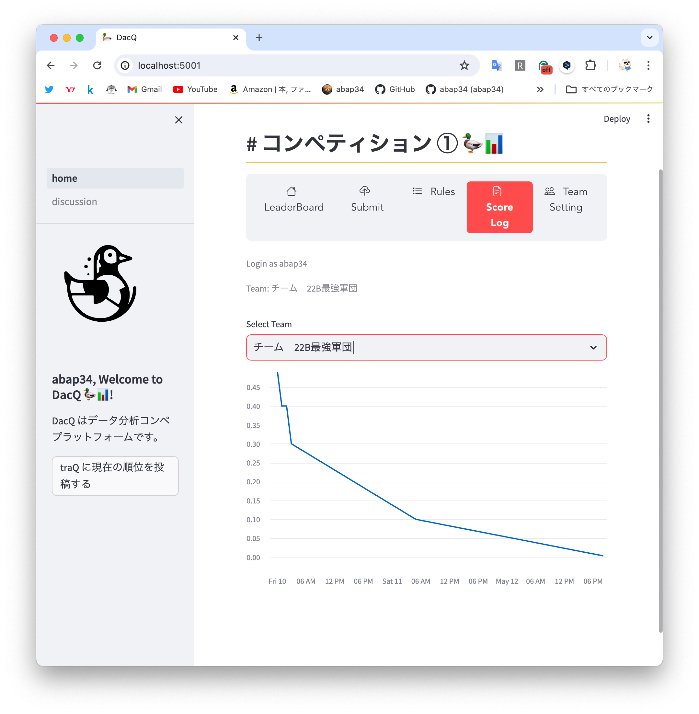
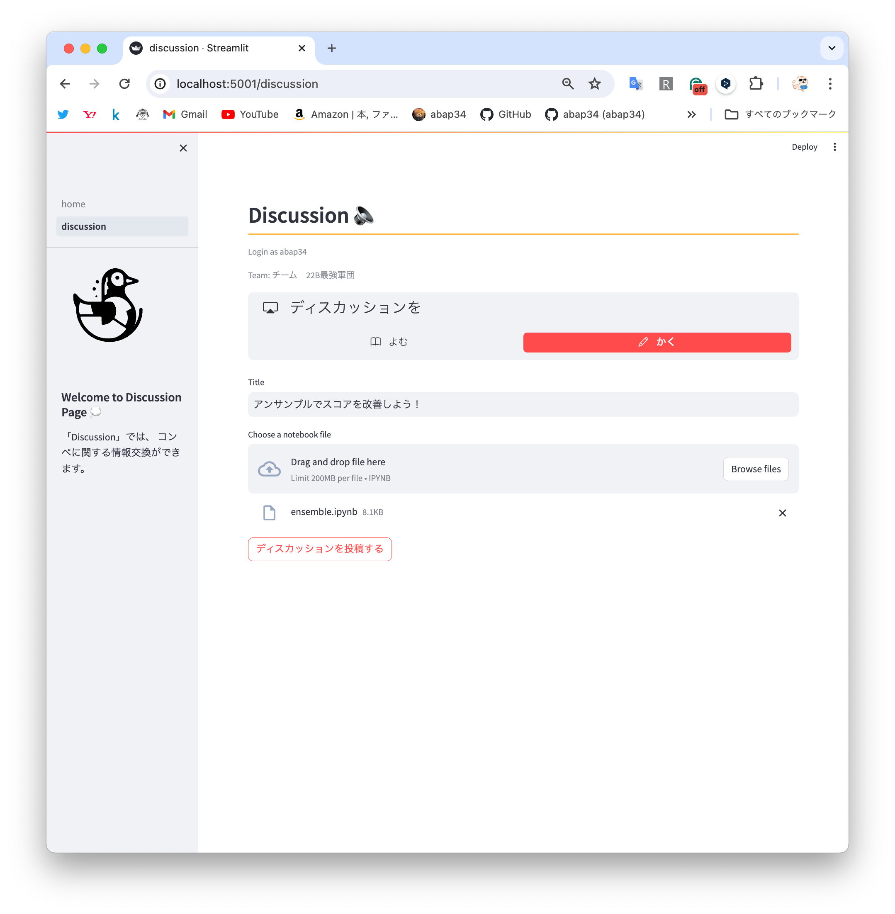

## 開発の経緯


ギャグの人数がいるサークル用に、昨年から部内コンペ用のプラットフォームを運営しています。

今は昨年作った Go製のものが稼働しているのですが、いくつかの課題を抱えていました。

- 評価指標が全然使えない
  - 評価指標の計算まで全て Goで自前で書いたものだったので、新しい評価指標を追加するのが大変です。 Python で書かれたライブラリを使いたいところです。
- 引き継ぎがやばそう
  - 今後後輩に引き継いでいくことを考えると、機械学習に興味があってかつ Webができる人に見てもらう必要があります。 流石にまずそうです。

<blockquote class="twitter-tweet"><p lang="ja" dir="ltr">新歓が終わって、158人の部員がKaggleコミュニティに入ってくれました🤲´-<br>mlに興味がある人が多くてうれしい<br>運営がんばります‼️ <a href="https://twitter.com/hashtag/trap1kaggle?src=hash&amp;ref_src=twsrc%5Etfw">#trap1kaggle</a></p>&mdash; abap34 (@abap34) <a href="https://twitter.com/abap34/status/1788718306008125491?ref_src=twsrc%5Etfw">May 9, 2024</a></blockquote> <script async src="https://platform.twitter.com/widgets.js" charset="utf-8"></script>

というわけで以前から気になっていた streamlit を使って作り直すことにしました。

## 作ったもの

### コンペ機能

まずメインのコンペの機能ですが、
画面を見てもらうとわかるように

- 順位表
- submit
- ルールの確認
- スコアの推移の確認
- チームの作成, 設定

とかが実装されていて、割とちゃんとしたプラットフォームな建て付けをしています。


ベストスコアが出るとお祝いしてくれます。





デザイン力が皆無な自分ですが、streamlit を使うとかなり綺麗なものが出来上がってしまってマジですごい！

### ディスカッション機能

コンペを盛り上げるにはディスカッションが必須です。

なのでディスカッションのページも作りました。


ディスカッションでは、 Jupyter notebook をそのままアップロードすることでディスカッションを作ることができます。





Jupyter Notebookの実体は jsonで、各セルの属性が書いてあるのでそれを丁寧丁寧丁寧に場合わけすると簡単に streamlit で表示できるようになります。

実装するとこんな感じです。

```python
def render_notebook(notebook: bytes):
    notebook = nbformat.reads(notebook, as_version=4)
    for cell in notebook.cells:
        if cell.cell_type == "code":
            st.code(cell.source)
            for output in cell.outputs:
                if output.output_type == "display_data":
                    st.image(read_nbimage(output.data["image/png"]))
                elif output.output_type == "execute_result":
                    if "text/html" in output.data:
                        render_html_out(output.data["text/html"])
                    else:
                        st.write(output.data["text/plain"])
                elif output.output_type == "stream":
                    st.write(output.text)
                elif output.output_type == "error":
                    st.error(output.ename)
                    st.error(output.evalue)
                elif output.output_type == "dataframe":
                    st.dataframe(output.data["text/plain"])
        elif cell.cell_type == "markdown":
            st.markdown(cell.source)
```

便利ですね〜

## 開発記録

こういうのはガッと作るのがいいので、土曜の深夜から作り始めて、一旦寝て日曜に集中して作業して終わらせました。

wakatime で見てみると大体9時間くらいの作業時間でした。


streamlit 使ったらすぐ終わるやろ！　という方向性の想定よりは少しかかりましたが、
とはいえこれくらい綺麗な見た目のものがこの短時間でできるのはだいぶ驚きです。

streamlit ほんとにすごいと思いました。


YAMLを1時間も触ってる謎の時間がありますが、
mariadb の healthcheck をするときに `mysqladmin` で `ping` する方法がなぜか一向にうまくいかずにガチャガチャやっていたせいです。


結局、 mariadb のイメージに最近つくようになった `healthcheck.sh` を使う方法でうまくいきました。


```yaml
version: '3'

services:
  mariadb:
    image: mariadb
    ports:
      - "3306:3306"
    environment:
      MARIADB_ROOT_PASSWORD: password
      MARIADB_DATABASE: app_db
      TZ: Asia/Tokyo
    volumes:
      - ./init.sql:/docker-entrypoint-initdb.d/init.sql
      - mariadb_data:/var/lib/mysql
    healthcheck:
      test:
        [
          "CMD",
          "healthcheck.sh",
          "--su-mysql",
          "--connect",
          "--innodb_initialized"
        ]
      interval: 3s
      timeout: 10s
      retries: 3

  backend:
    build: ./backend
    ports:
      - "5001:5001"
    depends_on:
      mariadb:
        condition: service_healthy

volumes:
  mariadb_data:
```

それと、SQL はそんなに得意ではないので消耗しそうだな〜と思っていたのですが、
GitHub Copilot を使ってみると ほとんど一発で所望のクエリを書いてくれてめちゃくちゃ効率がアップしました。

(一方で streamlit は更新が早いのでろくなコードをサジェストしてくれませんでしたが、まぁしゃーなしですね)


全てを Pythonで書いているのと、大した量のデータを扱っていないので、結構な部分でデータを全て DataFrame にしてしまって、
pandas 芸人力を遺憾無く発揮して手早く実装を済ませました。

## 感想

綺麗な見た目の Webサービスが作れてうれしい 😊


これでコンペが盛り上がるといいな〜


## 今日の一曲

<iframe width="560" height="315" src="https://www.youtube.com/embed/mwfgMm2RGNk?si=00Oh44vU7f2shXU2" title="YouTube video player" frameborder="0" allow="accelerometer; autoplay; clipboard-write; encrypted-media; gyroscope; picture-in-picture; web-share" referrerpolicy="strict-origin-when-cross-origin" allowfullscreen></iframe>