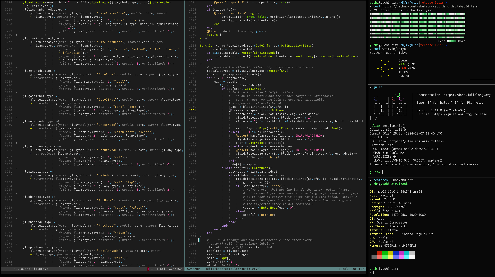
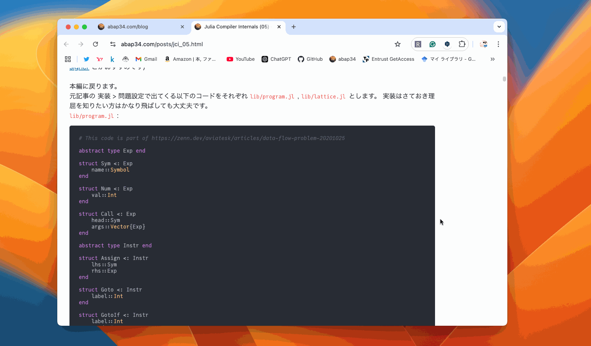
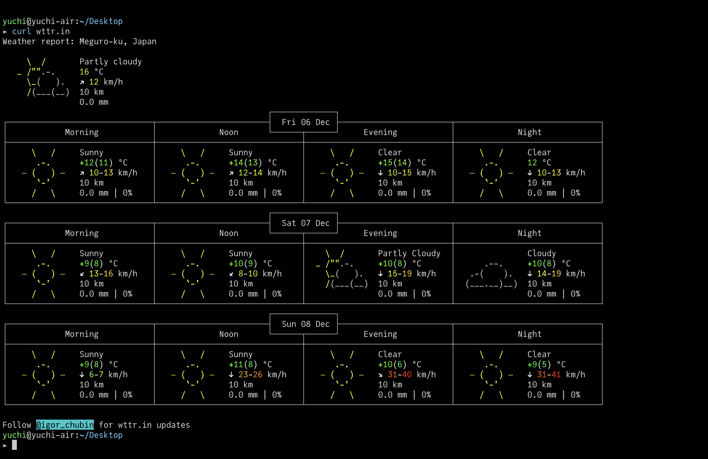
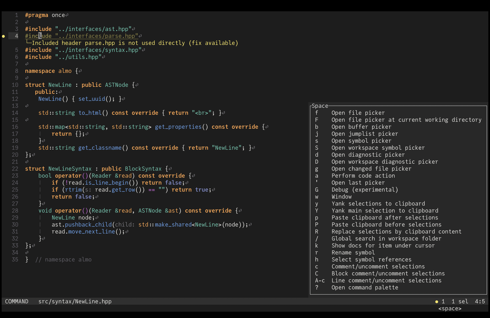
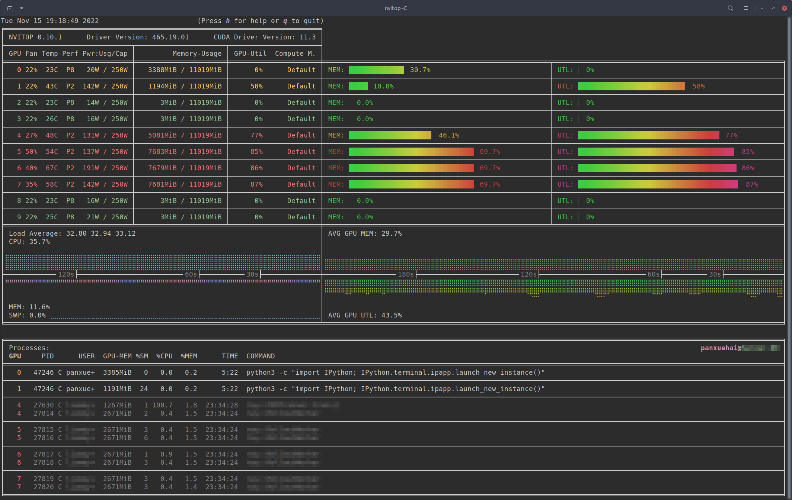
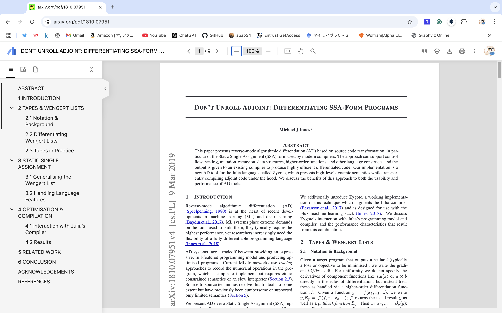
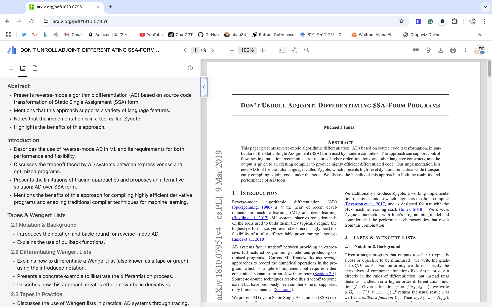
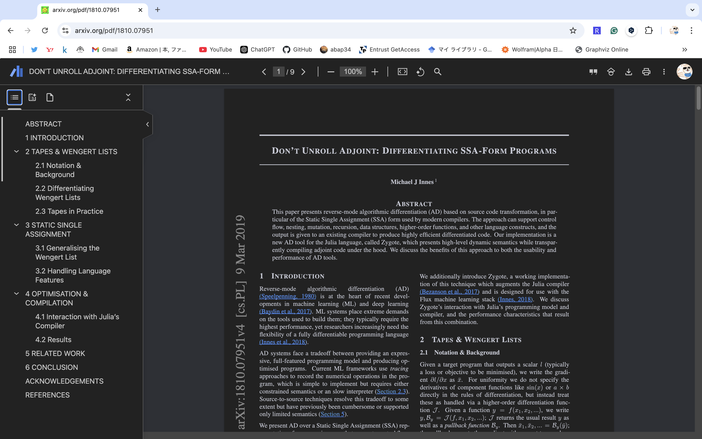
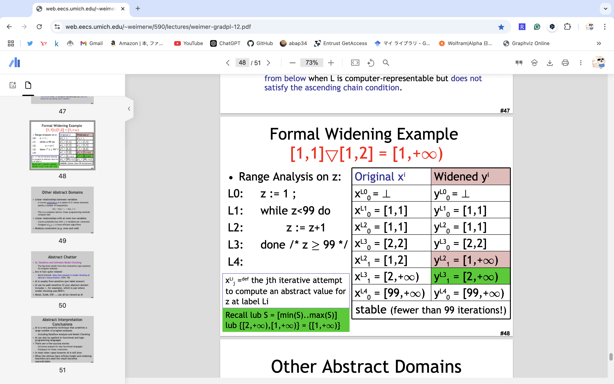
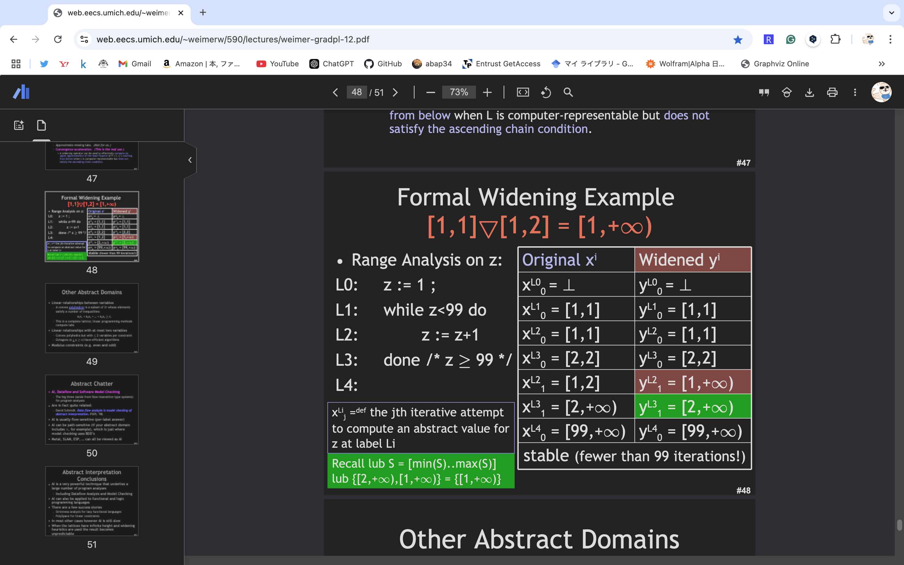

この記事は、[開発環境を紹介しますアドベントカレンダー](https://adventar.org/calendars/10438) 6日目の記事です。

## こんばんは

おい全然埋まってないぞ！！！！ [開発環境を紹介しますアドベントカレンダー！！！！！！！！](https://adventar.org/calendars/10438) 

みなさんはあんまり使っている人がいない変な CLI ツール, エディタ, Chrome 拡張などをお使いでしょうか？

そうでなくともこの手の便利ツールを網羅的に知ることは難しいので、実は人の開発環境を見るのは結構面白いものを知れます。

というわけでこういうアドカレを作ったのですが全然埋まっていないのでまずは自分で書こうと思います。

(ここでいう開発環境は本当に広い意味で、開発に使うものの話ならなんでも良いです)

網羅的に書くのは当然無理なので適当に変なやつを載せます。

とくに関係ないと思いますが自分の素性をかくと

- 機械学習, 言語処理系などをしています
- プログラムもめっちゃ書くし pdf もめっちゃ読むし紙とペンカリカリもめっちゃする
- よく書く言語は Python, Julia, C++ たまに Lisp 最近は Coq とかも

という感じです。

## 基本

### OS: macOS

小学校1年生のときに Mac を与えられて以来、 14年間　macOS を使い続けています。

もはや他の OS を普段使いすることは考えられないです。

これは初代 iMac で何かを書く @abap34 when he was 6 years old です。天才エンジニアの幼少期すぎる

### ターミナルエミュレータ

使っているターミナルエミュレータは iTerm2 です。

Ctrl 2回押し で全画面に表示するようにしています。

すぐに切り替えられて思考が飛ばないので気に入っています。

フォントは [JuliaMono](https://juliamono.netlify.app/) というのを使っています。

数学記号系が非常に充実しているので、このフォントをいろいろなところで使っています。

### シェル

シェルは fish を使っています。

デフォルトでもいい感じの見た目・異常に補完が効くことなどが気に入ってずっと使っています。

また、アルファベット 2文字が枯渇するのではないかという勢いで異常な alias を貼りまくっており、
例えば `code .` を `ch` にする、みたいなノリで全てを 2タイプで終わらせています。便利かは不明です。

### エディタ

エディタは Helix と VSCode を使っています。

長らく VSCode ユーザだったんですが、最近は Helix でも結構書いています。

Jupyter Notebook, Coq, Markdown, LaTeX を書くときは VSCode, それ以外では Helix を使っています。

脳にあるプログラムを文字にして書き込む、というパートはやはり Helix のようなモーダルエディタの方が速くできるだろうと思い練習中です。

Vim でなく Helix を選んだのは操作が体系的で覚えやすそうと思ったからです。 (逆張り精神もあります)

一方で、 Helix はまだまだ未成熟でなんとファイルツリーすら表示できない！ [^1]
ので、初見のコードベースをいじるときは VSCode を使っています。

AI による支援をたくさん受けられるというのもあります。 Copilot Chat めっちゃ便利。

[^1]: 実際に動く実装もありますが、コアに入れずにプラグインとして実装するという方針になり、プラグインシステムがまだ未実装なので使えないという感じです。なので既存の実装を手元でビルドすれば使えはします。

Helix 自体の設定で特徴的なところを挙げるなら、

- Diagnostic をインラインに表示するようにしている
- 引数名や型推論の結果を Inlay Hints で表示するようにしている

などを設定しています。上だと 4行め, 30行めとかがそうですね。

あとは Helix はテーマが結構オシャレなのがデフォルトでたくさん入っているのもいい点です。

テーマで気分を変えるタイプで、VSCode にゆうに 300 個を超えるテーマを入れて毎日切り替えているので、Helix はその点でも評価高いです。

## 便利な VSCode拡張

### Data Preview

[Data Preview](https://marketplace.visualstudio.com/items?itemName=RandomFractalsInc.vscode-data-preview) は、なんかやたらリッチなデータのプレビューができる拡張です。

結構重いのであまり常に使える感じではないですが、小さいデータを見るときにはかなり便利でよく使っています。

### Easzy Snippet

二秒でスニペットを登録できるやつです。

### Draw.io Integration

VSCode で draw.io を使えるようにするやつです。ブログ書くときに便利。

## 便利な CLI ツール・Chrome拡張など

### done

やっていることの性質上、実行終了まで短くても数十分, 場合によっては数時間, 数十時間かかるプログラムをよく回すので終わったら通知してもらうやつが必要です。

数日かかる系は流石にまともな Notification (Slack とか Discord に投げるやつ) を使いますが、簡単なものなら

で十分です。 これはある程度以上の長さのプログラムの実行が終わると Status と一緒に通知してくれる便利なやつです。おすすめです。

### nvitop

GPU が焼き切れないか心配しながら日々計算を回していますが、モニタリングで便利なのが

です.

かなりいい感じに CPU/GPU の使用率を表示してくれます。 `nvidia-smi` を回すのはやめてこっちを使いましょう。

### Google Scholar PDF Reader

[Google Scholar PDF Reader](https://chromewebstore.google.com/detail/google-scholar-pdf-reader/dahenjhkoodjbpjheillcadbppiidmhp?hl=ja) は Chrome拡張なのですが、めちゃくちゃにおすすめです。

pdf を開くとまずこのようにいい感じに目次を出してくれたり、

AI 要約をしてくれたり、また Google Scholar のマイラブラりに一発でグループ分けして追加したり、引用を一発で出せたり...とまぁ色々いいところはあるんですが、
個人的に一番革新的で感動したのは

この **夜間モード** です。 これは何をしているかというと、夜間モードにするといい感じに黒基調の色に pdf を変換してくれます！

何がすごいかというと、

こんな感じのも

結構読める感じに変換してくれます！ 

基本的に寝る前にベッドでこういうのを読んでいるので目が毎晩破壊されて無事不眠症を発動していたのですが、
これのおかげでかなり楽になって本当に感動しました。

なので普段はこれを使って pdf を読んでいます。

翻訳系は昔は Readable を使っていたんですが、 ChatGPT だけで同等以上のことができると感じたので今はそちらのみを使っています。

基本的に ChatGPT に投げて要約を読んで、細かいところを読みつつ英語がわからなったりしたら訳してもらったり、必要な前提知識をあげてもらったりしています。

### Wakatime

自分はあまり天才タイプではないので、なるべく長い時間計算機に触れたいと思っていて、
Wakatime を入れてその確認・モチベ維持をしています。

Wakatime は VSCode, fish はもちろん、Chrome拡張を入れて GitHub を見てる時間とかも測れたりするのでおすすめです！ 
毎日 10時間コーディング！(素振り) 

### GitHub 関連

他の GitHub 関連の便利ツールだと、GitHub のファイルにアイコンをつけてくれる [Material Icons for GitHub](https://chromewebstore.google.com/detail/material-icons-for-github/bggfcpfjbdkhfhfmkjpbhnkhnpjjeomc) とか Contribution Graph をいい感じにしてくれる [GitHub Isometric Contributions](https://chromewebstore.google.com/detail/github-isometric-contribu/mjoedlfflcchnleknnceiplgaeoegien)　とかも使っています。

飽きたのでこの辺にします。

## 今日の一曲

<iframe width="560" height="315" src="https://www.youtube.com/embed/2dnYpOeH2Wg?si=JZvAku_8fJLjfGfR" title="YouTube video player" frameborder="0" allow="accelerometer; autoplay; clipboard-write; encrypted-media; gyroscope; picture-in-picture; web-share" referrerpolicy="strict-origin-when-cross-origin" allowfullscreen></iframe>
