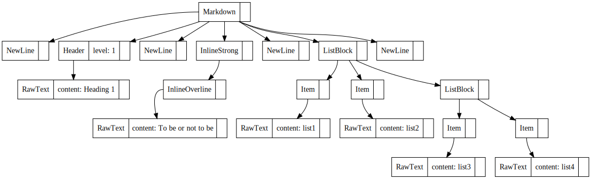

## 脚注機能の実装方法に関する議論のメモ

最近、このブログを作ってくれている Markdownパーサである almo [^1] に脚注を実装しました。

(まさに今つかったこれです)


脚注は、 Common Mark [^2] でも GFM [^3]　でも定められていない構文ですが、長いドキュメントを書くときには結構欲しくなります。

[^1]: [https://github.com/abap34/almo](https://github.com/abap34/almo)
[^2]: [https://spec.commonmark.org/](https://spec.commonmark.org/)
[^3]: [https://github.github.com/gfm/](https://github.github.com/gfm/)


ところで、脚注はパーサを書くことを考えると他の構文と比べてやや異質な存在です。

そのため実装の仕方に割と幅があります。　この記事では almo の脚注の実装方法とどうしてそうなったか、というのを日記がてら振り返りたいと思います。

## 脚注の何が特別なのか？

そもそもたいていの md2html な処理系たちはたいてい次のようなフローで処理を行います。

1. Markdown をパースして AST に変換
2. AST を走査して HTML に変換

almo も同様です。


例えば

```md
# Heading  1

**~~To be or not to be~~**

- list1
- list2
  - list3
  - list4
```

のような md ファイルを almo に渡して、

```python
import almo

md = """
# Heading  1

**~~To be or not to be~~**

- list1
- list2
  - list3
  - list4
"""

ast = almo.parse(md)
```


`ast.to_dot()` してみると



という結果が吐かれて、こんな感じの AST が得られていることがわかります。

ここから HTML に変換するわけです。


ここで、パースするとき・この AST から HTML を生成するときのうれしい性質として各ノードは独立に考えてもいいというのがあります。


それぞれのノードは (子ノードが valid な出力をしてくれているという前提に立って)、　自分が正しい出力をすれば良いだけです。

<span class="lined">**しかし、脚注は違います。**</span>

脚注 (の定義) は、末尾に生成される必要があります。

そのほかにも、

- 番号を振る
- 未定義な脚注がないかチェックする

などを考えると、AST 全体に渡るグローバルな状態を検査する必要があります。


したがって、脚注の実装は単に構文を追加するというより全体にわたる実装の変更を考える必要があります。


## どう実装するのか？

最初に自分が提案したのは、パースをする際に使う `Reader` にグローバルな状態を持たせてパースさせていくことでした。


というのも、実は類似の仕組みがすでに実装されていたためです。

これは almo 特有の事情ですが、Pyodide をロードするのは非常にコストがかかるので、不要ならこれをスキップするために
「Pyodide が必要か？」というのを調べるために `Reader` クラスに情報を持たせる仕組みがすでにありました。


そのため、自分は当初脚注の実装を任せた共同開発者にこれを提案しましたが、他の共同開発者からは別の仕組みを提案されました。


そもそも、 `Reader` クラスにあまり情報を持たせるのはうれしくありません。
この手の構文が増えるたびに肥大化していくのが目に見えています。


そこで almo では、脚注の実装を AST に対する後処理として行うことにしました。

つまり、 (第一段階の) AST を作る段階では末尾に移動する、正しい脚注定義がなされているかをチェックする、などの処理は行わず、AST が完成した後に AST を走査して脚注を処理する方式です。


この実装で統一することで 「Pyodide が必要か？」という処理も書き直すことができます。


## 実装

[実際の実装](https://github.com/abap34/almo/blob/b3389f3126551e85ae6d3bebe8a77913793fa61d/src/render.hpp#L100)　では、


```cpp
void move_footnote_to_end(Markdown& ast) {
    std::vector<std::shared_ptr<ASTNode>> footnote_defs =
        ast.nodes_byclass("FootnoteDefinition");

    std::shared_ptr<DivBlock> footnote_div =
        std::make_shared<DivBlock>("footnote");

    ast.pushback_child(footnote_div);

    for (auto node : footnote_defs) {
        ast.move_node(node, footnote_div);
    }
}
```

という感じで、 AST を走査して脚注を末尾に移動させる処理を行っています。　便利！


## 感想

こんな感じの流れでこういう実装にしたんだよね、という話を 同じく自分のブログのためにマークアップ言語を作っている友人に話したら、
「全く同じ流れで全く同じ方式に行き着いた」と言われてびっくりしました。　

おもしろいもんですね 🤗


## 今日の一曲

最近雨やばいですよね


<iframe width="560" height="315" src="https://www.youtube.com/embed/yEpKC0wXy4M?si=MvIcU92Y6I_1f1rt" title="YouTube video player" frameborder="0" allow="accelerometer; autoplay; clipboard-write; encrypted-media; gyroscope; picture-in-picture; web-share" referrerpolicy="strict-origin-when-cross-origin" allowfullscreen></iframe>


