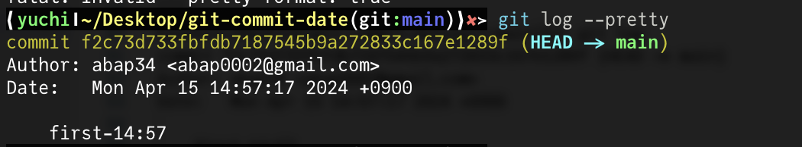
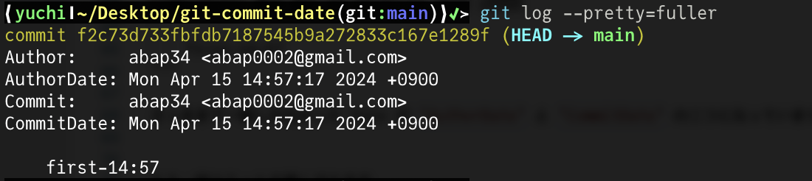
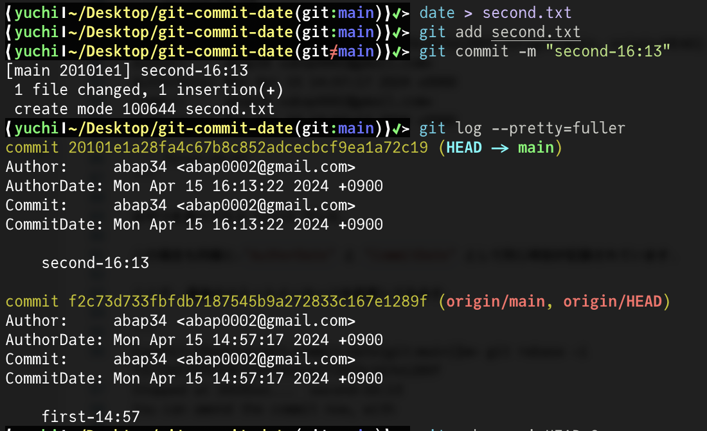
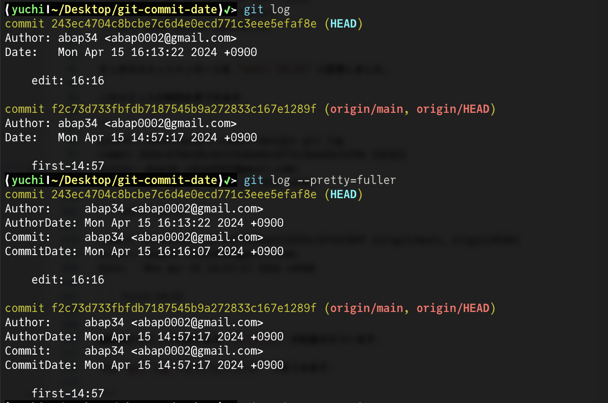
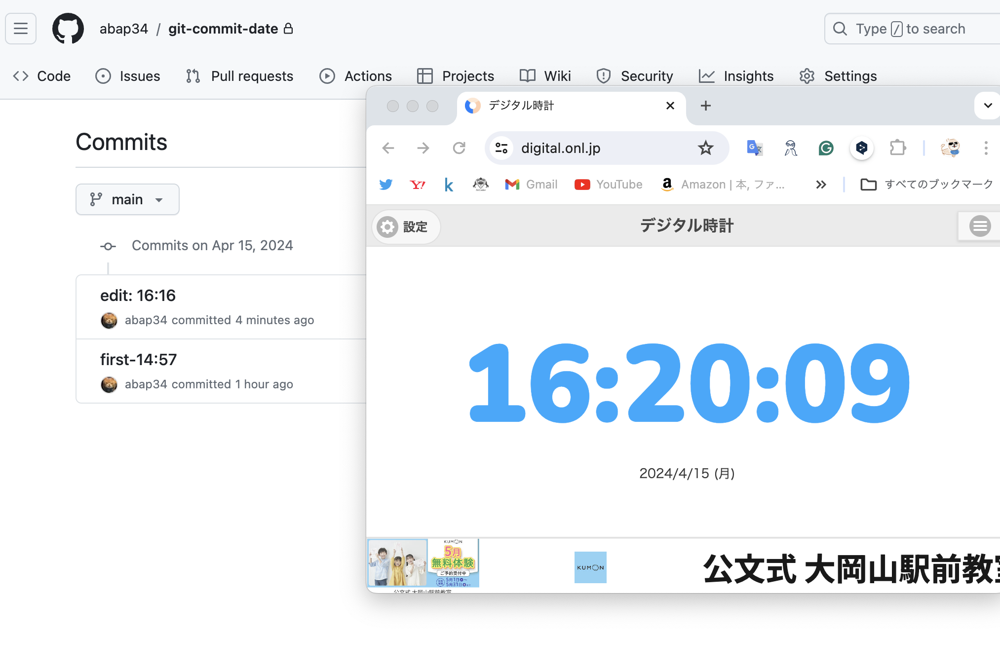
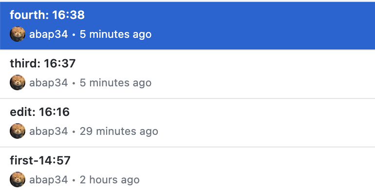
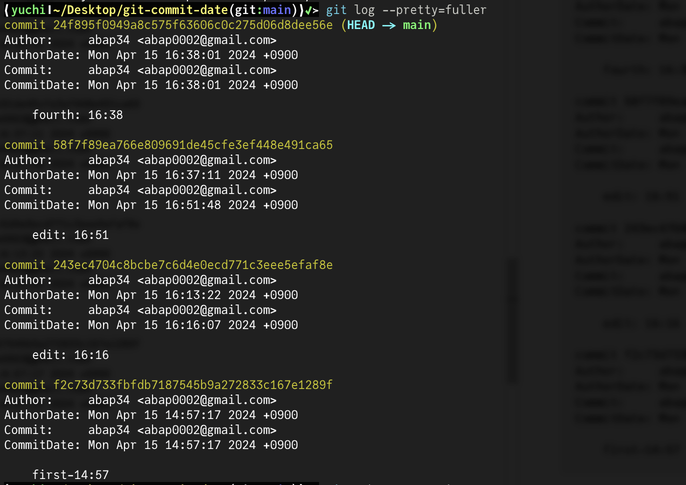
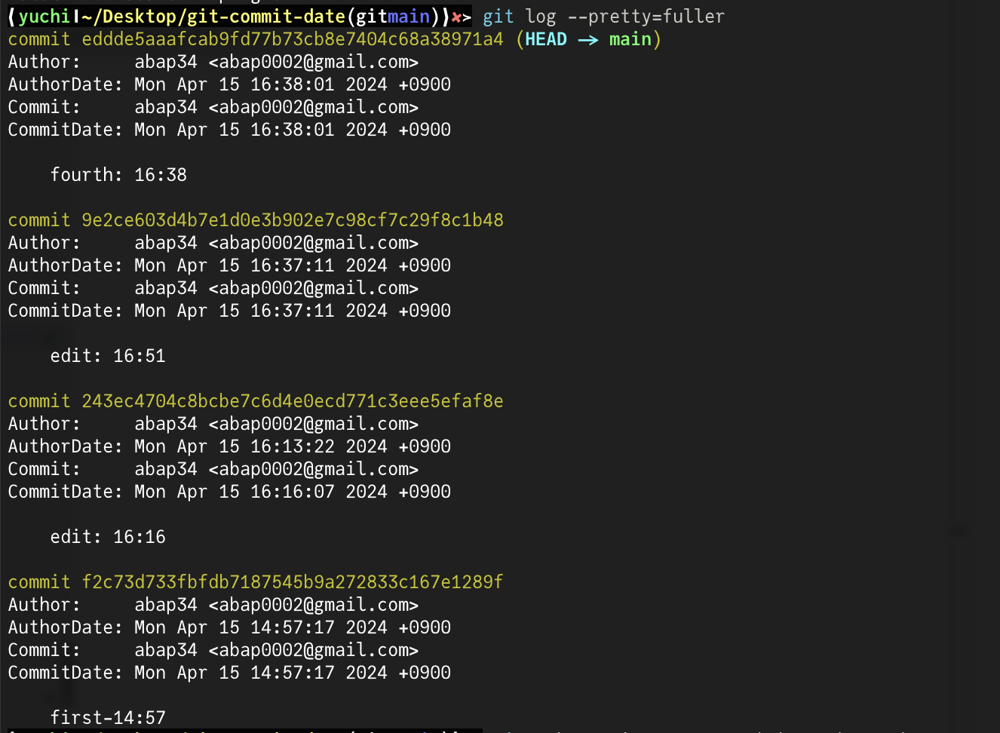

## イントロ

`git rebase` を使うと昔のコミットを編集することができます。


昔のコミットに Co-Author を追加したくなり rebase した後に、コミット時刻が `git log` で見ているときと GitHub で違うことに気がつき、いろいろ調べてみたのでまとめます。


## Git の二つの Date

Git でコミットするとコミット時刻を記録してくれますが、実は二つの時刻があります。

実例で見てみます。


```
❰yuchi❙~/Desktop❱✔≻ mkcd git-commit-date
❰yuchi❙~/Desktop/git-commit-date❱✔≻ git init .
Initialized empty Git repository in /Users/yuchi/Desktop/git-commit-date/.git/
❰yuchi❙~/Desktop/git-commit-date(gitmain)❱✔≻ date > first.txt
❰yuchi❙~/Desktop/git-commit-date(gitmain)❱✔≻ git add first.txt
❰yuchi❙~/Desktop/git-commit-date(git≠main)❱✔≻ git commit -m "first-14:57"
[main (root-commit) f2c73d7] first-14:57
 1 file changed, 1 insertion(+)
 create mode 100644 first.txt
```

とりあえず `first.txt` というファイルを作成して `git commit` しました。

このコミットの時刻を調べてみます。　

(`git log` に ハイライトが当たらなくて死ぬほど見にくいので、スクショにします)



コミットした時刻の `Date:   Mon Apr 15 14:57:17 2024 +0900` が記録されています。 
これを push して GitHub 上で見ても当然この時刻が表示されます。


ところが、 `git log --pretty=fuller` でくわしく見てみると、



さっきまで一個しかなかった Date が `AuthorDate` と `CommitDate` の二つになっています。


もう一個コミットを積んでみます。




おやつを食べてたら 16:13 でした。

この場合も同様に、`AuthorDate` と `CommitDate` として同じ時刻が記録されています。

ここで、 最後のコミットメッセージを変更してみます。

```
❰yuchi❙~/Desktop/git-commit-date(git:main)❱✘≻ git rebase -i f2c73d733fbfdb7187545b9a272833c167e1289f
Stopped at 20101e1...  second-16:13
You can amend the commit now, with

  git commit --amend

Once you are satisfied with your changes, run

  git rebase --continue

❰yuchi❙~/Desktop/git-commit-date❱✘≻ git commit --amend -m "edit: 16:16"
[detached HEAD 243ec47] edit: 16:16
 Date: Mon Apr 15 16:13:22 2024 +0900
 1 file changed, 1 insertion(+)
 create mode 100644 second.txt
```

さっきのコミットメッセージを `edit: 16:16` に変更しました。

このコミットの時刻を見てると、編集前のコミット時刻である `16:13:22` が記録されていますが、
`git log --pretty=fuller` で見てみると、




こんな感じで、 `AuthorDate` にはコミット時刻が、 `CommitDate` には `git commit --amend` した時刻が記録されていることがわかります。


これを GitHub で見てみるとどうなるでしょうか。

```
❰yuchi❙~/Desktop/git-commit-date❱✔≻ git rebase --continue
Successfully rebased and updated refs/heads/main.
❰yuchi❙~/Desktop/git-commit-date(git:main)❱✔≻ git push origin main -f
Enumerating objects: 4, done.
Counting objects: 100% (4/4), done.
Delta compression using up to 8 threads
Compressing objects: 100% (2/2), done.
Writing objects: 100% (3/3), 318 bytes | 318.00 KiB/s, done.
Total 3 (delta 0), reused 0 (delta 0), pack-reused 0
To https://github.com/abap34/git-commit-date.git
   f2c73d7..243ec47  main -> main
```





と、こういう感じで `CommitDate` が表示されます。つまり、

- `AuthorDate`
  - コミットが作られた時刻
  - `git log` で表示される
- `CommitDate`
  - コミットが最後に編集された時刻
  - GitHub で表示される

です。なんで `git log` と GitHub で揃ってないんでしょうか。


## AuthorDate と CommitDate を揃える

さて、二つの時刻があるのはいいとして、これで困ることもあります。


最初にも書いたのですが、昔ペアプロで作ったコミットを自分名義だけでコミットしてしまったので、
今更ながら Co-Author を追加したくなりました。


Co-Authorの追加 は Gitの機能ではなく GitHub の機能ですが、要はコミットメッセージに `Co-Authored-By: ` を追加するという作業です。


なので昔のコミットまで戻ってコミットメッセージを修正すればいいのですが、ここまでで分かるように普通に rebase してしまうと `CommitDate` が変わってしまい、GitHub で表示される時刻が変わってしまいます。


`AuthorDate` は残ってますが、 GitHub上でコミット履歴を見たときに全部 rebase したときの時刻になっているのはちょっと嫌です。


そんな困った人のために実は rebase にオプションが用意されています。


説明のために何個かコミットを積みます。

```
❰yuchi❙~/Desktop/git-commit-date(git:main)❱✔≻ date > third.txt
❰yuchi❙~/Desktop/git-commit-date(git:main)❱✔≻ git add .
❰yuchi❙~/Desktop/git-commit-date(git≠main)❱✔≻ git commit -m "third: 16:37"
[main 4bbedd6] third: 16:37
 1 file changed, 1 insertion(+)
 create mode 100644 third.txt
❰yuchi❙~/Desktop/git-commit-date(git:main)❱✔≻ date > fourth.txt
❰yuchi❙~/Desktop/git-commit-date(git:main)❱✔≻ git add .
❰yuchi❙~/Desktop/git-commit-date(git≠main)❱✔≻ git commit -m "fourth: 16:38"
[main bfa019a] fourth: 16:38
 1 file changed, 1 insertion(+)
 create mode 100644 fourth.txt
```

今はこんな感じです。




三番目のコミットを同じように編集します。

```
❰yuchi❙~/Desktop/git-commit-date(git:main)❱✔≻ git rebase -i 243ec4704c8bcbe7c6d4e0ecd771c3eee5efaf8e
Stopped at 9e2ce60...  edit: 16:51
You can amend the commit now, with

  git commit --amend

Once you are satisfied with your changes, run

  git rebase --continue
❰yuchi❙~/Desktop/git-commit-date❱✔≻ git commit --amend -m "edit: 16:51"
[detached HEAD 3c7157c] edit: 16:51
 Date: Mon Apr 15 16:37:11 2024 +0900
 1 file changed, 1 insertion(+)
 create mode 100644 third.txt
❰yuchi❙~/Desktop/git-commit-date❱✔≻ git rebase --continue
Successfully rebased and updated refs/heads/main.
```

これをすると先ほど見たように `CommitDate` が変わってしまいます。




ここから `CommitDate` を揃えましょう。


先ほどと同じところまで rebaseするときに、 `--committer-date-is-author-date` オプションをつけます。

```
❰yuchi❙~/Desktop/git-commit-date(git:main)❱✘≻ git rebase -i 243ec4704c8bcbe7c6d4e0ecd771c3eee5efaf8e --committer-date-is-author-date
Successfully rebased and updated refs/heads/main.
```




すると、三番目のコミットの `CommitDate` が `AuthorDate` と同じになりました！

これで GitHub上でも履歴を保ったまま Co-Author を追加することができました。


## まとめ
- コミットには時刻が二つ記録されてるよ
- ところによって表示されるものが違うので気をつけよう
- rebase するときに `--committer-date-is-author-date` オプションをつけると `CommitDate` を `AuthorDate` に揃えることができて便利

## 今日の一曲

<iframe width="560" height="315" src="https://www.youtube.com/embed/fGx6K90TmCI?si=7QNwsgeLoPxrsEo_" title="YouTube video player" frameborder="0" allow="accelerometer; autoplay; clipboard-write; encrypted-media; gyroscope; picture-in-picture; web-share" referrerpolicy="strict-origin-when-cross-origin" allowfullscreen></iframe>