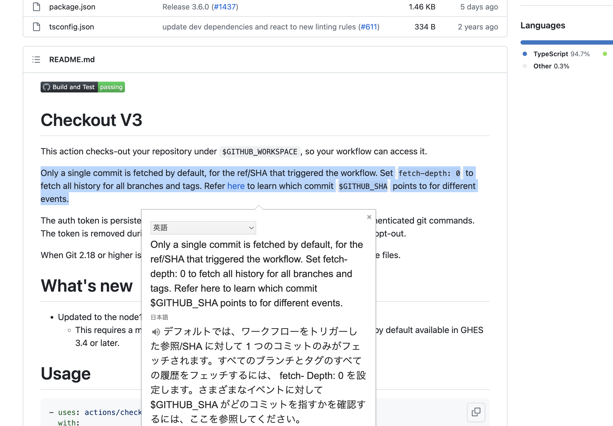

# GitHub Actionsで過去コミットとかを参照したいときはfetch-depthを指定しないとダメだった

## `git diff` が通らない


[このページをビルドしてくれるGitHub Actionのワークフローファイル](https://github.com/abap34/my-site/blob/main/.github/workflows/blog.yml)では、
マークダウンファイルで差分があったときだけビルドするために

```
      - name: Check for Changes in MD Files
        id: check_changes
        run: |
          changed_files=$(git diff --name-only ${{ github.event.before }} ${{ github.sha }} | grep '\.md$' || true)
          echo "changed_files=$changed_files" >> $GITHUB_OUTPUT
          if [[ -z "$changed_files" ]]; then
            echo "No changes in MD files. Skipping build."
          else
            echo "Change: $changed_files"
          fi
```

みたいなことをしていますが、これを普通に書くだけでは
`fetal: bad obejct xxx...`となります。


全然原因がわからず、
`actions/checkout`を見にいくと、




すいません。 READMEの一番上に書いてありました。

## 対応策

```
    steps:
      - name: Checkout Repository
        uses: actions/checkout@v2
        with:
            fetch-depth: 0
```

として全てのコミットを参照できるようにすると
`git diff`が動いて差分だけビルドできるようになりました。

