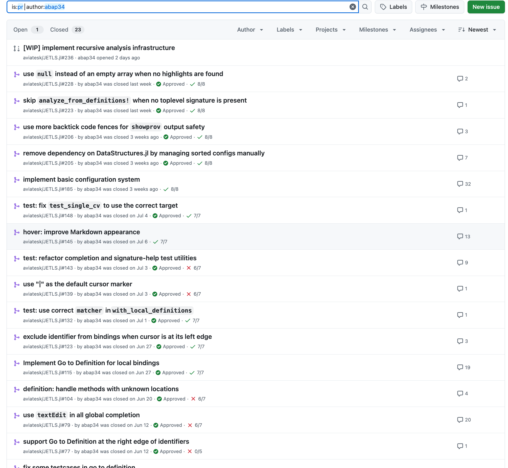
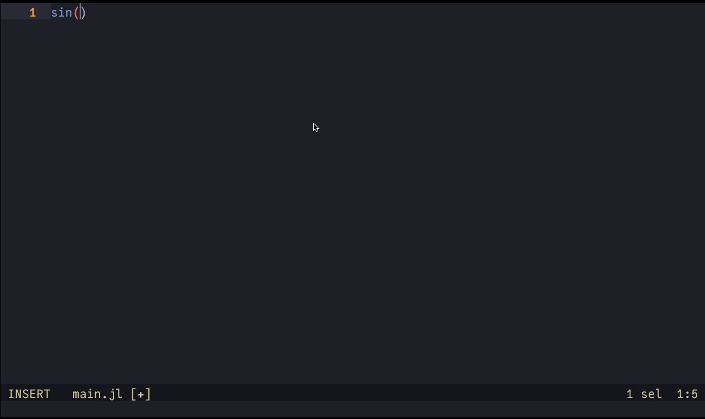
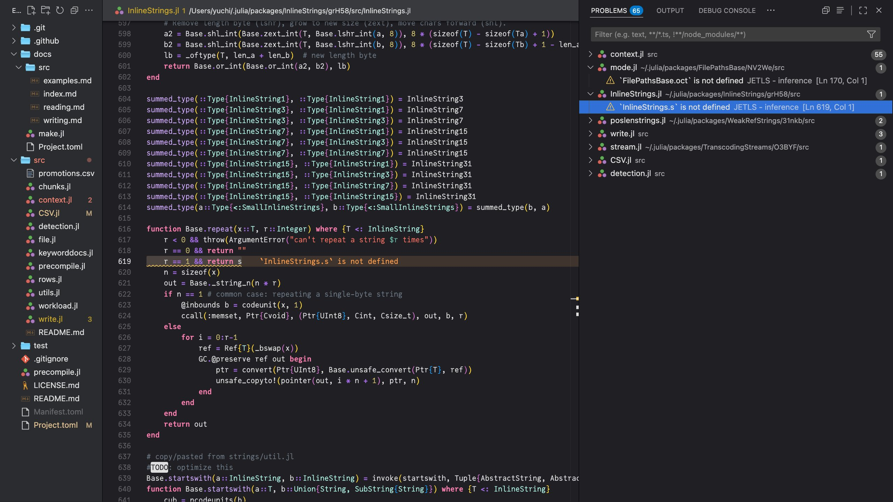

## GSoC 2025 Final Report

This blog is the final report of my work during Google Summer of Code 2025, where I worked on the project [Development of a New Language Server for Julia](https://summerofcode.withgoogle.com/programs/2025/projects/9PZY6C2m).

This was an exciting project to build a  new language server that leverages Julia’s latest compiler infrastructure.

## Achievements

Since this project was still in a very early stage, the proposal planned for me to take on a wide range of tasks in close collaboration with my mentor. In practice, I worked on a very broad set of features.

The image shows some of the PRs I opened for JETLS.

As can be seen from the number of comments, my mentor [@aviatesk](https://github.com/aviatesk) and the Julia community put in great effort to support my contributions.

### Major Contributions

Here are some of the major features I contributed:

#### Implementation of Go to Definition for methods

- [https://github.com/aviatesk/JETLS.jl/pull/61](https://github.com/aviatesk/JETLS.jl/pull/61)
- JETLS can also jump to functions defined by `@eval` macro :)
- In the future, we plan to extend this so that only the methods that could actually be called are suggested, based on type analysis.

#### Implementation of Go to Definition for local bindings

<video controls width="600">
  <source src="https://github.com/user-attachments/assets/cb924339-4475-4171-b390-db3c88ddc257" type="video/mp4">
  Your browser does not support the video tag.
</video>

- [https://github.com/aviatesk/JETLS.jl/pull/115](https://github.com/aviatesk/JETLS.jl/pull/115)  
- This is where JuliaLowering played a remarkable role. It is great that such a feature can be implemented with relatively little code by leveraging JuliaLowering.

#### Implementation of a basic configuration system

- [https://github.com/aviatesk/JETLS.jl/pull/185](https://github.com/aviatesk/JETLS.jl/pull/185)
- It also allows dynamic changes after startup.
- In the future, We plan to [publish a schema](https://www.schemastore.org/) so that completion and validation can be provided in many editors.

#### Implementation of recursive analysis (WIP, but close to completion at the time of writing so it may be merged when this is published)

- [https://github.com/aviatesk/JETLS.jl/pull/236](https://github.com/aviatesk/JETLS.jl/pull/236)
- The current analysis routines of JET did not have the ability to recursively locate and analyze the source code of packages. My contribution was to extend JET with such functionality and integrate it into JETLS.
- This required a detailed study of Julia’s package loading mechanism, which was quite challenging.

#### Some UI improvements

While analysis and various infrastructure are important, even small UI improvements can greatly affect the usability of a language server. [https://github.com/aviatesk/JETLS.jl/pull/145](https://github.com/aviatesk/JETLS.jl/pull/145) and [https://github.com/aviatesk/JETLS.jl/pull/206](https://github.com/aviatesk/JETLS.jl/pull/206) and are examples of such contributions. These are small implementations, but they improve the user experience highly.

The same kind of consideration was required when implementing the features described above. For instance, when implementing Go to ~, how should we decide what is "under the cursor" ? This is not a straightforward question.
In cases like `│func(x)` and also in cases like `func│(x)`, where should it go? ─ both to the definition of `func`, isn’t it?
([https://github.com/aviatesk/JETLS.jl/pull/61#discussion_r2134707773](https://github.com/aviatesk/JETLS.jl/pull/61#discussion_r2134707773))

#### Additional details

Including to these, many PRs—including bug fixes and contributions to related packages—were merged :)

merged PRs

- [https://github.com/aviatesk/JETLS.jl/pull/236](https://github.com/aviatesk/JETLS.jl/pull/236)  
- [https://github.com/JuliaStrings/InlineStrings.jl/pull/88](https://github.com/JuliaStrings/InlineStrings.jl/pull/88)  
- [https://github.com/aviatesk/JETLS.jl/pull/228](https://github.com/aviatesk/JETLS.jl/pull/228)  
- [https://github.com/c42f/JuliaLowering.jl/pull/41](https://github.com/c42f/JuliaLowering.jl/pull/41)  
- [https://github.com/aviatesk/JETLS.jl/pull/223](https://github.com/aviatesk/JETLS.jl/pull/223)  
- [https://github.com/c42f/JuliaLowering.jl/pull/37](https://github.com/c42f/JuliaLowering.jl/pull/37)  
- [https://github.com/aviatesk/JETLS.jl/pull/206](https://github.com/aviatesk/JETLS.jl/pull/206)  
- [https://github.com/aviatesk/JETLS.jl/pull/205](https://github.com/aviatesk/JETLS.jl/pull/205)  
- [https://github.com/aviatesk/JETLS.jl/pull/185](https://github.com/aviatesk/JETLS.jl/pull/185)  
- [https://github.com/aviatesk/JETLS.jl/pull/148](https://github.com/aviatesk/JETLS.jl/pull/148)  
- [https://github.com/aviatesk/JETLS.jl/pull/145](https://github.com/aviatesk/JETLS.jl/pull/145)  
- [https://github.com/aviatesk/JETLS.jl/pull/143](https://github.com/aviatesk/JETLS.jl/pull/143)  
- [https://github.com/aviatesk/JETLS.jl/pull/139](https://github.com/aviatesk/JETLS.jl/pull/139)  
- [https://github.com/aviatesk/JETLS.jl/pull/132](https://github.com/aviatesk/JETLS.jl/pull/132)  
- [https://github.com/aviatesk/JETLS.jl/pull/123](https://github.com/aviatesk/JETLS.jl/pull/123)  
- [https://github.com/aviatesk/JETLS.jl/pull/115](https://github.com/aviatesk/JETLS.jl/pull/115)  
- [https://github.com/aviatesk/JETLS.jl/pull/104](https://github.com/aviatesk/JETLS.jl/pull/104)  
- [https://github.com/aviatesk/JETLS.jl/pull/79](https://github.com/aviatesk/JETLS.jl/pull/79)  
- [https://github.com/aviatesk/JETLS.jl/pull/77](https://github.com/aviatesk/JETLS.jl/pull/77)  
- [https://github.com/aviatesk/JETLS.jl/pull/72](https://github.com/aviatesk/JETLS.jl/pull/72)  
- [https://github.com/aviatesk/JETLS.jl/pull/69](https://github.com/aviatesk/JETLS.jl/pull/69)  
- [https://github.com/aviatesk/JETLS.jl/pull/61](https://github.com/aviatesk/JETLS.jl/pull/61)  
- [https://github.com/aviatesk/JETLS.jl/pull/56](https://github.com/aviatesk/JETLS.jl/pull/56)  
- [https://github.com/aviatesk/JETLS.jl/pull/40](https://github.com/aviatesk/JETLS.jl/pull/40)  
- [https://github.com/aviatesk/JETLS.jl/pull/31](https://github.com/aviatesk/JETLS.jl/pull/31)  
- [https://github.com/aviatesk/JETLS.jl/pull/11](https://github.com/aviatesk/JETLS.jl/pull/11)  
- [https://github.com/aviatesk/JETLS.jl/pull/10](https://github.com/aviatesk/JETLS.jl/pull/10)  

As noted earlier, this language server leverages Julia’s new compiler infrastructure.
Deepening my understanding of these systems through this development was itself a great outcome for me.

It was also valuable that I was able to submit bug-fix patches for that infrastructure during the project.

(ex: [https://github.com/c42f/JuliaLowering.jl/pull/37](https://github.com/c42f/JuliaLowering.jl/pull/37), [https://github.com/c42f/JuliaLowering.jl/pull/41](https://github.com/c42f/JuliaLowering.jl/pull/41)).

My understanding of both the Julia compiler and JET.jl has also grown significantly.

In particular, the many discussions I had with @aviatesk about “virtual global execution” in this LS were crucial to its development.

#### Remaining work

As described in the [roadmap in README.md](https://github.com/aviatesk/JETLS.jl?tab=readme-ov-file#roadmap), JETLS already supports a variety of features. Beyond error detection, it also includes formatting and an excellent test runner.
(⚠️ Clarification: This section describes overall LS progress, not just my own contributions.)

However, there are still major challenges in performance and stability before it becomes practical. I am highly interested in addressing these, including applying known techniques for faster startup and researching cache strategies best suited to this LS.

## Conclusion

This project has the potential to greatly impact the Julia ecosystem, and I am proud to be part of it.

I would like to express my sincere gratitude to my mentor @aviatesk and the Julia community for their warm guidance throughout GSoC. I also thank my university friends, lab seniors, and advisor for supporting me in various ways.

I will continue to contribute to the success of this project.

