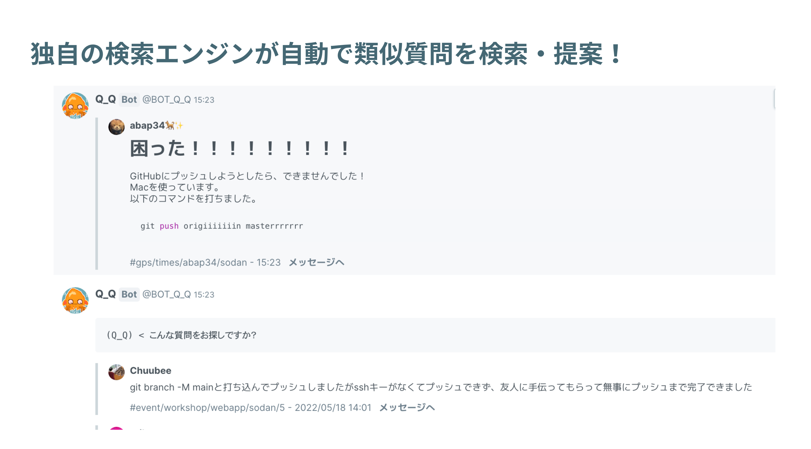
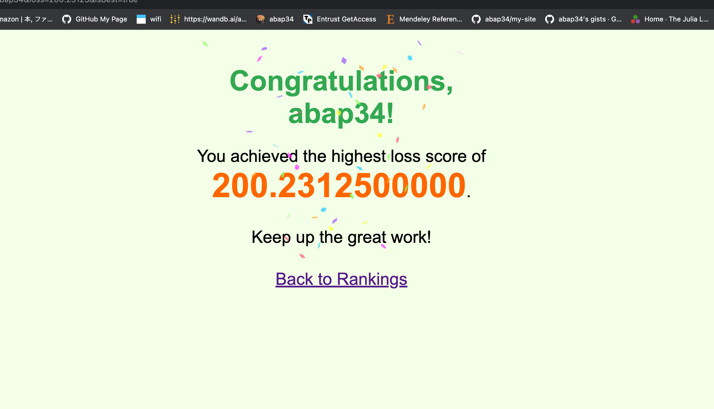
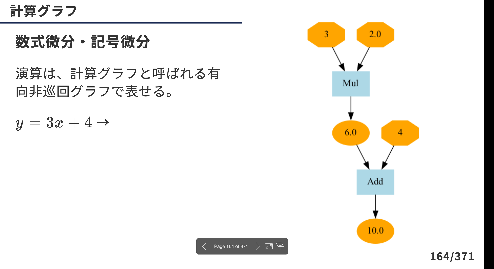
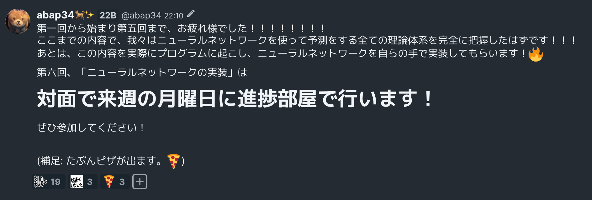
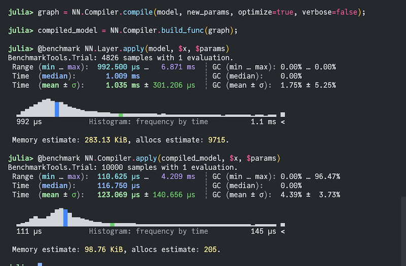
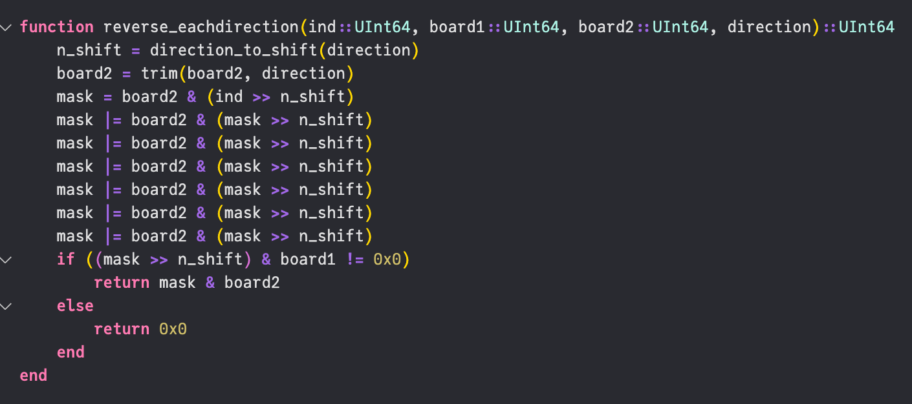
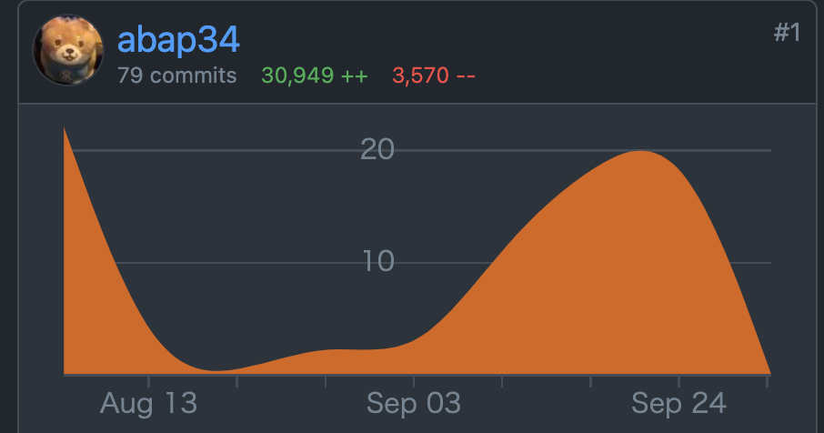

一番嫌いな...冬に...突入！！

## 2023年度前期の振り返り
### 作ったもの・書いたもの
大体時系列順です。
 
- (Q_Q) ?
  - 「いかしかめか」と読みます。部内ハッカソンで作りました。
  - 部内SNSでの質問と回答を収集して自動で収集しページを構築、類似質問と回答をサジェストします。
  - 諸々とサジェスト周りの実装を担当しましたが、計算資源がきつい中でサジェストしなきゃで、面白かったです。
  - 発表スライド : [https://www.canva.com/design/DAFmIYJAcZ0/ORsZk-s0UZHNjIB479qnAA/view?utm_content=DAFmIYJAcZ0&utm_campaign=designshare&utm_medium=link&utm_source=publishsharelink](https://www.canva.com/design/DAFmIYJAcZ0/ORsZk-s0UZHNjIB479qnAA/view?utm_content=DAFmIYJAcZ0&utm_campaign=designshare&utm_medium=link&utm_source=publishsharelink)

- Wuff
  - コメントをするとリアルタイムにニコニコみたいな感じで画面に流れるやつです。
  - Cloud Run を初めて使ってみて、めちゃくちゃ簡単で、感動...

 

- DacQ
  - 部内 mini Kaggleです。昨年度にも先輩の間で開発の構想があったみたいなのですが頓挫してしまっていて、えいやとかなり簡素なものですが作りました。
  - 部内 PaaS の Neoshowcase を使うとめちゃくちゃ簡単に traP部員だけが使えるように認証できて、感動...
  

- 機械学習の入門資料
  - [https://www.abap34.com/ml-lecture/slide.html](https://www.abap34.com/ml-lecture/slide.html)
  - 400ページ近くの資料を作った。 めちゃくちゃ大変だったけど割と楽しかったです。
  - 内容をきちんとめに直してどこかに出したいな〜　(色々と微妙なところがある上に書き込み前提の資料なので)

- 機械学習講習会
  - ここまで 3つの内容は全部これです！
  - 新入部員向けの教育でやりました。
  - 全7回、合計10時間講義 + 演習やりました。
  - 内容は traP のブログにまとまっているので読んでみてください。 個人的には結構頑張りました。
  - サークルを卒業した先輩とか弊学の先生とかに結構褒められていて嬉しかったです。
  - ブログ: [Kaggle部で機械学習講習会を開催しました！](https://trap.jp/post/1918/)

- JITrench.jl の計算グラフの最適化機能
  - JITrench.jl で、静的な計算グラフの構築とかそれのLayerFusionとか定数ノードの伝播とかができるようになりました。
  - 好きに開発するだけで100点がもらえる謎の講義の発表に間に合わせるべくかなりバグを仕込んで完成させてしまったので直すのがかなり面倒でなかなかリリースされません。どうして...
  - 色々論文読んだり実装するのがちょっとは上手くなってきたかなという気がします。Readableは神です。

- Juliaで並列AlphaBeta法
  - 大学の人工知能の講義でなんかレポートを書けと言われたので書いて授業で発表しました。
  - pdfを貼っているだけですが記事にしているので読んでみてください。 
  - 記事: [https://www.abap34.com/posts/parallel_othello.html](https://www.abap34.com/posts/parallel_othello.html)
  - 並列化もしんどかったけどビットボードで脳が破壊されました

- ALMO
  - レポジトリ: [https://github.com/abap34/ALMO](https://github.com/abap34/ALMO)
  - このページを作っているMarkdownパーサです。WebAssemblyで実行可能なコードブロックとかプロットとかジャッジが作れます。
  - かなりかなりブラッシュアップされて v1.0 リリース間近です。~~ドキュメントを書くのが面倒でなかなかリリースされない~~

- 部内コンペ (sponsored by ピクシブ社) の運営
  - 去年から運営しているコンペをやりました。
  - 今年はスポンサーがついたので、それも含めて色々やることが多くて大変でしたがめちゃくちゃ楽しかったです。
  - 開催記録が例によって traP のブログにまとまっているので読んでみてください。
  - ブログ: [traP コンペ 2023 夏 sponsored by ピクシブ株式会社 運営後記](https://trap.jp/post/1975/)

## その他
- プロ野球
  - 贔屓球団が10/1の最終戦を終えた時点で最下位です。今年の中日より弱いのは、やばい！
- ドイツ語
  - 朝起きれなさすぎて単位を落としました...

## 後期の目標
とにかく頑張ります。

## 今日の一曲

<iframe width="560" height="315" src="https://www.youtube.com/embed/A2k6ZO6B0A8?si=llQhLWX-WATgUhGN" title="YouTube video player" frameborder="0" allow="accelerometer; autoplay; clipboard-write; encrypted-media; gyroscope; picture-in-picture; web-share" allowfullscreen></iframe>

 