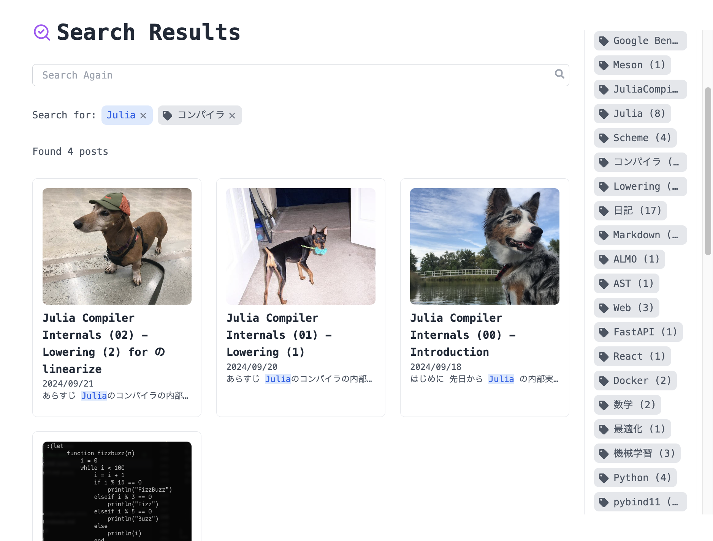
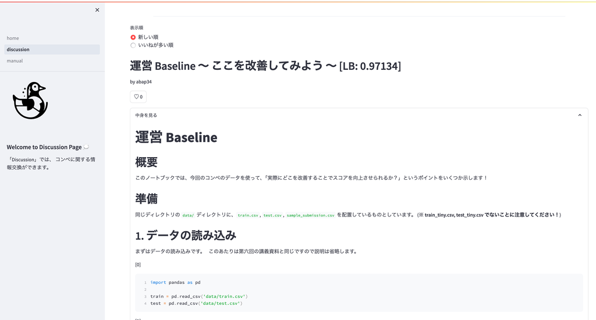
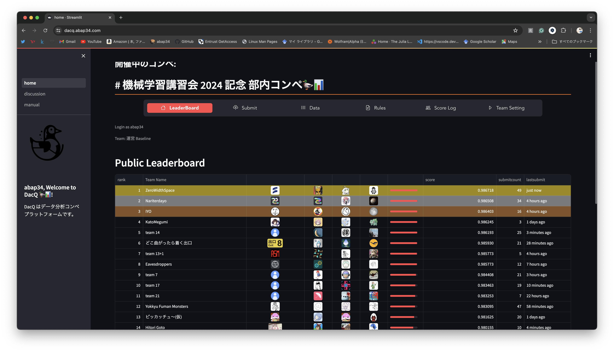
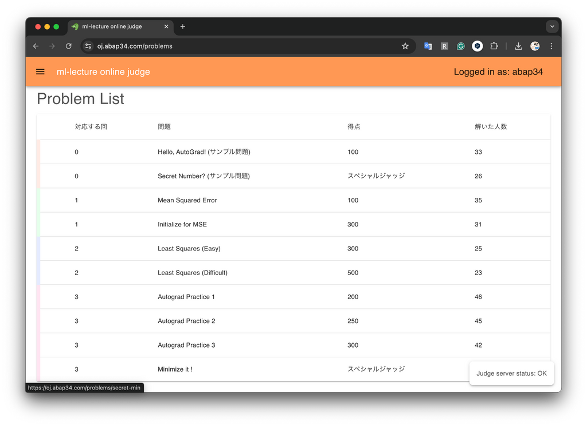
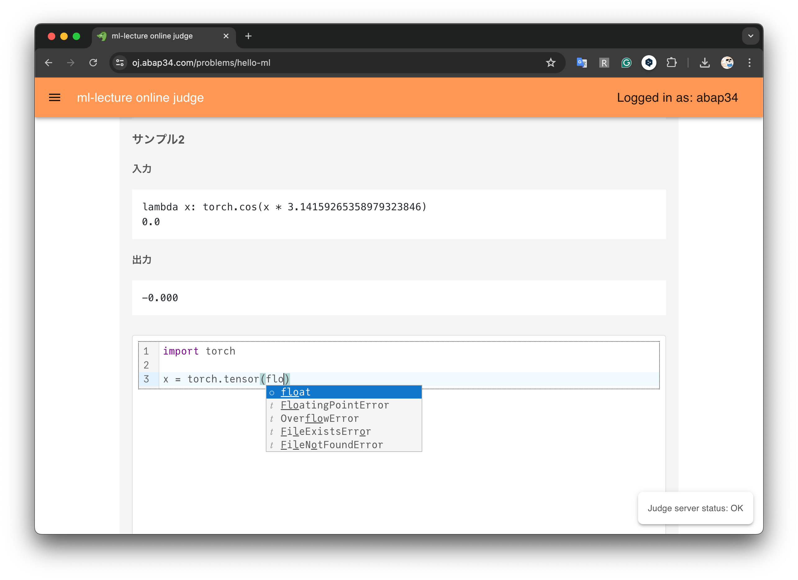

## 2024年度前期の振り返り

2024年度前期 (4月~9月) の振り返りです。


去年の前期の振り返りは [→ こちら](https://www.abap34.com/posts/hurikaeri_2023_0.html)

去年の後期の振り返りは [→ こちら](https://www.abap34.com/posts/hurikaeri_2023_1.html)


## 作ったもの

### このサイト

<a href="https://github.com/abap34/abap34.com"></a>

このサイト [abap34.com](abap34.com) がリニューアルされました。

個人的には記事検索画面 [https://www.abap34.com/search](https://www.abap34.com/search?tag=%E3%82%B3%E3%83%B3%E3%83%91%E3%82%A4%E3%83%A9&q=Julia) は結構気に入ってます。



### almo 

<a href="https://github.com/abap34/almo"></a>

[ついにリリースが v0.9.5-alpha まできてしまいました。](https://github.com/abap34/almo/tags)


すいません、いつ v1 になるんでしょうか。


それはともかくいくつか重要な進展があり、

- Python 向けバインディングの提供とメインのインターフェースをそちらに移動
- パーサの根本的な書き直し [https://github.com/abap34/almo/pull/130](https://github.com/abap34/almo/pull/130)
- 脚注の追加

などが行われました。 (44個の PR が mainにマージされました。)


とくにパーサの書き直しは noya2 が、 脚注の追加は potato167 さんが Contribution してくれました。大感謝。


Python 向けバインディングは自分が作業していて、 Python側から AST を操作したり、 Jupyter Notebook から変換したり、 jinja2 を使った拡張性の高いテンプレートの作成などができるようになりました。

(今はその過程で見つかったパフォーマンス上の問題に対応するために、そもそものベンチマークの仕組みの整備などをしています。)

こういう感じのコードが動きます。 (中身は全部 C++ です！)

```python
import almo

divblock = almo.DivBlock("code")

rawtext = almo.RawText("import matplotlib.pyplot as plt")

divblock.add_child(rawtext)

print(divblock.to_html())
# => <div class="code">import matplotlib.pyplot as plt</div>

md = """
# Head1

**~~Strong, But Strikethrough~~**, $x^2$
"""

ast = almo.parse(md)

def pretty_print(ast, indent=0, last=False):
    print("  " * indent + f"{'└──' if last else '├──'} {ast}")
    for i, child in enumerate(ast.childs):
        pretty_print(child, indent + 1, i == len(ast.childs) - 1)

def count_node(ast):
    count = 1
    for child in ast.childs:
        count += count_node(child)
    return count

print(ast)
# => <almo.Markdown (uuid: 2)>

print(count_node(ast))
# => 12

pretty_print(ast)
# ├── <almo.Markdown (uuid: 2)>
# │   ├── <almo.NewLine (uuid: 3)>
# │   ├── <almo.Header (uuid: 4)>
# │   │   └── <almo.RawText (uuid: 5)>
# │   ├── <almo.NewLine (uuid: 6)>
# │   ├── <almo.InlineStrong (uuid: 7)>
# │   │   ├── <almo.InlineOverline (uuid: 8)>
# │   │   │   └── <almo.RawText (uuid: 9)>
# │   ├── <alm.oRawText (uuid: 10)>
# │   ├── <almo.RawText (uuid: 11)>
# │   └── <almo.NewLine (uuid: 12)>
```


almo に関連する記事もいくつか書きました:

- [pybind11 を使って C++の関数をバインドして Pythonから呼び出す (m1mac)](https://www.abap34.com/posts/pybind11.html)
- [livereload でホットリロードするCLIツールを作る](https://www.abap34.com/posts/livereload.html)
- [脚注機能の実装に関するメモ](https://www.abap34.com/posts/footnote_implement.html)
- [C++ のプロジェクトでいい感じの テスト・ベンチマーク・カバレッジ計測環境を構築する](https://www.abap34.com/posts/cpp_ci.html)


これ書いてて思ったんですが、やっぱり早急にリンクカード欲しいですね。

### DacQ (-v2)

データ分析コンペのプラットフォームです。


<a href="https://github.com/abap34/DacQ-v2"></a>


軽率にやりたい放題コンペをやるために作りました。 

記事: [mini Kaggle を streamlit で作った](https://www.abap34.com/posts/dacq.html)

チーム戦を含めたコンペの機能、 Discussion 機能などがあります。




実際にこれを使ってコンペをしましたが、なんとか致命的な不具合なく終わってくれてよかったです。





### ml-lecture-judge


オンラインジャッジです。


<a href="https://github.com/abap34/ml-lecture-judge"></a>




　
最初、既存の適当な OSS を動かそうと思っていたのですが、 PyTorch などを導入してのデプロイの手順が一生分からず、しょうがないので自分で作りました。




問題は自分でも作成しつつ、後輩・同級生にも手伝ってもらえて楽ができました。大感謝。


他にも、複数出力時のジャッジを konkoma が実装してくれるなどしました。大感謝。


### ml-lecture

以前から学部一年生向けに機械学習の入門資料を公開したいと思っていたのですが、ちゃんと書いて公開しました。


<a href="https://github.com/abap34/ml-lecture"></a>


なるべく誤魔化したくない + なるべく完全に理解してほしい　の落とし所としてワントピックを掘り下げる感じで頑張って書きました。


力作です。 あまり類似した資料はないと思います。 個人的にはこれにはとても満足しています。
　
### コンペ開催

上に付随して講習会とコンペを一つやりました: [https://trap.jp/post/2289/](https://trap.jp/post/2289/)

大抵のことはこの記事に書いてありますが、

- 38 チームが 1Sub 以上 (**1チーム3人です！**)
- 合計で 1692 Sub

と、今までやったコンペの中では一番大規模でした。


<blockquote class="twitter-tweet"><p lang="ja" dir="ltr">今日は機械学習講習会の第6回の講義とコンペの開会式(?) でした。ネットワークの攻撃検知を題材に1週間のコンペを始めました！！40以上のチームが組まれていて盛り上がっています🙌<br> <a href="https://twitter.com/hashtag/trap1kaggle?src=hash&amp;ref_src=twsrc%5Etfw">#trap1kaggle</a> <a href="https://t.co/Q8OQLVJAxS">pic.twitter.com/Q8OQLVJAxS</a></p>&mdash; abap34 (@abap34) <a href="https://twitter.com/abap34/status/1811009775033078126?ref_src=twsrc%5Etfw">July 10, 2024</a></blockquote> <script async src="https://platform.twitter.com/widgets.js" charset="utf-8"></script>


盛り上がってよかった。


## 書いたもの

ブログなどを全て入れると多すぎてブロガーの振り返り記事になってしまうので、特に時間をかけたものだけ載せます。


### 並列化時代の乱数生成

擬似乱数生成は、数値計算・機械学習において欠かせない存在です。
また、現代においてはこれらの計算を並列化によって高速化することもまた重要です。


一方で、単純な並列化は擬似乱数生成の再現性を損なうことがあります。


この資料は、まず擬似乱数・並列処理の基礎からはじめ、最終的には並列実行時に再現性を保つための手法について解説しています。


具体例として、 Julia のマルチプロセス・マルチスレッドにおける擬似乱数生成器の状態管理の手法と実装を紹介しています。

(コピペ)


<iframe class="speakerdeck-iframe" frameborder="0" src="https://speakerdeck.com/player/c43f18061d8a4493968b8ddb9e67ab6f" title="「並列化時代の乱数生成」" allowfullscreen="true" style="border: 0px; background: padding-box padding-box rgba(0, 0, 0, 0.1); margin: 0px; padding: 0px; border-radius: 6px; box-shadow: rgba(0, 0, 0, 0.2) 0px 5px 40px; width: 100%; height: auto; aspect-ratio: 560 / 315;" data-ratio="1.7777777777777777"></iframe>


### Julia Compiler Internals

mrkn さんと antimon2 さんと一緒に毎週木曜日の夜に Juliaの処理系の実装を読む会をしていて、そこで知った内容をまとめるシリーズを始めました。
大体週に 1, 2本のペースで書いていて、今後も続けていくつもりです。

JuliaLangJa の Discord で毎週開催しているので、興味がある方はぜひ 🤗

[https://www.abap34.com/search?tag=JuliaCompilerInternals](https://www.abap34.com/search?tag=JuliaCompilerInternals)


## その他・大学など
- **何事もなければ** 4年で卒業できそうです。 よかった.
- atmaCup #17 に参加しました。 (68/319 ...) NLPコンペは数年ぶりで、自分の知識が化石と化していることを痛感しました。ちゃんとキャッチアップします。
- 大学の OS の授業がめちゃくちゃ面白くて、興味を持ちました。 それまでは知識も興味も全然なかったですが、 授業を受けてからかなり多くの文章がスッと読めるようになり感動しました。今後も割と真面目に勉強していきたいです。
- 夏休みの前半に帰省して全ての親知らずを抜きました。歯が痛いだけで脳がまともなパフォーマンスを一切発揮してくれなく、人間弱すぎるなぁと思いました。
- 東京ヤクルトスワローズは今年もダメでした。 
- 東京工業大学が消滅しました。
- 前期のコントリビューション数は 1982 Contributions でした。 (`curl "https://github-contributions-api.deno.dev/abap34.json?flat=true" | jq '[.contributions[] | select(.date >= "2024-04-01") | .contributionCount] | add'` してください)


## ふりかえりと抱負

なんとなく記事を見てみると Web っぽいものが多いです。 
Web 系の知識は何も知らずに今までやってきましたが、
それこそ ChatGPT などのおかげでかなり学びやすくなって、低いクオリティのものならサッと作れるようになっていい話です。
(streamlit にもありがとう)


とはいえ、自分にとって人と差別化できる要素だとは思っていないので、
後期はもっと機械学習・低レイヤ、、、 「発展させるために自分の人生を使っても良さそう」 と思っていることの勉強に時間を使っていきたいです。


また、それなりに (とくに、大学の) コミュニティに色々と返せたような気もするので、なるべく自分のために頑張りたいです。

---

なんとなく以前より 「これ (計算機) で食べていくぞ」 という実感 (自覚?) が強くなってきました。

**正直に言うと、半年あったらもうちょっとできただろという気持ちがあり、自分の目指しているエンジニア像になれるか不安しかない**ので、後期は一層頑張ります。


## 今日の一曲

<iframe width="560" height="315" src="https://www.youtube.com/embed/u5KV0B0teIA?si=0OK8OPChXR6rfMIN" title="YouTube video player" frameborder="0" allow="accelerometer; autoplay; clipboard-write; encrypted-media; gyroscope; picture-in-picture; web-share" referrerpolicy="strict-origin-when-cross-origin" allowfullscreen></iframe>


