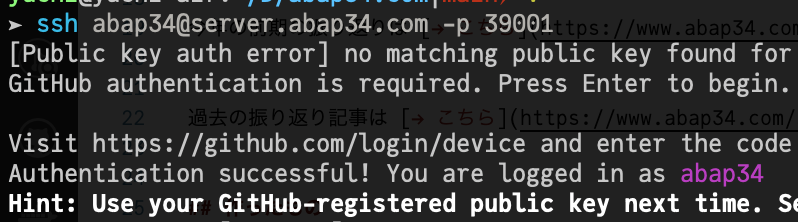
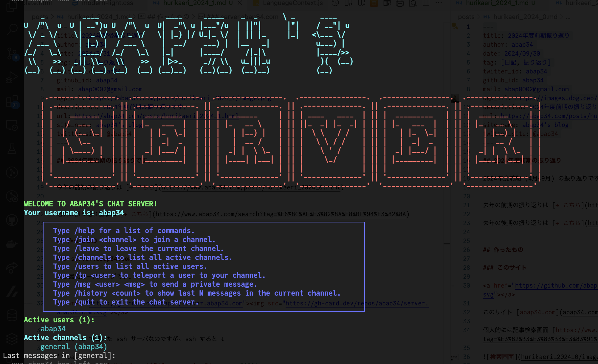

2024年度後期の振り返りです。

今年の前期の振り返りは [→ こちら](https://www.abap34.com/posts/hurikaeri_2024_0.html)


過去の振り返り記事は [→ こちら](https://www.abap34.com/search?tag=%E6%8C%AF%E3%82%8A%E8%BF%94%E3%82%8A)


## 作った・作っているもの

### server.abap34.com (ssh チャットサーバ)

まずは一発ギャグです。

{@ogp https://github.com/abap34/server.abap34.com}

これは Go で書いた ssh サーバなのですが、 ssh すると ↓

```bash
$ ssh {ここに GitHub のユーザ名}@server.abap34.com -p 39001
```




認証が始まり、




チャットが始まります。爆笑。


もちろんリアルタイムで更新されるので他の人と会話できます。

周りに Discord で身内サーバを作っている人がいたのですが、エンジニアたるもの身内サーバくらい自分で書かんかいということで作りました。


珍しく Go で書きましたが [x/term がバグっていて](https://github.com/golang/go/issues/68880) 日本語入力の削除がうまく行かないようで、
かなり嫌な気持ちになっているので他に乗り換えてちゃんとした TUI もついでに作りつつ乗り換えが濃厚です。 👆 fix するほどの気力はなく...


### mu (型推論付きの処理系)

{@ogp https://github.com/abap34/mu}


これはそこそこ時間を使ったもので、 desciption にもあるように

- 多重ディスパッチ
- 抽象解釈ベースの型解析

が載った処理系です。

[src/ を見たらわかるかもしれませんが](https://github.com/abap34/mu/tree/main/src)、 意外とちゃんとしています。

例えば

```js
function binarysearch(arr::AbstractArray, target::Int){
    low = 1
    high = length(arr)
    while (low <= high){
        mid = floor((low + high) / 2)
        if (get(arr, mid) == target){
            return mid
        } else {
            if (get(arr, mid) < target){
                low = mid + 1
            } else {
                high = mid - 1
            }
        }
    }

    return false
}
```


みたいなコードを書いて、

```julia
julia> using mu.MuCore; using mu.MuBase

julia> ast = MuCore.parse_file("example/example.mu");  # parse a file

julia> lowerd = MuCore.lowering(ast);   # lowering

julia> mt = MuBase.load_base(); # get method table with base functions

julia> MuCore.MuInterpreter.load!(mt, lowerd); # load lowered code

julia> MuCore.MuTypeInf.return_type(
              lowerd[3], 
              argtypes=[MuCore.MuTypes.Array{MuCore.MuTypes.Int, 1}, MuCore.MuTypes.Int],    
              mt=mt
      )  # inference `binarysearch` return `Int` or `Bool`
mu.MuCore.MuTypes.Union{mu.MuCore.MuTypes.Int, mu.MuCore.MuTypes.Bool}
```

ちょっと最後ごちゃごちゃしてますが、この関数が 

`Array{Int, 1}, Int` に対して呼び出された場合は `Int` または `Bool` を返す、が推論できます。


これは実装などブログにしました。 qiita に載せたのですが、同じものをこっちにも最近動かしました。

{@ogp https://abap34.com/posts/jci_06.html} 

全体作ることで細部まで色々と知れてよかったです。


### lapisla (定理証明支援系)


多分これが一番時間を使った気がします。定理証明支援系  (とそのエディタ、そのレジストリ、そのほか色々全部のプラットフォームです。)

{@ogp https://github.com/lapisla-prover/lapisla-prover}

{@ogp https://trap.jp/post/2478/}

秋くらいに大学の授業で定理証明支援系を触ったときに色々と可能性と課題を感じ、それに一旦アプローチしてみました。

最近は LLM-based の自動証明を色々調べていて、実際手を動かすフェーズになりつつあり、最終的には lapisla で賢い自動証明を提供したいですね。


個人的には結構いい出来のソフトウェアだなぁと思っています。チームに感謝！

<blockquote class="twitter-tweet"><p lang="ja" dir="ltr">Lapispla で左単位元と右単位元が同じであることも言えた<a href="https://t.co/JShgd83G0F">https://t.co/JShgd83G0F</a> <a href="https://t.co/3zvfTrQSK0">https://t.co/3zvfTrQSK0</a></p>&mdash; ひゅ〜Men (@men_cotton) <a href="https://twitter.com/men_cotton/status/1889186482352767214?ref_src=twsrc%5Etfw">February 11, 2025</a></blockquote> <script async src="https://platform.twitter.com/widgets.js" charset="utf-8"></script>

すごいぜ

### コンペ開催

またコンペをやりました。

{@ogp https://trap.jp/post/2518/}


今回は作問にかなり力を入れていて、 BigQuery を回しまくるくらいの規模のデータを触れて楽しかったです。

詳しいことは上のブログを読んでください。


### abap34.com

このサイトも相変わらず色々新しくなりました。

例えば [/works](https://www.abap34.com/works) や [/blog](https://www.abap34.com/blog)、　そして何よりブログの記事のデザインが大幅に見直されてちょっとマシな見た目になりました。

また `{@ogp ...}` という構文でリンクカードが自動生成されるようになり、まさにこの記事のようなものが書きやすくなりました。
(ビルド時に ogp image などを取得して埋め込んでいます)


デザインはちょっとダサいと思っているのでそのうち直します。


あとしれっとダークモードと英語に対応しました。
(翻訳はすべてチャッピーに投げていて全然正確でないので、暇を見つけて直そうと思っています。)

### almo (拡張 Markdown パーサ)

このブログを動かしているやつです。

{@ogp https://github.com/abap34/almo}

本格的にビルドシステムの書き換え (ついでにユーザが触る部分は全部 Python に) をやろうとしているのですがシングルバイナリで配るために Hacky なビルドをしているせいで前途多難です。

{@ogp https://github.com/abap34/almo/pull/167}

前書いた　[C++ のプロジェクトでいい感じの テスト・ベンチマーク・カバレッジ計測環境を構築する](https://www.abap34.com/posts/cpp_ci.html) くらいのことはするつもりでいますが、もう少しかかりそうです。

進捗としては謎の Contributor が現れて [nixpkgs に入っているらしいです](https://github.com/search?q=repo%3ANixOS%2Fnixpkgs%20almo&type=code) なぜ？


### ??? (こうご期待！)

これは近いうちにまともな文章が出るのでここでは何も書かないんですが、
来年度前期はこれに集中することになりそうな面白いものに手を出しています、楽しみ！

## 書いたもの

### JuliaCompilerInternals

完全にブロガー化していますが、とくに [JuliaCompilerInternals シリーズ](https://www.abap34.com/search?tag=JuliaCompilerInternals) はこれの執筆駆動によって かなり Julia コンパイラについて詳しくなれたのでよかったです。


とくにデータフロー解析のいろんな性質を頑張って導出した [Julia Compiler Internals (05) - Algorithm of Type Inference [2]](https://www.abap34.com/posts/jci_05.html) とかなり実践的な [Julia Compiler Internals (06) - Implementing Small Julia Compiler](https://www.abap34.com/posts/jci_06.html) は書いてる過程でだいぶ思考が深まりました。


### その他ブログなど

- [ROC-AUC の解釈](https://www.abap34.com/posts/auc.html)
  - これ結構面白くないですか？ こっちの解釈が広まってないのは個人的には変な話だと思っています。
- [開発環境を紹介しますアドベントカレンダー @abap34](https://www.abap34.com/posts/devenv_advent.html})
  - 結構 Helix の操作に慣れてきました。
- [Kaggle 班ができるまで](https://speakerdeck.com/abap34/kaggle-ban-gadekirumade)
  - 上に書いたコンペでサークル完全引退おじいさんになったのですが、それより少し前にすでに Kaggle コミュニティの長は後輩に譲っており、そのときちょうど部内 + OB・OG の人の前で話す機会があったのでスライドにしました。数年後ノスタルジーを提供してくれそう


## その他・大学など

- 卒業研究を除く必要単位を無事取り切りました ハッピー
- 研究室配属があり、無事第一志望の研究室に配属されました！ﾔｯﾀｰ
  - プログラミング言語をやります。
  - 長いのでやりたいことは最後の 抱負 のとこに書いておきます
- 観念してもろもろの所属を Science Tokyo に更新しました
- 後期の Contribution 数は 1035 でした。 (`curl "https://github-contributions-api.deno.dev/abap34.json?flat=true" | jq '[.contributions[] | select(.date >= "2024-10-01") | .contributionCount] | add'`)
- 今年のセリーグ順位予想は 1-ヤ巨神横中広-6 でいきます。
  - ところでセリーグに開幕三連敗しているチームがいるのですが...?

## ふりかえりと抱負

プ言語をやる研究室に配属されたわけですが、別に ml を辞める (?) わけではなく、いい感じに両方やっていきたい (大谷翔平) と思っています。


ここ数ヶ月は、どうするか割とちゃんと悩んでいて何人かの人に相談してみたりしていたのですが、やはり参入障壁というところを考えると ml <<< プ だろうから、大学では後者に取り組んだほうがいいのでは、
というアドバイスをいくらかもらったので、そういう選択をしました。


実際 TL では大学で CS をやっていなくても ml バリバリやっている人を本当にたくさん見かける一方で、 CS専攻でなくプログラミング言語をやっている 
(ここでいう「やる」は論文を書き、発表し ... を指しています)　人はあまり見かけないので、自分としてもまぁそうだろうなとは思っています。　


最近は自動証明のようなところに結構興味を持っていますし、 (LLM が書いたコードに全部ちゃんと証明がついていたらめちゃくちゃ面白くないですか?)、


一応へなちょこ データ分析・数値計算etc のプレーヤーでもあるので、そういうのを簡単に 安全・パフォーマンスよく実行できるために色々やっていきたいですね。
(例えば `torch.compile` に大衝撃を受けたのを今でも覚えてます！ こういう仕事ができたら楽しいだろうな〜 と思います)


ともかく、 相互に絶対役に立つと思っているので、どちらもちゃんと勝負できるレベルまで勉強できたらと思います！
とりあえず短期的にはプログラミング言語の勉強をがんばります.

## 今日の一曲

<iframe width="560" height="315" src="https://www.youtube.com/embed/DeGkiItB9d8?si=tlb9DV7eFHif1w6K" title="YouTube video player" frameborder="0" allow="accelerometer; autoplay; clipboard-write; encrypted-media; gyroscope; picture-in-picture; web-share" referrerpolicy="strict-origin-when-cross-origin" allowfullscreen></iframe>
