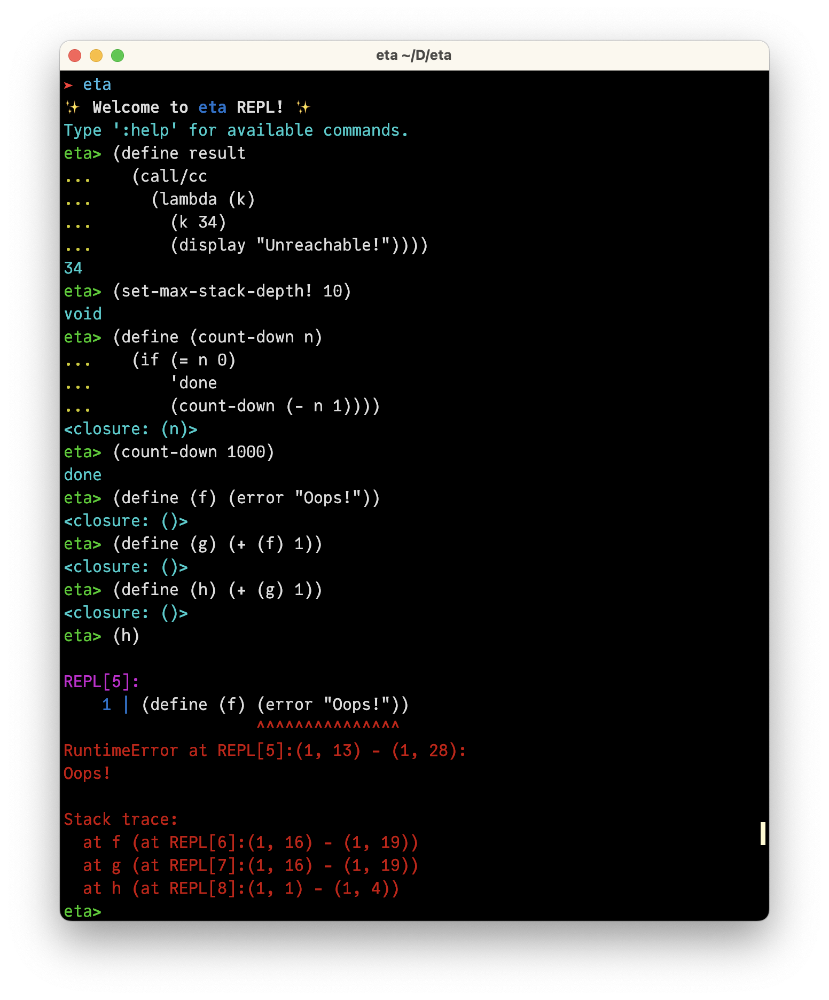

2025年度前期の振り返りです。


去年の後期の振り返りは [→ こちら](https://www.abap34.com/posts/hurikaeri_2024_1.html)


過去の振り返り記事は [→ こちら](https://www.abap34.com/search?tag=%E6%8C%AF%E3%82%8A%E8%BF%94%E3%82%8A)


## 作った・作っているもの

### JETLS.jl (Julia の次世代 Language Server, Google Summer of Code)

今年の前期に一番時間を使ったものはこれでした．


{@ogp https://github.com/aviatesk/JETLS.jl}


すでに記事にもなっていますね．


{@ogp https://www.abap34.com/posts/gsoc2025.html}

{@ogp https://www.abap34.com/posts/gsoc2025_final_report.html}


ざっくりいえば既存の LS と異なり

- Julia コンパイラのインフラを最大限活用することで保守性をあげて
- advanced なさまざまな解析が可能な


LS です． 本当の本当に初期段階なので，かなり色々な機能の開発を担当しています．


レベルが高いプログラマの人たちと一緒に仕事をするのはとても楽しかったですし，
これを機に Julia コンパイラに一層詳しくなれたとてもいい機会でした．

いろいろな課題も認識することができ，研究ネタになりそうな話もいっぱいあり今後が楽しみです．(引き続きチームのメンバーとして頑張って行く予定です！)


また，自分の中で海外で仕事や研究をするということに対する価値観の変化もありました．


いままでは海外で学生や労働をすることは，認識しつつもリアルな選択肢の中に入ってくるまでは来ていませんでした．


ですが，日本の外にはすごい人がいっぱいいることをちゃんと認識する (わかってるつもりだったんですが) とともに，わりと選択肢として考えられるようになりました．
英語を真面目に練習したいと思います．


来年の JuliaCon (in ドイツらしいです) くらいまでには質疑応答とかスラスラできるくらいにはなっていたい．．．

### eta (Scheme インタプリタ)

Scheme (Racket) 製の Scheme インタプリタです．

{@ogp https://github.com/abap34/eta}

call/cc, TCO などが実装されています．





call/cc は初めて実装したのでとても勉強になりました．
evaluator を CPS で書くことでとてもシンプルに実装されています．


また，エラー報告をなるべくちゃんとやる，というのも真面目に考えてみたのですが，それなりにいい感じになりました． 上にあるようにバイトレベルでエラーも出ますし Stack Trace も出ます．


### abap34.com

デザインが一新されました．落ち着く未来はおそらく来なさそうです．

### 謎のスライド作成ツール

裏でコソコソ作っているものがあるのでここでコンセプトだけ紹介します．


自分はよくスライドを作ります． [⇨ speakerdeck](https://speakerdeck.com/abap34)

スライドのデザインや構成にも比較的こだわりがある方です．
いまは

1. 数式やプログラムを多用する
2. Git 管理がしたい

ということから，ほとんどのスライドは marp で作成しています．

おそらく [東工大 traP Kaggle班 機械学習講習会 2024](https://speakerdeck.com/abap34/dong-gong-da-trap-kaggleban-ji-jie-xue-xi-jiang-xi-hui-2024) などは marp 以外ではかなり大変だったと思います．

一方で，自分がヘンテコなスライドばかり作ろうとするので様々な不満が出てきました．

 (※ これは marp を使っているのに書くには本当に不当な文句です，marp が悪いとか言いたいのではなくて，自分からの需要がずれてきたという話です)


大体以下のような不満を持っています:

1. **プログラムや図の更新忘れ，コピペミスをしてしまう**
   1. データやアルゴリズムをちょっと変更したときにスライドの方をアップデートし忘れがちです．
   2. プログラムのコピペミスをすることもあります
2. **グラフを何度も貼るのが面倒**
   1. 自分は [ここ](https://speakerdeck.com/abap34/julia-tokyo-number-11-toku-juliadebu-kuzi-dong-wei-fen?slide=92) からの数枚のような，連続した図による説明を多用しがちです．しかしこれをやるには毎回図を書き出しては貼るという作業が必要で，更新し直すのもとても面倒です．
3. **スライド自身の情報や外部とのインタラクションなどからの生成をユーザが簡単に，際限なくできて欲しい**
   1. BibTeX のサポート, Table of Contents の自動生成, アイコンの簡単な挿入などがしたいです
   2. marp でも可能ですが，ものすごく簡単というわけではありません
   3. エディタ支援を受けながらやりたいところでもあります


そこで今考えているのはスライドを programmable にすることです．


大体，次のような感じで書けるようになることを目指しています．


```python
from datetime import datetime
import matplotlib.pyplot as plt
from pathlib import Path
import pandas as pd

from yogrt.component import Slide, Page, Text, Src, Image, TwoColumn
from mydesignlib import MyTitlePage, MyHeader, MyTableOfContents

slide = Slide()
page1 = MyTitlePage(title="インライン化入門", date=datetime(), icon=GitHubIcon("abap34"))
slide << page1
slide << Page(Text("適切なインライン化をすることで，高速化が期待できます．"))

alg1_src = Path("alg1.py").read_text()
py_static_lint(alg1_src)

slide << Page(
  MyHeader("アルゴリズム1: 適当なアルゴリズム", level=2),
  TwoColumn(
    Text("実装例 (Python)"),
    Src(alg1_src, lang="python")
  )
)

input_data = pd.read_csv("data.csv")
result0 = some_algorithm(input_data)
graph0 = plt.plot(result0)

slide << Page(
  MyHeader("途中結果その1", level=3),
  Image(graph0, caption="途中結果 その1")
)

result1 = some_algorithm(result0)
graph1 = plt.plot(result1)

slide << Page(
  MyHeader("最終結果", level=2),
  Image(graph1, caption="最終結果")
)

toc_list: list[tuple[int, str]] = []
for page in slide.pages:
    for comp in page.components:
        if isinstance(comp, MyHeader) and comp.level <= 2:
            toc_list.append((comp.level, comp.text))

slide.insert(2, MyTableOfContents(toc_list))

slide.export("my_slide.html")
```

このような python のプログラムによってスライドを作成します．

スライドのページもコンポーネントも全て Python のオブジェクトであって，自由に操作できます．


例えば，

```
MyTitlePage(title="インライン化入門", date=datetime(), icon=GitHubIcon("abap34"))
```

のようにすれば時刻をわざわざ入力しなくて良いです．

GitHub のアイコンなどもいちいちダウンロードしなくても取得してくるやつを実装しておくだけでいいですし，
補完やチェックも容易です。

また，デザインに関しても `MyTitlePage` のようなものを作ることによって marp のようにすぐに高クオリティなスライドが作れます．


ソースコードの更新忘れやコピペミスも

```python
alg1_src = Path("alg1.py").read_text()
py_static_lint(alg1_src)
```

のようにすることで防げています．

複数グラフの貼り付けも

```python
input_data = pd.read_csv("data.csv")
result0 = some_algorithm(input_data)
graph0 = plt.plot(result0)

slide << Page(
  MyHeader("途中結果その1", level=3),
  Image(graph0, caption="途中結果 その1")
)

result1 = some_algorithm(result0)
graph1 = plt.plot(result1)

slide << Page(
  MyHeader("最終結果", level=2),
  Image(graph1, caption="最終結果")
)
```

のように容易に実現できていますし，データを更新するだけで全て更新できます．

さらに

```python
toc_list: list[tuple[int, str]] = []
for page in slide.pages:
    for comp in page.components:
        if isinstance(comp, MyHeader) and comp.level <= 2:
            toc_list.append((comp.level, comp.text))

slide.insert(2, MyTableOfContents(toc_list))
```

のようにして Table of Contents のサポートもごく簡単なプログラムを書くだけで実現できます．
様々な拡張が簡単に実装できそうでいいなと思っています．


普通に便利そうなので，いい感じにして公開したいと思っています．


(まだ何も置かれていません)

{@ogp https://github.com/abap34/yogrt}


## 書いた・書いているもの

研究室に配属されたので，ゼミや輪講が始まりました．

なんか出席するだけでパソコンカタカタに詳しくなれてすごいぜ


輪講では [Principles of Program Analysis](https://link.springer.com/book/10.1007/978-3-662-03811-6) を読みました．

自分が担当した範囲は Galois 接続に関連するもので，かなり面白かったのでブログ記事にしているところです．4割くらい書けたのでそろそろ出したい．

(wip: [https://github.com/abap34/abap34.com/blob/main/posts/wip_galois_connection_and_program_analysis.md](https://github.com/abap34/abap34.com/blob/main/posts/wip_galois_connection_and_program_analysis.md))


証明のしょうもないミスを見つけたかったのと，ついでに勉強しようと思い内容の Lean による形式化にも挑戦しています．

{@ogp https://github.com/abap34/galois-connection.lean/blob/main/GaloisConnection/Basic.lean}


他にもいちおう外に書いたブログなどがあります．


{@ogp https://hack.nikkei.com/blog/trap_kaggle_competition_2025/}


後期はゼミなどの資料も出せる感じにして公開していきたいですね．


## その他

- 後期の Contributions 数は 647 でした．(`curl "https://github-contributions-api.deno.dev/abap34.json?flat=true" | jq '[.contributions[] | select(.date >= "2025-04-01") | .contributionCount] | add'`)
- しばらくいたインターンをやめました．とてもいいところだったのでポジキャンするなどして恩返ししていきたい．
- 論文の管理用のちょっとしたツールを作ってもらいました． [https://github.com/abap34/theke](https://github.com/abap34/theke) LLM 要約とか依存関係のグラフが見れるやつです．自分で使うくらいならまぁ便利ではありますがクオリティは... 自分からの需要がちゃんとわかったら自分で真面目に作りたいですね．
- 2 年くらい前にとある OSS に投げていたもののレビューが放置されていた PR が急にレビュー & マージされてびっくりしました．どうも Copilot がレビューに導入されてキューが動いたということらしいです．いい話だなと思いました．
- いい包丁を買いました．QoL が上がりました．
- 家にホワイトボードを設置しました．QoL が爆上がりしました．
- 研究室はめちゃくちゃ居心地が良くて楽しいです
  - どこもこんな感じかと思っていたんですが，友達に聞いた感じだとそうでもないらしいので，とてもラッキーだったなと思います．
  - ふらっと来たら先生や先輩がいて，普通に同じテーブルで弁当食べながら変なコンパイラの話などしていると言ったらびっくりされました
- 東京ヤクルト... 😢
- 卒業が半年遅れる予定です．単位が足りていないとか院試に落ちたわけではなく(バカデカボイス)，開発と研究に集中するための措置です．幸い GSoC に採択されたりそのほか労働のおかげで金銭的な問題がなんとかなりそうだったのでこういう感じになりました．生まれた時間を有効に使っていきたいと思います．

## 抱負など

この半年だけでもエーアイの発展も含め環境が変わりつつありますね．

自分も簡単なタスクは Claude Code に丸投げすることが増えてきたので時代の変化を感じるところです．


他にも地元の友達は就職していたり，もう子供がいたり (！)

優秀な同期は何人か卒業していたり (かたや卒業したくなくて騒いでるのに)，

海外に行ってしまう人もいたり (かたや卒業したくなくて騒いでるのに) (寂しい)

自分の周辺でも色々変化を感じています．


自分は実家が寺で父は僧侶をしているんですが，今まで家がバカみたいに広くてウケるな程度の感想しか持っていませんでした．
が，最近になって割と影響を受けているなと感じることが増えてきました．(※ スピリチュアル的なのにハマっているわけではないです)


そのうちの一つを紹介すると，「刹那滅」という言葉があります．
すごくざっくりいうと，「全ての事物は瞬間ごとに消滅と生成を繰り返している」という主張で,諸行無常みたいなのと似ている話です． (こっちの方が主張として真に強いですが)


もちろん物理的に本当にそうなっているとかそういう話をしたいわけではないんですが，自分は割とこの考え方が好きです．


あまり自分を規定しすぎずに，そのとき興味があることに対して真面目に取り組めていけたらと思います．


とりあえずこの文章をタイプしているときの自分は一貫してプログラミング言語について考えるのが好きなようなので，
引き続き研究頑張っていきます 💪💪


## 今日の一曲

<iframe width="560" height="315" src="https://www.youtube.com/embed/mNpPQXMgtmw?si=eRJwd-NXS_LygD6t" title="YouTube video player" frameborder="0" allow="accelerometer; autoplay; clipboard-write; encrypted-media; gyroscope; picture-in-picture; web-share" referrerpolicy="strict-origin-when-cross-origin" allowfullscreen></iframe>