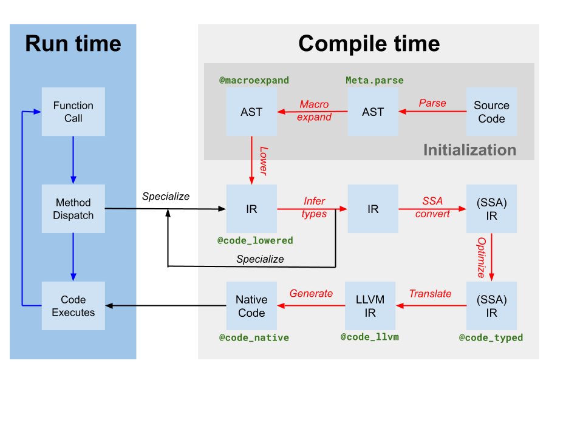

## はじめに

先日から Julia の内部実装を読む会を始めたのですが、そこで得た知識をここにまとめていこうと思います。

すでに scrapbox にメモ書きが生えているのですが、それを再構成してもう少しちゃんと文章に書いていきます。

短い記事の集まりになる予定です。


### 前提

- 読んでいるコードやドキュメントは全て Julia 1.11-rc3 (コミット: 616e45539db4c49ab019b7ccd318800f240743f6) のものです。
- なるべく正確になるよう頑張りますが、誤り等あればコメントで指摘していただけるとありがたいです。
- 解説記事というよりメモ書きに近い形態です。 コンパイラや Julia に関する知識を割と前提にしています。

### 目標

一応、 **Julia の IR・最適化周りをきちんとめに理解する** ことを目標にしています。

そのため、 例えば

- パーサ周り
- マクロ展開まわり

についてはそこまで深くは追求しないことになりそうです。

目標としてこの辺りを定めたのは

- 現代の自動微分ライブラリ: [https://arxiv.org/abs/1810.07951](https://arxiv.org/abs/1810.07951) や [https://arxiv.org/abs/2010.01709](https://arxiv.org/abs/2010.01709) あたりをきちんと理解したい。
- 「Julia ってなんで速いの？」 に対する回答を常に適切な粒度でできるまできちんと理解したい。

あたりによるものです。

なのでこのあたりに関心がある人は面白いと思います。

## 00. Julia の処理系の大枠



Julia がコードを実際に実行するまでの流れをざっと理解します。

### パース

ソースコードはまずパースされて AST に変換されます。

Syntax Error 周りがかなり見やすくなったので気がついた人も多いと思いますが、 Julia 1.9 までは lisp で書かれたパーサが使われていたのが、Julia 1.10 からは [https://github.com/JuliaLang/JuliaSyntax.jl](https://github.com/JuliaLang/JuliaSyntax.jl) がデフォルトになりました。

### マクロの展開

Julia のマクロはこのタイミングで展開されます。

そのため、この後出てくる型推論の結果などをマクロに反映させることは難しいです。

### Lowering

AST は Lowering という処理を経て、 IR に変換されます。

AST と IR の違いですが、 IR の方がかなりネイティブに近い形式になっています。

実際に見るのがわかりやすいと思います。

例えば、

```julia-repl
for i in 1:10
    s += i
end
```

の AST は

```julia-repl
julia> ex = :(for i in 1:10
           s += i
       end)
:(for i = 1:10
      #= REPL[19]:2 =#
      s += i
      #= REPL[19]:3 =#
  end)

julia> Meta.show_sexpr(ex)
(:for, (:(=), :i, (:call, :(:), 1, 10)), (:block,
    :(#= REPL[19]:2 =#),
    (:+=, :s, :i),
    :(#= REPL[19]:3 =#)
  ))
```

と、そのままループ構造が残っていますが、IR に変換されると

```julia
julia> Meta.lower(Main, ex)
:($(Expr(:thunk, CodeInfo(
    @ none within `top-level scope`
1 ─ %1  = 1:10
│         #s3 = Base.iterate(%1)
│   %3  = #s3 === nothing
│   %4  = Base.not_int(%3)
└──       goto #4 if not %4
2 ┄ %6  = #s3
│         i = Core.getfield(%6, 1)
│   %8  = Core.getfield(%6, 2)
│   @ REPL[6]:2 within `top-level scope`
│         s = s + i
│   @ REPL[6]:3 within `top-level scope`
│         #s3 = Base.iterate(%1, %8)
│   %11 = #s3 === nothing
│   %12 = Base.not_int(%11)
└──       goto #4 if not %12
3 ─       goto #2
4 ┄       return nothing
))))
```

と、ループ構造が `goto` とかで書き換えられているのがわかります。


### Infer types 

この IR に対して型推論が行われます。

ここがおそらく今回のシリーズで一番難しい部分になるかと思います。
今書けることといえば

`@code_typed` とかで型推論の結果を見ることができますよ、くらいでしょうか。
　
```julia
julia> @code_typed 1 + 3.4
CodeInfo(
1 ─ %1 = Base.sitofp(Float64, x)::Float64
│   %2 = Base.add_float(%1, y)::Float64
└──      return %2
) => Float64
```

### SSA Convert

Julia は最適化のために IR を SSA形式の IR に変換します。

### Optimize

ここも難しそうです。

SSA形式の IR をこねこねすることで最適化を行います。

### Translate

Julia は バックエンドとして LLVM を使っています。

得られた最適化された IR は LLVM IR に変換されます。

### Generate

最後に、LLVM IR からネイティブコードが生成されます。

## まとめ

がんばっていきたい。

## 今日の一曲

<iframe width="560" height="315" src="https://www.youtube.com/embed/tcV1IIARPX4?si=7F0HxxLLAqT8Arpk" title="YouTube video player" frameborder="0" allow="accelerometer; autoplay; clipboard-write; encrypted-media; gyroscope; picture-in-picture; web-share" referrerpolicy="strict-origin-when-cross-origin" allowfullscreen></iframe>