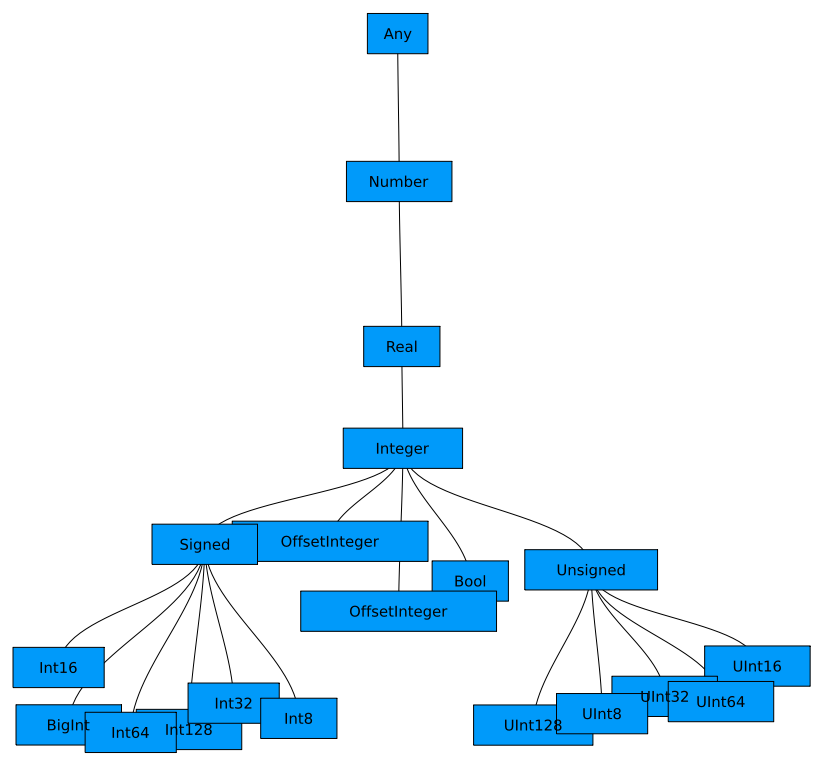
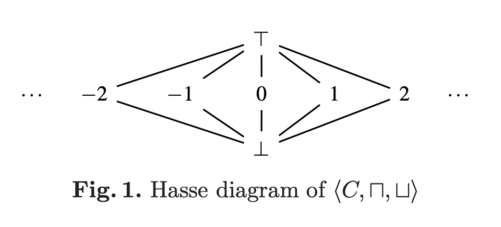

## 小話

@abap34 です。

最近は腰と肩がかなり痛いです。いい椅子に座りたい 😢

この Julia 処理系を読む会もなんやかんや 2ヶ月くらい毎週続いているのですが、いくつかニュースがあったので本題に入る前に書いておきます！

### ちょっとしたニュース ① 

先日 Julia の Co-Founder の [Jeff Bezanson](https://en.wikipedia.org/wiki/Jeff_Bezanson) さんが来日されていて、なんとお会いすることができました。


Twitterのリンクでも貼ろうかと思ったら Wikipedia のページがありました。すごすぎ。


<blockquote class="twitter-tweet"><p lang="en" dir="ltr">It was such an honor to meet <a href="https://twitter.com/JeffBezanson?ref_src=twsrc%5Etfw">@JeffBezanson</a> and fellow Julia compiler enthusiasts in Tokyo! <a href="https://t.co/r1vzPaP0X7">pic.twitter.com/r1vzPaP0X7</a></p>&mdash; abap34 (@abap34) <a href="https://twitter.com/abap34/status/1846208258216022469?ref_src=twsrc%5Etfw">October 15, 2024</a></blockquote> <script async src="https://platform.twitter.com/widgets.js" charset="utf-8"></script>


そこで 「Julia の処理系を読む会を毎週やっていて、あなたが 10 年前に Scheme で書いたコードをみんなで何時間も読んでいるんです」と伝えたらとても喜んで貰えました！笑


### ちょっとしたニュース ②

第5回のコードを読んでいるとき、まだ SSA形式の IR になっていないはずなのに SSA形式の IR にするようなチェックがなされている箇所を見つけ、
「不思議だな〜」と話していたところがあったのですが、今日の記事にも登場する Juliaコンパイラの中の人であるところの aviatesk さんに聞いてみたところ、どうもミス (実際誤った挙動にはならないのでバグというほどでもないですが) っぽいという結論に至りました。

読み始めたときにバグの一つや二つでも見つけられたらいいな〜と思っていたのでこれは嬉しいです。

追伸: 修正のPRが作られて、マージされました。 [https://github.com/JuliaLang/julia/pull/56314](https://github.com/JuliaLang/julia/pull/56314)


いろいろといいことが起きてていい感じですね。今後も頑張っていきます！


---


## あらすじ

今回もJuliaのコンパイラの内部実装を読んでいくシリーズです。

シリーズ自体については [第0回](https://abap34.com/posts/jci_00.html) を見てください。


[前回](https://abap34.com/posts/jci_03.html) は Julia の型推論について概観しました。


今回は実際にアルゴリズムに踏み込んでいきます。

具体的には、一旦 Julia のソースコードから離れて aviatesk さんの記事 [Juliaの型推論アルゴリズムを実装する](https://zenn.dev/aviatesk/articles/data-flow-problem-20201025) を読んで実装しようと思います。 (以下 「元記事」とかきます)


この記事はなるべく元記事の理解の補足になることを目指しています。

少し長くなりそうなので 2,3 個に分ける予定です。


まず今回は前提知識や問題設定などについて書きます。


(※ この記事の執筆は aviatesk さんの許諾をいただいて行われています。ありがとうございます！)


また、この記事を書くにあたって、元記事に加えて以下の資料を参考にしています。

- [https://pages.cs.wisc.edu/~horwitz/CS704-NOTES/10.ABSTRACT-INTERPRETATION.html](https://pages.cs.wisc.edu/~horwitz/CS704-NOTES/10.ABSTRACT-INTERPRETATION.html)
- [https://releases.llvm.org/14.0.0/tools/clang/docs/DataFlowAnalysisIntro.html](https://releases.llvm.org/14.0.0/tools/clang/docs/DataFlowAnalysisIntro.html)
- [Mohnen, Markus. "A graph—free approach to data—flow analysis." International Conference on Compiler Construction. Berlin, Heidelberg: Springer Berlin Heidelberg, 2002.](https://www.semanticscholar.org/paper/A-Graph-Free-Approach-to-Data-Flow-Analysis-Mohnen/5ad8cb6b477793ffb5ec29dde89df6b82dbb6dba?p2df)

ラインナップからわかるように、抽象解釈 (というかコンパイラ全般そうですが...) はかなり入門したてなので間違い等あればコメントで教えていただけるとありがたいです 🙇 

特に以下のようなことに自信がありません。

- 読んでいる文章によって順序関係 (後述) が逆転しているという現象が大量に発生しているため、自分でも混乱して誤って逆に書いている箇所があるかもしれません
- 一般的でない定義を一般的だと思ったりしている可能性があります.

また、いくつかのポイントがわかっていないため、わかっていないと書いてあるところがあります。

## 束 (Lattice) の定義と具体例

少しだけ使う概念の準備を書いておきます。

:::definition
**束 (Lattice)**


集合 $L$ と $L$ 上の二項関係 $\leq$ が以下の条件を満たすとき、$(L, \leq)$ を束であるという。

1. $\leq$ が半順序である
2. 各 $x, y \in L$ について $\{ x, y \}$ の上限と下限が常に存在する

とくに $L$ が有限集合のとき、有限束という。
:::

:::definition
**交わり(meet), 結び(join)**


束 $(L, \leq)$ について、

- $x, y \in L$ に対して $\inf \{ x, y \}$ を $x$ と $y$ の交わり (meet)
- $x, y \in L$ に対して $\sup \{ x, y \}$ を $x$ と $y$ の結び (join)

という。
:::


これ命名もう少しあったんじゃないかと思うのは自分だけでしょうか。

ともかく、これだけだとパッとわかりにくいので、具体例を挙げてみます。

### 束の例1: 論理関数

束は割と色々なところに現れる構造です。


例えば、自分は論理回路理論の講義で束に出会いました。調べたらあまり例に上がっていなかったのと、この記事のメインと構造が同じことに気がついたのででここで書いてみます。


$\mathbb{B} = \{ \text{0}, \text{1} \}$ として、 ($\text{0} \leq \text{1}$ です) 

$\mathbb{B}^n \to \mathbb{B}$ な関数全体の集合を $\mathcal{F}$ とします。

$f, g \in \mathcal{F}$ に対して次のように $\mathcal{F}$ 上の二項関係 $\leq$ を定義しましょう:

$$
f \leq g \Leftrightarrow \forall x \in \mathbb{B}^n, f(x) \leq g(x)
$$

要は $f(x) = 1$ なる入力の包含関係を見ています。

このとき $(\mathcal{F}, \leq)$ は束です。

確認してみます。

1. $\leq$ が半順序であること: これは一つずつ確認すると、それはそうです
2. $f, g \in \mathcal{F}$ に対して、$\{ f, g \}$ の上限と下限が存在すること: $h(x) := \max \{ f(x), g(x) \}$ とすると、これは上限です。 $h(x) := \min \{ f(x), g(x) \}$ とすると、これは下限です。

実際、例えば $\mathbb{B} \to \mathbb{B}$ の関数全体の集合は


| $x$  | $f(x)$ | $g(x)$ | $h(x)$ | $l(x)$ |
| :--- | :----- | :----- | :----- | :----- |
| 0    | 0      | 0      | 1      | 1      |
| 1    | 0      | 1      | 0      | 1      |


からなるわけですが、

以下のような図でその束の構造を表すことができます。

```
     l
     /\
    /  \
   /    \
  /      \
 h        g
  \      /
   \    /
    \  /
     \/
     f
```

つまり、ふんわり言うと (有限) 束は上のような上下関係をいい感じの図にしたときに、どれをとっても下か上に辿れば交わるものと言えます。

なのでこういうグラフが得られているのであれば  $\inf \{a, b\}$ と $\sup \{a, b\}$ を求めるのは LCA を求める問題に帰着します。


### 束の例2: Julia の型

Julia の型と、その親子関係による順序関係も束をなします。

$L$ を Julia の型全体の集合とし、

$L = \{ \text{Any}, \text{Number}, \text{Real}, \text{Int64} \cdots \}$ 


二項関係 $\leq$ を次のように定義します:

$T \leq U \Leftrightarrow$ 型 $T$ が型 $U$ のサブタイプである


このとき $(L, \leq)$ は束になります。

上に載せた図を作ることで直感的に確認しておきましょう、 「Julia Type Tree」 とかで検索するといい感じの図が出てきます。



おかしいです！ 束であるためには任意の 2つの元について下限が必要ですから、枝分かれのある木な訳がないです。


しかし Julia の Concrete Type は サブタイプを持たないはずです。どう言うことでしょうか？


──実は Julia の Concrete Type にサブタイプが存在しないと言うのが誤りで、 `Union{}` 型と言う型が存在してこれは任意の型のサブタイプになります。

(`Union{}` のオブジェクトは存在しません。型としてのみ存在します。)


```julia-repl
julia> Union{} <: Any
true

julia> Union{} <: Int64
true
```

したがって、任意の Concrete Type $T, U$ に対して $\inf \{ T, U \} = \text{Union\{\}}$ となります。

この型の存在によって Julia の型の階層関係は束をなします。

また、 Juliaの型の階層関係がこの記事で今後扱っていくアルゴリズムにおいて重要な以下の性質を満たしていることが直感的にわかります。


:::definition
**鎖 (Chain)**

集合 $L$ と $L$ 上の二項関係 $\leq$ を考える.

このとき、 $P \subseteq L$ が鎖であるとは、任意の $x, y \in P$ に対して $x \leq y$ または $y \leq x$ が成り立つことをいう。
このとき $|P|$ を鎖の長さという。
:::


:::definition
**有限性条件**

$L$ の任意の鎖の長さが有限であるとき、束 $(L, \leq)$ が有限性条件を満たすという。
:::

例えば

$$
\{ \text{Any}, \text{Number}, \text{Real}, \text{Int64} \}
$$

などは鎖です. ($\text{Any} \leq \text{Number} \leq \text{Real} \leq \text{Int64}$ なので)


今の自分の理解では Julia の型の階層構造はこれを満たしているはずです。

(※ 仕様を読んだり示したりしたわけではなく、そう思っているだけなのでご存じの方がいたら教えてください)

---

さて、このように束は割といろんなところに現れる構造っぽいです。

そして、実はプログラムのさまざまな要素・状態を束で表現することでいろいろな性質の解析ができます。

ここからはそれを具体的に見ていきます。

## 抽象解釈

Julia の型推論アルゴリズムは抽象解釈と呼ばれる手法を使っています。

そこで、まずは 一旦 Julia の型推論のことは忘れて一般の抽象解釈についての話をしましょう。


まず前提として、プログラムの調べたい性質は大抵の場合 Undecidable で、静的解析をするには常に諦めもしくはある程度の抽象化が必要になります。


そこで、抽象解釈は読んで字の如し、プログラムをある程度抽象化して仮想的に実行することで、プログラムの性質を解析します。
つまり、抽象解釈という言葉は具体的なアルゴリズムというより、ある種のアプローチというかフレームワークというかを指す言葉です。

調べると、 Nim でも同じことしているようです。しかも実装の方針も同じ。 [https://nim-lang.org/1.6.6/compiler/dfa.html](https://nim-lang.org/1.6.6/compiler/dfa.html).


この抽象化の程度や方向性によって色々な解析をやっていくわけです。
例えば (役に立つのかはともかく、) 変数の偶奇だけに着目して「偶奇だけがわかるレベルで」プログラムを解釈して静的に偶奇の情報を得る、などができます。


... より役に立つ例を考えましょう。元記事では定数畳み込みを抽象解釈を使って行っています。

この記事でもまずはこの例を検討してみます。

### 抽象解釈による定数畳み込み: 問題設定

以下のような機能を持つ簡単な言語を考えます。


- 代入: `x := 1`, `r := y + z`
- goto: `goto line`
- 条件つき goto: `if x < 10 goto inst`, `if x ≤ z goto inst`

簡単のために、代入の右辺は定数か変数またはそれらの二項演算のみで、値は全て整数とします。

例えば以下のような感じです。 

```
0 ─ I₀ = x := 1
│   I₁ = y := 2
│   I₂ = z := 3
└── I₃ = goto I₈
1 ─ I₄ = r := y + z
└── I₅ = if x ≤ z goto I₇
2 ─ I₆ = r := z + y
3 ─ I₇ = x := x + 1
4 ─ I₈ = if x < 10 goto I₄
```

<details>
<summary>左についている枠について</summary>

命令列の左に枠がついていますが、これは基本ブロック (Basic Block) というものです。
基本ブロックは、文の列であって、分岐も合流もない、つまり一つの入り口と一つの出口を持つものをいいます。

これによってプログラム全体の流れを表したものを制御フローグラフ (Control Flow Graph) と言います。

プログラムが直列化されていれば goto, 条件付き goto によって分割することでこれが得られます。 (Julia では Lowering によってこれがされているんでした！このシリーズの過去記事を見てください。)
</details>

じっと見ると、以下のような処理をしていることがわかります。

```julia
x = 1
y = 2
z = 3

while x < 10
     r = y + z
     if !(x ≤ z)
         r = z + y
     end   
     x += 1

     # @show x, y, z, r
end
```

手で実行してみると、こんな感じです.


| step | $I$ | $x$ | $y$ | $z$ | $r$ |  |
| :--- | :-- | :-- | :-- | :-- | :-- | :--: |
| 0 | $I_0$ | 1 | - | - | - |  |
| 1 | $I_1$ | 1 | 2 | - | - |  |
| 2 | $I_2$ | 1 | 2 | 3 | - | |
| 4 | $I_8$ | 1 | 2 | 3 | - | $x < 10$ なので $I_4$ にジャンプ |
| 5 | $I_4$ | 1 | 2 | 3 | 5 |  |
| 6 | $I_5$ | 1 | 2 | 3 | 5 | $x \leq z$ なので $I_7$ にジャンプ |
| 7 | $I_7$ | 2 | 2 | 3 | 5 |  |
| 8 | $I_8$ | 2 | 2 | 3 | 5 | $x < 10$ なので $I_4$ にジャンプ |
| 9 | $I_4$ | 2 | 2 | 3 | 5 |  |
| 10 | $I_5$ | 2 | 2 | 3 | 5 | $x \leq z$ なので $I_7$ にジャンプ |
| 11 | $I_7$ | 3 | 2 | 3 | 5 |  |
| 12 | $I_8$ | 3 | 2 | 3 | 5 | $x < 10$ なので $I_4$ にジャンプ |
| 13 | $I_4$ | 3 | 2 | 3 | 5 |  |
| 14 | $I_5$ | 3 | 2 | 3 | 5 | $x \leq z$ なので $I_7$ にジャンプ |
| 15 | $I_7$ | 4 | 2 | 3 | 5 |  |
| 16 | $I_8$ | 4 | 2 | 3 | 5 | $x < 10$ なので $I_4$ にジャンプ |
| 17 | $I_4$ | 4 | 2 | 3 | 5 |  |
| 18 | $I_5$ | 4 | 2 | 3 | 5 | $x \leq z$ ではないのでジャンプはしない |
| 19 | $I_6$ | 4 | 2 | 3 | 5 |  |
| 20 | $I_7$ | 5 | 2 | 3 | 5 |  |
| 21 | $I_8$ | 5 | 2 | 3 | 5 | $x < 10$ なので $I_4$ にジャンプ |
| 22 | $I_4$ | 5 | 2 | 3 | 5 |  |
| 23 | $I_5$ | 5 | 2 | 3 | 5 | $x \leq z$ ではないのでジャンプはしない |
| 24 | $I_6$ | 5 | 2 | 3 | 5 |  |
| 25 | $I_7$ | 6 | 2 | 3 | 5 |  |
| 26 | $I_8$ | 6 | 2 | 3 | 5 | $x < 10$ なので $I_4$ にジャンプ |
| ... | ... | ... | ... | ... | ... | ... |
| 45 | $I_5$ | 10 | 2 | 3 | 5 | $x < 10$ でないのでジャンプはしない. 終了 |


`x` をループカウンタとして使いつつ、最後の `10 - z` 回は `r = z + y` もする、みたいなコードです (これは何？)


さて、ここから以下の事実を静的解析によって見つけることが目標です:


<div style="text-align: center;">

**`y`, `z`, `r` は定数である**

</div>


### データフロー解析の形式的定義

このあと具体的なアルゴリズムに入る前に、もう少し解こうとしている問題をもう少し一般化して定式化してみます。

今回解きたい問題は、以下のように定義される 「データフロー解析」 と呼ばれる問題として捉えることができます。


:::definition
**データフロー解析 (Data Flow Analysis)**


命令全体の集合を $\text{Instr}$ 、プログラムの状態全体の集合を $A$ とする。

$\text{Instr}$ は 

- 代入 
- goto
- 条件つき goto

のいずれかに属する命令の集合。


ここで、以下のような四つ組 $(P, L, ![.!], a_0)$ を考える:

- $P = I_1, I_2, \cdots, I_n \in \text{Instr}$: プログラム (命令の有限列)
- $L = (A, \leq)$: 有限の鎖のみを持つ束
- $![.!] \in \text{Instr} \to (A \to A)$: 各命令の作用を表す単調関数  ※
- $a_0 \in A$: 初期状態

このとき、データフロー解析は以下のような問題を解くことである:


$\text{Pred}_P: \{1, 2, \cdots, n\} \to 2^{\{1, 2, \cdots, n\}}$ を

$$
j \in \text{Pred}_P(i) \Leftrightarrow 
I_j \in \{ \text{goto i}, \text{条件つき goto i} \} \text{ または } j = i - 1  \ かつ\  I_i \neq \text{goto}
$$

と定めたとき、連立方程式

$$
s_i = \prod_{j \in \text{Pred}_P(i)}  \quad (i = 1, 2, \cdots, n) 
$$

を満たす最大の解 $s_1, s_2, \cdots, s_n$ を求めよ。

:::

少し補足をします。

- 状態 $s \in A$ のときに 命令 $I$ を実行したときの状態は $$ です (記法の確認です)
- `\bigsqcap` が MathJax で使えなかったので $\prod$ で代用しています。交わりの意味です。
- $\text{Pred}_P(i)$ はややこしくなっていますが、要は命令 $I_i$ の直前になりうる命令のインデックスの集合になります。
- つまり、 連立方程式の各方程式はつまるところ「ありうる直前命令からの実行結果の全ての交わり」と言うことになります。
- 元記事や [元論文](https://www.semanticscholar.org/paper/A-Graph-Free-Approach-to-Data-Flow-Analysis-Mohnen/5ad8cb6b477793ffb5ec29dde89df6b82dbb6dba?p2df) では $L$ を その交わりと結びで定義していますが、ここでは準備に合わせて $(A, \leq)$ としています。
- 順序関係が $A$ 上で定まっていることに注意しましょう。 (後述します)

※ 元論文には "monotone semantic functional" と書いてあるんですが、 $\text{Instr}$ には順序が定まっていないように見えるので、少し謎です。意味がわかる方がいれば教えてください。


### 定数畳み込みの形式的定義

実際に今回の問題をこの定義に落とし込みます。


上から行きましょう。

#### 1. $\text{Instr}$

ちゃんと定義したければ BNF とかを書けばいいと思いますがいったんふわっと書くと

$$
\begin{align*}
\text{Instr} =\  &\{ \\
&x := 1, \\
&x := 1 + y, \\
&\text{goto 1}, \\
&\text{if } x < 10 \text{ goto 2}, \\
&\vdots \\
\}
\end{align*}
$$

みたいな集合です。全ての要素はそれぞれ 代入, goto, 条件つき goto のどれかただ一つに属することに注意してください。

#### 2. $A, \leq$

次はプログラムの状態 $A$ とその順序関係 $\leq$ です。

今回の設定では変数の状態以外に特に状態はありませんから、

$X$ を変数の集合、 $C$ を変数の状態の集合として

$A = X \to C$ とすればいいでしょう。


今さらっと $C$ を導入しましたが、ここが (多分自分が思うに) キモです。
これの中身をどうするかが抽象解釈の設計の本質パート (ではないかとと素人ながら) 思います.


というのもこの部分こそが調べたい性質のためにプログラムを抽象化するパートだからです。


例えば今回の場合、次のような集合と順序関係を考えることによって抽象化します。


$L = \{ \bot, 1, 2, 3, \cdots, \top \}$ として、
$L$ 上の順序関係 $\leq$ を次のように定義します:

$$
l_i \leq l_j \Leftrightarrow l_i = l_j \text{ または } l_i = \bot \text{ または } l_j = \top
$$

このとき $(L, \leq)$ は束です。 


図にすると



みたいな感じです。

$\bot, \top$ はそれぞれ次のような意味です。 [^1]

- $\bot$: 定数でない
- $\top$: 未定義

[^1]: 分野によって入れ替わることもあるみたいです。 [参考](https://x.com/__pandaman64__/status/1321404812332654592)

このような状態 $C$ を設定することで、実際の実行から、「定数かどうか && 定数ならその値」を考える抽象的な解釈に落とし込まれるわけです！ (たぶん)


例えば (そんなもんが役に立つのかはさておき) 単に「定数かどうか」だけ調べるのであれば $C = \{ \bot, c, \top \}$  みたいな感じでいいのだと思います。


なお、注意する点として、
**データフロー解析の問題設定においてはあくまでも束をなのは 各変数でなく状態 $A$ と $A$ 上の順序です。**

したがって $A$ 上の順序関係を考える必要があります。

が、そこまで大変でなく単に次のようにすればいいです。

$$
a_i \leq a_j \Leftrightarrow \forall x \in X, a_i(x) \leq a_j(x)
$$

これが束をなすのは論理関数のときと同じような感じでわかります！　

なお、次の記事で使うのでここでいくつかメモ書きをしておきます。
(また、これ以降では記法の煩雑さ回避のために全ての変数が共通の状態 $l$ である抽象状態 $C: X \mapsto l$ を単に $l$ と書きます.)

1. meet の単位元は $\bot$ です
2. join の単位元は $\top$ です
3. $C$ は有限性条件を満たします. (長さが最大の鎖は $\bot \leq c \leq \top$ です)

#### 3. $![.!]$

構文は 3種類に分かれているわけですが、それぞれについて考えればいいです。

[代入]

`x := expr` としたとき、 $x$ 以外の変数の状態は変わりません。

右辺に現れるのが全て定数( $\neq \bot$) であれば `x` も定数になりますから、 
$s' = $ は次のようになります。


$$
a = 
\begin{cases}
\text{expr} & \text{右辺がすべて定数} \\
\bot & \text{otherwise}
\end{cases}
$$

として、

$$
s'(x) = \begin{cases}
\text{a} & x = \text{\text{var}} \\
s(x) & \text{otherwise}
\end{cases}
$$


[goto]

何も変わらないです。


[条件つき goto]

何も変わらないです。


#### 4. $a_0$

初期状態は全ての変数が $\top$ です。 元記事によれば元論文が間違っているとのことです。自分が一から読んでいたら気がつけないだろうことなので、ありがたいです。。。


## まとめ ！？

こうして今回の問題設定をデータフロー解析の形式的定義に落とし込むことができました。


次回は実際にこれを解くアルゴリズムを紹介します。


## 今日の一曲

<iframe width="560" height="315" src="https://www.youtube.com/embed/D0W44Z3D3wo?si=kvQ68VsF5tg-C5lC" title="YouTube video player" frameborder="0" allow="accelerometer; autoplay; clipboard-write; encrypted-media; gyroscope; picture-in-picture; web-share" referrerpolicy="strict-origin-when-cross-origin" allowfullscreen></iframe>