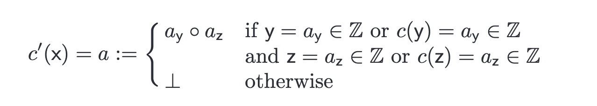
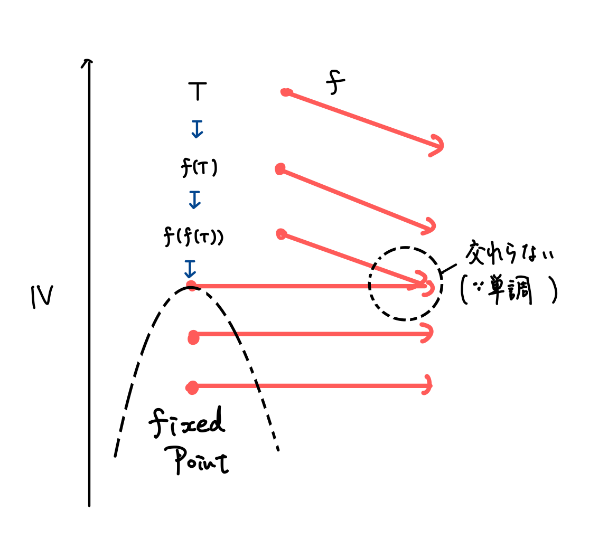
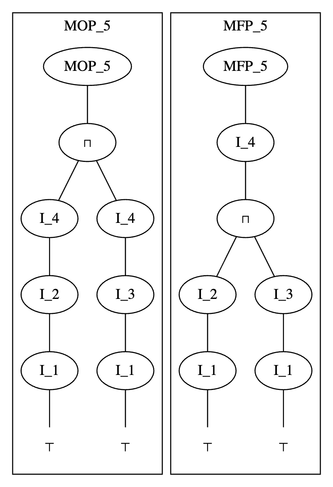

## あらすじ

今回もJuliaのコンパイラの内部実装を読んでいくシリーズです。

シリーズ自体については [第0回](https://abap34.com/posts/jci_00.html) を見てください。


[前回](https://abap34.com/posts/jci_03.html) は Julia の型推論について学ぶ前に、抽象解釈やデータフロー解析の基本的な部分をやりました。

今回は前回見たデータフロー解析問題を解くアルゴリズムを実際に実装してその性質を調べます。


さらに、世間の解説との diff として、停止性や正当性を含む各種性質の証明をすること、なぜこのように定義するのか？何が求まったのか？ などの解説をすることなどを試みてみました。


ただ、頑張って書いていますが、頑張ったからといって必ずしも誤りがなくなるわけではない 😢 (悲しい) ので、
あまり信用せずに読んでください。(とくに証明まわり)


何かあれば一番下のコメントからお願いします。


また、単に頻繁にアップデートが入る可能性が極めて高いというのもあるので、**事実の出典にはしないことをとてもお勧めします。**
記事に末尾に読んだ文章をまとめておくので、正確な情報を得たい場合はそちらを参照するようにお願いします。


## 準備 1 ─ プログラムの表現の実装

### プログラム自体の表現

元記事で、 MacroTools を使ったパターンマッチングなどを活用したとても綺麗な実装があるのでそれを拝借させていただきます 🙏


こういう 言語内 DSL みたいなのが簡単に書けると面白いですよね〜

全然一ミリも本編に関係ないんですが、 MacroTools などを作った Mike さんという方は自動微分界隈で結構有名な方で、 Mike さんの書いた 
[Differentiation for Hackers](https://github.com/MikeInnes/diff-zoo) という文章は本当に面白いのでおすすめです。

Mike さんのブログ: [https://mikeinnes.io/](https://mikeinnes.io/) にも本当に面白い記事がたくさんあります (例えば [The Modern Language Designer](https://mikeinnes.io/posts/modern-languages/) とかおすすめです)


本編に戻ります。

元記事の 実装 > 問題設定で出てくる以下のコードをそれぞれ `lib/program.jl`, `lib/lattice.jl`  とします。 実装はさておき理屈を知りたい方はかなり飛ばしても大丈夫です。

`lib/program.jl`:

```julia
# This code is part of https://zenn.dev/aviatesk/articles/data-flow-problem-20201025

abstract type Exp end

struct Sym <: Exp
    name::Symbol
end

struct Num <: Exp
    val::Int
end

struct Call <: Exp
    head::Sym
    args::Vector{Exp}
end

abstract type Instr end

struct Assign <: Instr
    lhs::Sym
    rhs::Exp
end

struct Goto <: Instr
    label::Int
end

struct GotoIf <: Instr
    label::Int
    cond::Exp
end

const Program = Vector{Instr}
```

`lib/lattice.jl`:

```julia
# This code is part of https://zenn.dev/aviatesk/articles/data-flow-problem-20201025

import Base: ≤, ==, <, show

abstract type LatticeElement end

struct Const <: LatticeElement
    val::Int
end

struct TopElement <: LatticeElement end
struct BotElement <: LatticeElement end

const ⊤ = TopElement()
const ⊥ = BotElement()

show(io::IO, ::TopElement) = print(io, '⊤')
show(io::IO, ::BotElement) = print(io, '⊥')

≤(x::LatticeElement, y::LatticeElement) = x≡y
≤(::BotElement,      ::TopElement)      = true
≤(::BotElement,      ::LatticeElement)  = true
≤(::LatticeElement,  ::TopElement)      = true

# join
⊔(x::LatticeElement, y::LatticeElement) = x≤y ? y : y≤x ? x : ⊤

# meet
⊓(x::LatticeElement, y::LatticeElement) = x≤y ? x : y≤x ? y : ⊥


# NOTE: the paper (https://api.semanticscholar.org/CorpusID:28519618) uses U+1D56E MATHEMATICAL BOLD FRAKTUR CAPITAL C for this
const AbstractState = Dict{Symbol,LatticeElement}

# extend lattices of values to lattices of mappings of variables to values;
# ⊓ and ⊔ operate pair-wise, and from there we can just rely on the Base implementation for
# dictionary equiality comparison

⊔(X::AbstractState, Y::AbstractState) = AbstractState( v => X[v] ⊔ Y[v] for v in keys(X) )
⊓(X::AbstractState, Y::AbstractState) = AbstractState( v => X[v] ⊓ Y[v] for v in keys(X) )

# ↓ 元記事とちょっと違いますが同じです
≤(X::AbstractState, Y::AbstractState) = all(x -> X[x] ≤ Y[x], keys(X))
<(X::AbstractState, Y::AbstractState) = X ≤ Y && X ≠ Y
```


この部分は、よく見れば、そう。という感じでおそらく大丈夫だと思います。

### 抽象的意味論の実装

ここからは abstract semantics $![.!]$ を実装していきます。 (元記事とほぼ同じです)

まずは、そもそも `Exp` たちの evaluation がないことには何もできないので、それだけ一旦書きます。

```julia
# This code is part of https://zenn.dev/aviatesk/articles/data-flow-problem-20201025

unwrap_val(x::Num) = x.val
unwrap_val(x::Const) = x.val


_eval_expr(m::Num, s::AbstractState) = Const(x.val)
_eval_expr(x::Sym, s::AbstractState) = get(s, x.name, ⊥)


function _eval_expr(x::Call, s::AbstractState)
    f = getfield(@__MODULE__, x.head.name)

    argvals = Int[]
    for arg in x.args
        arg = _eval_expr(arg, s)
        arg === ⊥ && return ⊥ # bail out if any of call arguments is non-constant
        push!(argvals, unwrap_val(arg))
    end

    return Const(f(argvals...))
end
```

続いて、 $![.!]$ の実装です。

```julia
function abstract_eval(x::Assign, s::AbstractState)
    new_s = copy(s)
    lhs::Sym = x.lhs
    new_s[lhs.name] = _eval_expr(lhs, s)
    return new_s
end

function abstract_eval(::Goto, s::AbstractState)
    return s 
end

function abstract_eval(::GotoIf, s::AbstractState)
    return s
end
```

これを `lib/abstract_semantics.jl` とします。

## 準備 2 ─ 軽微な修正

ここから実際にデータフロー解析問題を解くアルゴリズムを実装しますが、
少し細々とした注意について見るために簡単なケースで実装してみます。

### 定数の定義 ─ 制御構文がない場合を例に

まずは、次のような Goto, GotoIf がないプログラムに対してうまく動かす例を考えましょう。

```julia
prog_simple = @prog begin
    x = 1
    y = 2
    z = 3
    x = 4 + y
end
```

ここから見つけたいのは次の事実です:

- `x`, `y`, `z` は定数になる

ここで注意ポイントですが、 `x` は定数です。 

ここでいう定数というのはプログラムの中で最初から最後まで値が変わらない、という意味ではなく、
「ある命令前における値が条件分岐の結果に関わらず静的に決まる」という意味だからです。


つまりこの場合では、 

- 1つ目の命令を実行したあとは `x = 1`
- 2つ目の命令を実行したあとは `x = 1`
- 3つ目の命令を実行したあとは `x = 1`
- 4つ目の命令を実行したあとは `x = 6`

ということが分かりますから、 その意味では `x` は定数です。

つまり、条件分岐がない valid なプログラムに対するデータフロー解析問題の解にはそのエントリポイントを除いて $\bot$ が含まれないことになります。

さて、これを求めるコードを書きます。

まずは 抽象状態の初期値 $a_0$ を定義します。

前の記事で見たように、これは

```
AbstractState(
    :x => ⊤,
    :y => ⊤,
    :z => ⊤
)
```

なんでした。もう少し忠実に実装すると `get(s::AbstractState, varname::Symbol)` とかで `haskey(s, varname) ? s[varname] : ⊤` とかすれば良さそうですが、今回は簡単のために手で全部書いてしまいます。

プログラムと初期状態を受け取って実際に抽象解釈を行う関数を書いてみましょう。

今回は、 $\text{Pred}_i = \{ i - 1 \}$ ですから、解くべき連立方程式は

$$
\begin{cases}
s_1 = a_0 \\
s_{i+1} = 
\end{cases}
$$
です。

これは単に $s_1, s_2, \dots, s_n$ を順に計算すればいいだけです。

```julia
function abstract_interpret(I::Program, a₀::AbstractState, abstract_semantics::Function)::Vector{AbstractState}
    n = length(I)
    s = [copy(a₀) for _ in 1:n+1]
    for i in 1:n
        s[i+1] = abstract_semantics(I[i])(s[i])
    end

    return s
end
```

結果は以下のようになります。

```julia-repl
julia> result = abstract_interpret(
    prog_simple,
    AbstractState(
        :x => ⊤,
        :y => ⊤,
        :z => ⊤
    ),
    abstract_semantics
)


julia> vartable(result)

┌───┬──────────┬──────────┬──────────┐
│ i │        x │        y │        z │
├───┼──────────┼──────────┼──────────┤
│ 1 │ Const(1) │        ⊤ │        ⊤ │
│ 2 │ Const(1) │ Const(2) │        ⊤ │
│ 3 │ Const(1) │ Const(2) │ Const(3) │
│ 4 │ Const(6) │ Const(2) │ Const(3) │
└───┴──────────┴──────────┴──────────┘

```

無事に各命令の実行直前の抽象状態が求まっています！

### 不正な遷移をどう扱うか？

ここで、条件なしのジャンプ (Goto) が含まれるケースを例に実装上の一つの問題を考えます。

プログラムの具体例として、以下のようなものを使います。

```julia
prog_goto = @prog begin
    x = 1       # 1
    y = 2       # 2 
    z = 3       # 3
    @goto 6     # 4
    x = 4 + y   # 5  unreachable
    y = 5       # 6  go to here
    z = 6       # 7
end
```

この場合の $\text{Pred}_P(i)$ を定義:

$$
j \in \text{Pred}_P(i) \Leftrightarrow 
I_j \in \{ \text{goto i}, \text{条件つき goto i} \} \text{ または } j = i - 1  \ かつ\  I_i \neq \text{goto}
$$


にしたがって $i = 1, 2, \dots, 8$  について調べてみると 


$$
\begin{align*}
\text{Pred}_P(1) &= \emptyset \\
\text{Pred}_P(2) &= \{ 1 \} \\
\text{Pred}_P(3) &= \{ 2 \} \\
\text{Pred}_P(4) &= \{ 3 \} \\
\text{Pred}_P(5) &= \emptyset \\
\text{Pred}_P(6) &= \{ 4, 5 \} \\ 
\text{Pred}_P(7) &= \{ 6 \} \\
\text{Pred}_P(8) &= \{ 7 \}
\end{align*}
$$

ということになります.
 

このまま実装すると

```julia
function build_pred(I::Program)::Vector{Vector{Int}}
    n = length(I)
    pred = [Int[] for _ in 1:n+1]

    for i in 1:n
        Iᵢ = I[i]
        if isa(Iᵢ, Goto)
            push!(pred[Iᵢ.label], i)
        else
            push!(pred[i+1], i)
        end
    end

    return pred
end
```

```julia-repl
julia> build_pred(prog_goto)
8-element Vector{Vector{Int64}}:
 []
 [1]
 [2]
 [3]
 []
 [4, 5]
 [6]
 [7]
```


これで $\text{Pred}_P$ が求まりました。

続いて解くべき連立方程式を考えましょう。

今回は

$$
\begin{cases}
s_1 = a_0 \\
s_{i} = \prod_{j \in \text{Pred}_P(i)} 
\end{cases}
$$

を解かなければいけなくなったわけですが、
プログラムが無限ループにならないなら全ての $j \in \text{Pred}_P(i)$ が $j < i$ なので、例えば前から確定させていけば大丈夫です。


(この部分は最終的には使わないのであまり考えず適当でいいです)


```julia
function abstract_interpret(I::Program, a₀::AbstractState, abstract_semantics::Function)::Vector{AbstractState}
    n = length(I)
    s = [copy(a₀) for _ in 1:n+1]
    pred = build_pred(I)

    for i in 2:n+1
        s[i] = reduce(⊓, (abstract_semantics(I[j])(s[j]) for j in pred[i]), init=a₀)
    end

    return s
end

```

これを実行してみます。

```julia-repl
julia> prog_goto = @prog begin
           x = 1       # I₁
           y = 2       # I₂
           z = 3       # I₃
           @goto 6     # I₄
           x = 4 + y   # I₅
           y = 5       # I₆
           z = 6       # I₇
       end
7-element Vector{Instr}:
 Assign(Sym(:x), Num(1))
 Assign(Sym(:y), Num(2))
 Assign(Sym(:z), Num(3))
 Goto(6)
 Assign(Sym(:x), Call(Sym(:+), Exp[Num(4), Sym(:y)]))
 Assign(Sym(:y), Num(5))
 Assign(Sym(:z), Num(6))

julia> result = abstract_interpret(
           prog_goto,
           AbstractState(
               :x => ⊤,
               :y => ⊤,
               :z => ⊤
           ),
           AbstractState(
               :x => ⊥,
               :y => ⊥,
               :z => ⊥
           ),
           abstract_semantics
       )


ERROR: AssertionError: arg != ⊤
Stacktrace:
  [1] _eval_expr(x::Call, s::OrderedDict{Symbol, LatticeElement})
```

エラっています！ 右辺に $\top$ が入っているらしいです。


エラーの原因は よく考えるとそれはそうで、 $s_5 = \top$ なので $ = $ をするとき $y$ が Undefined で壊れています。


もう一度  $![I!]$ の実装である `abstract_eval` を確認してみると


```julia
function abstract_eval(x::Assign, s::AbstractState)
    new_s = copy(s)
    lhs::Sym = x.lhs
    new_s[lhs.name] = _eval_expr(lhs, s)
    return new_s
end


function _eval_expr(x::Call, s::AbstractState)    
    f = getfield(@__MODULE__, x.head.name)

    argvals = Int[]
    for arg in x.args
        arg = _eval_expr(arg, s)

        # 未定義のやつが引数に出てきたらおかしい
        @assert arg != ⊤

        arg === ⊥ && return ⊥ # bail out if any of call arguments is non-constant
        push!(argvals, unwrap_val(arg))
    end

    return Const(f(argvals...))
end
```

引っかかる箇所としてはここの `assert` になります.

実は論文の定義をじっと見ると



本当の本当にこの定義だけちゃんと見ると右辺に $\top$ があるときも $\bot$ を返すべきとなっているように見えます。

一旦これを信じることにしてみます。


```julia
function _eval_expr(x::Call, s::AbstractState)    
    f = getfield(@__MODULE__, x.head.name)

    argvals = Int[]
    for arg in x.args
        arg = _eval_expr(arg, s)

        if arg === ⊤ || arg === ⊥
            return ⊥
        else
            push!(argvals, unwrap_val(arg))
        end
    end

    return Const(f(argvals...))
end
```

これで実行してみると

```julia-repl
julia> result = abstract_interpret(
           prog_goto,
           AbstractState(
               :x => ⊤,
               :y => ⊤,
               :z => ⊤
           ),
           AbstractState(
               :x => ⊥,
               :y => ⊥,
               :z => ⊥
           ),
           abstract_semantics
       )

julia> vartable(result)
┌───┬──────────┬──────────┬──────────┐
│ i │        x │        y │        z │
├───┼──────────┼──────────┼──────────┤
│ 1 │        ⊤ │        ⊤ │        ⊤ │
│ 2 │ Const(1) │        ⊤ │        ⊤ │
│ 3 │ Const(1) │ Const(2) │        ⊤ │
│ 4 │ Const(1) │ Const(2) │ Const(3) │
│ 5 │        ⊤ │        ⊤ │        ⊤ │
│ 6 │        ⊥ │ Const(2) │ Const(3) │
│ 7 │        ⊥ │ Const(5) │ Const(3) │
│ 8 │        ⊥ │ Const(5) │ Const(6) │
└───┴──────────┴──────────┴──────────┘
```

という結果になりました。

`x` が定数であることは見つけられていませんね... 😢


正確には以下のように実装すると良いと思います。

$$   
\begin{align*}
a := \begin{cases}
a_y \circ a_z & \text{どちらも定数} \\
\bot & \text{どれかが} \bot \\
\top & \text{otherwise}
\end{cases}
\end{align*}
$$


```julia
function _eval_expr(x::Call, s::AbstractState)
    f = getfield(@__MODULE__, x.head.name)

    arg_eval = _eval_expr.(x.args, Ref(s))
    
    if any(isequal(⊥), arg_eval)
        return ⊥
    elseif all(arg -> arg isa Const, arg_eval)
        argvals = unwrap_val.(arg_eval)
        return Const(f(argvals...))
    end

    return ⊤
end
```

です。こうすると Unreachable なコードからの遷移は無かったことになります。
$\top$ は meet の単位元だからです。


つまりこの実装は 「不正な遷移は無視して、正しい遷移のみが実行される」という仮定にたったものといえます。

このことは、エラーを起こしうるプログラムに対する最適化でとても興味深い挙動を引き起こします。 この記事の最後で少し紹介します。


また、重要な事実として、このように定義すれば単調性も保たれていることに注意してください。


この実装で実行してみると

```julia-repl
julia> result = abstract_interpret(
           prog_goto,
           AbstractState(
               :x => ⊤,
               :y => ⊤,
               :z => ⊤
           ),
           AbstractState(
               :x => ⊥,
               :y => ⊥,
               :z => ⊥
           ),
           abstract_semantics
       )

julia> vartable(result)
┌───┬──────────┬──────────┬──────────┐
│ i │        x │        y │        z │
├───┼──────────┼──────────┼──────────┤
│ 1 │        ⊤ │        ⊤ │        ⊤ │
│ 2 │ Const(1) │        ⊤ │        ⊤ │
│ 3 │ Const(1) │ Const(2) │        ⊤ │
│ 4 │ Const(1) │ Const(2) │ Const(3) │
│ 5 │        ⊤ │        ⊤ │        ⊤ │
│ 6 │ Const(1) │ Const(2) │ Const(3) │
│ 7 │ Const(1) │ Const(5) │ Const(3) │
│ 8 │ Const(1) │ Const(5) │ Const(6) │
└───┴──────────┴──────────┴──────────┘
```

と、ちゃんと `x` が定数であることが分かりました。


## 準備 3 ─ データフロー方程式を再考する

代入, Goto, GotoIf の全てがある場合を考えます。

具体例として、次のような極めて単純なプログラムを例にして考えていきます。

```julia
prog_gotoif = @prog begin
    x = 1             # I₁
    y = 2             # I₂
    x = x + 1         # I₃
    x == 3 && @goto 3 # I₄
    x = 10            # I₅
end
```

この場合、解くべき連立方程式は

$$
\begin{cases}
s_1 = a_0 \\
s_2 =  \\
s_3 =  \ \sqcap \  \\
s_4 =  \\
s_5 =  \\
s_6 = 
\end{cases}
$$

です。

これを満たす $s_1, s_2, \dots, s_8$ であって 各 $s_i$ が最大なものは

| $i$ | $s_i(\text{x})$ | $s_i(\text{y})$ |
| --- | --------------- | --------------- |
| 1   | $\top$          | $\top$          |
| 2   | 1               | $\top$          |
| 3   | $\bot$          | 2               |
| 4   | $\bot$          | 2               |
| 5   | $\bot$          | 2               |
| 6   | 10              | 2               |

です。

解が一意でないことに注意しましょう。例えば

| $i$ | $s_i(\text{x})$ | $s_i(\text{y})$ |
| --- | --------------- | --------------- |
| 1   | $\top$          | $\top$          |
| 2   | 1               | $\top$          |
| 3   | $\bot$          | $\bot$          |
| 4   | $\bot$          | $\bot$          |
| 5   | $\bot$          | $\bot$          |
| 6   | 10              | $\bot$          |


も、実際上の連立方程式を満たします。
(欲しいのは一つ目の解です)

プログラムの CFG を描くと

```
        START
          │
          ▼
 ┌──────────────────┐
 │    I₁: x = 1     │
 │    I₂: y = 2     │
 └──────────────────┘
          │
          ▼
 ┌──────────────────┐
 │  I₃: x = x + 1   │◀︎──────────┐
 └──────────────────┘           │
          │                     │ 
          ▼                     │
 ┌──────────────────┐    True   │
 │   I₄: x == 3 ?   │ ──────────┘
 └──────────────────┘
          │ False
          ▼
 ┌──────────────────┐
 │    I₅: x = 10    │
 └──────────────────┘
          │
          ▼
         FIN
```

みたいな感じになります。 `x` を 3 までインクリメントするだけのプログラムです。


これが実行終了されるまでの経路を考えると、以下のようなものがあります。

- $I_1 \to I_2 \to I_3 \to I_4 \to I_5$
- $I_1 \to I_2 \to I_3 \to I_4 \to I_3 \to I_4 \to I_5$
- $I_1 \to I_2 \to I_3 \to I_4 \to I_3 \to I_4 \to I_3 \to I_4 \to I_5$
- $I_1 \to I_2 \to I_3 \to I_4 \to I_3 \to I_4 \to I_3 \to I_4 \dots \to I_5$

この全ての経路の交わりを求めれば良いですが、これは見ての通りいくらでも考えられるので直接計算はできません。

一旦これについてもう少し考察しましょう。 かなり手戻りになりますが、再度解の意味から考察することにします。

### 理想の解と近似とそのまた近似

プログラムのエントリポイントから $I_i$ までの全ての **実際に実行されうる** 経路の集合を $\mathcal{P}_{\text{IDEAL}}$ とします.

$\mathcal{P}_{\text{IDEAL}}$  の元 $P$ は  $I_1 \to I_{l} \to I_{m} \to \dots \to I_i$ のような経路です。

ここで、この経路によって得られる抽象状態は初期状態に全ての命令の作用の合成を作用させたものです. この合成した作用を $![I_P!]$ と書くことにします。
つまり、 $![I_p]! = ![I_1!] \circ ![I_l!] \circ ![I_m!] \circ \dots \circ ![I_i!]$ です。

そして、次のように$\text{IDEAL}_i$ を定義します。

$$
\text{IDEAL}_i = \prod_{P \in \mathcal{P}_{\text{IDEAL}}} 
$$ 


よく考えると、これこそが求めたい解です。ですが前回ではそのことを説明せず、これと異なる定義をいきなり与えました。

定義をいきなり与えたのは、あの段階でここの議論をすると意味不明だったからですが、この定義を採用しないのは、残念ながらあるコントロールフローを実際通るのか判定するのは決定不能で、$\text{IDEAL}_i$ は普通の計算機では一般には求められないからです。


なのでここから解ける形に頑張って持っていきます。まず、次に以下のように定義される、 $\text{MOP}$ (Meet-Over-Paths) 解を考えます。 


(実際に実行されるかは考慮せず、 CFG 上で到達可能という意味で) ずべての実行経路を $\mathcal{P}_{\text{MOP}}$ として

$$
\text{MOP}_i = \prod_{P \in \mathcal{P}_{\text{MOP}}}  
$$

とします。

このとき、 
$\mathcal{P}_{\text{IDEAL}} \subseteq \mathcal{P}_{\text{MOP}}$ であり、
$x \sqcap y \leq x$, $x \sqcap y \leq y$ なので
$\text{MOP}_i \leq \text{IDEAL}_i$ です。


つまり、条件分岐を考慮しないのは理想の解よりも安全な見積もりであることがわかります。
経路を余分に考えても抽象状態はより安全側に倒れるだけということです。


では $\text{MOP}$ は計算できるかというと、残念ながらこれも決定不能です。 
参考文献にした文献の 3つ目に Post の対応問題に帰着させる証明が載っているのですが、少し考えたことを書いてみます。


何もわかっていない関数 `no_idea_function` によって終了するループを含む、以下のようなプログラムがあるとします。

```
1. x = 0
 
2. x = x + 1

3. no_idea_function(x) ? goto 2

4. y = x
```

このとき `y = x` の実行後の抽象状態、つまりプログラムの終了状態を求めることを考えます。

$\text{MOP}$ は、 `y = x` を実行する前の全ての抽象状態を列挙して、最後にそれらの交わりを取る必要があります。

これは上にも書いたように、経路がいくらでも考えられるのでナイーブに列挙して計算するのは不可能です。 $x$ として $0, 1, 2, \dots$ が無限に列挙されて停止しません。
じゃあ単に $0, 1$ と違う値来た時点で $\bot$ としてやめればいいのじゃないか、と思うかもしれませんが、


```
1. x = 0
 
2. x = x + 0

3. no_idea_function(x) ? goto 2

4. y = x
```

としたときは $0, 0, \dots$ が続くことになります。もちろん最後まで $0$ が続きますから、$\text{MOP}_4(y) = 0$ な訳ですが、
そう結論づけるにはどうすればいいでしょうか。

ループ回数を一つ増やしても $0$ が続いたらそれ以降も $0$ としていいでしょうか？

もちろんそんなことはなく


```
1. x = 0
2. y = 0

3. x = x + 1
4. y = y - 1
5. x <= 3 && goto 7
6. x = 100 

7. no_idea_function(x) && goto 3
8. z = x + y    
```

では、

| ループ回数 | x   | y   | z   |
| ------------------- | --- | --- | --- |
| 0                   | 1   | -1  | 0   |
| 1                   | 2   | -2  | 0   |
| 2                   | 3   | -3  | 0   |
| 3                   | 100 | -3  | 97  |
| 4                   | 100 | -4  | 96  |
| ...                 | ... | ... | ... |

です。

このような、いくらでも大きな点で壊す例を構成できますから、結局どんなに $0$ が続こうと定数と結論づけることはできません。

なので後から交わりを取るならば、 ちゃんと$0$ が $+$ の右単位元であることを証明する必要があります。
このレベルなら Coq を担いでこなくても示せるかもしれませんが、一般の複雑なコントロールフローに対してこのような性質を示すことは困難です。

なので、 $\text{MOP}$ を計算することも無理でした。


そこでまた、$\text{MOP}$ に近い安全な解を求める方法を考えることにします。


それこそが前回定義したデータフロー解析で登場した方程式:


$$
s_i = \prod_{j \in \text{Pred}_P(i)} 
$$

です。

## 求解アルゴリズム

### 最大不動点を求めるアルゴリズム

突然結論から述べますが、次のような実装のアルゴリズムで得られる解 $\text{MFP}$ は連立方程式の解です。


このアルゴリズムは、先行命令からの全てを命令を作用させた交わりをとる、というのを状態が変化するまで繰り返すというものです。

言い換えれば、データフロー方程式の右辺を変化するまで繰り返す、つまりデータフロー方程式の不動点の一つを求めるアルゴリズムといえます。


```julia
function abstract_interpret(I::Program, abstract_semantics::Function, a₀::AbstractState)::Vector{AbstractState}
    n = length(I)
    inputs = [copy(a₀) for _ in 1:n]
    outputs = [copy(a₀) for _ in 1:n]
    pred = build_pred(I) 

    while true
        change = false

        for i in 1:n
            current_input = inputs[i]
            current_output = outputs[i]
            
            inputs[i] = reduce(⊓, outputs[j] for j in pred[i]; init=copy(a₀)) 
            outputs[i] = abstract_semantics(I[i])(inputs[i])

            
            if (current_input != inputs[i]) || (current_output != outputs[i])
                change = true
            end
        end


        if !change
            break
        end
    end           


    return [inputs; outputs[end]]
end
```

さて、いきなり出てきたからにはこのアルゴリズムはうまく働きます。


そのことを証明します。

### 解である証明

:::theorem

$\text{MFP}$ は連立方程式の解である。

:::

:::proof

連立方程式の解でないなら、 $s_i \neq \prod_{j \in \text{Pred}_P(i)} $ なる $i$ があるので、 `outputs` が更新されて `while` が終了しない。

なので $\text{MFP}$ は連立方程式の解。

:::

### 停止性の証明

:::theorem

このアルゴリズムは停止する。

:::

:::proof

$\text{In}_i$ が $k$ 回更新されたときの値を $\text{In}_i^{(k)}$,
$\text{Out}_i$ が $k$ 回更新されたときの値を $\text{Out}_i^{(k)}$ とかく。


まず、次の補題を示す。

:::lemma

$$
\begin{cases}
\text{In}_i^{(k+1)} \leq \text{In}_i^{(k)}  \\
\text{Out}_i^{(k+1)} \leq \text{Out}_i^{(k)} 
\end{cases}
$$

:::

:::proof

$\text{In}_i, \text{Out}_i$ が更新されるのは

```julia
inputs[i] = reduce(⊓, outputs[j] for j in pred[i]; init=copy(a₀)) 
outputs[i] = abstract_semantics(I[i])(inputs[i])
```

$$
\Leftrightarrow \begin{cases}
\text{In}_i^{(k+1)} = \prod_{j \in \text{Pred}_P(i)} \text{Out}_j^{(k)} \\
\text{Out}_i^{(k+1)} = })
\end{cases}
$$

に限るのでこの更新だけ調べればよい。

$k$ について帰納法で示す。


**1. $k = 0$ のとき**

$\text{In}_i^{(0)} = \top, \text{Out}_i^{(0)} = \top$ なので、その最大性から成立.


**2. $k = n$ のとき成立すると仮定**

仮定: $\text{Out}_i^{(n+1)} \leq \text{Out}_i^{(n)}$ と $\sqcap$ の性質から

$$
\prod_{j \in \text{Pred}_P(i)} \text{Out}_j^{(n)} \leq \prod_{j \in \text{Pred}_P(i)} \text{Out}_j^{(n+1)}
$$

つまり

$$
\text{In}_i^{(n)} \leq \text{In}_i^{(n+1)}
$$

作用の単調性から

$$
}) \leq })
$$

なので、結局

$$
\text{Out}_i^{(n)} \leq \text{Out}_i^{(n+1)}
$$
:::

この補題から


$$
\text{Out}_i^{(0)} \geq \text{Out}_i^{(1)} \geq \dots 
$$

ところで、束の高さの有限性から、ある $k$ が存在して

$$
\text{Out}_i^{(k)} = \text{Out}_i^{(k+1)} = \dots
$$

が成立する。このアルゴリズムはそのような `k` に達すると `while` ループが終了するので、アルゴリズムは停止する。

:::

また、証明から、束の高さを $h$ として 繰り返し回数は $n \times h$ で抑えられることがわかります. なので、変数の数を $m$ とすると、このアルゴリズムの計算量は $\mathcal{O}(n \times h \times m)$ です。


### 最大の解であることの証明


:::theorem  

このアルゴリズムで得られる解は、データフロー方程式の最大の解である。

つまり、 $s_1, s_2, \dots, s_n$ がデータフロー方程式の解であるとき、 

$$
s_i \leq \text{MFP}_i
$$

:::

:::proof

このアルゴリズムの `while` ループ一回での $\text{In}$ の更新を $f$ とする。

つまり、 $f$ は $A^{n}$ から $A^{n}$ の関数であって、

$$
\text{In}_1^{(k)}, \text{In}_2^{(k)}, \dots, \text{In}_n^{(k)} = f(\text{In}_1^{(k-1)}, \text{In}_2^{(k-1)}, \dots, \text{In}_n^{(k-1)})
$$

ここで、 $A^n$ 上の半順序 $\leq$ を $S \leq S' \Leftrightarrow \forall i, S_i \leq S'_i$ として定めたとき、以下が成り立つ。

:::lemma

$f$ は単調である。

:::

:::proof

$\text{In} \leq \text{In'} \Rightarrow f(\text{In}) \leq f(\text{In'})$ であることを示せば良い。

仮定: $\text{In} \leq \text{In'}$ と作用の単調性から
$\text{Out} \leq \text{Out'}$.

すると、任意の $i$ について、 $\sqcap$ の性質から

$f(\text{In}_i) = \prod_{j \in \text{Pred}_P(i)} \text{Out}_j \leq \prod_{j \in \text{Pred}_P(i)} \text{Out'}_j = f(\text{In'}_i)$

なので $f(\text{In}) \leq f(\text{In'})$. 

:::

したがって、以下を示せばよい。

:::lemma

高さが有限の束 $(L, \leq)$ と、単調な関数 $f: L \to L$ に対して、 
$f^{(k+1)}(\top) = f^{(k)}(\top)$ なる $k$ が存在して、そのうち最小のものを $k_0$ とすると、 $f^{(k_0)}(\top)$ は $f$ の最大不動点である。
:::

:::proof

存在性は停止することの証明と同じ。

ここで、これが最大であることを示す。

$p$ が不動点であるならば任意の $i$ について $p \leq f^{(i)}(\top)$ であることを $i$ についての帰納法で示す。

**1. $i = 0$ のとき**

$p \leq f^{(0)}(\top)$ なので成立。


**2. $i = n$ のとき成立すると仮定**

$$
\begin{align*}
\text{仮定:} \quad & p \leq f^{(n)}(\top) \\
\Rightarrow \quad & f(p) \leq f(f^{(n)}(\top)) (\because f \text{ は単調}) \\
\Rightarrow \quad & p \leq f^{(n+1)}(\top)  (\because p \text{ は不動点})
\end{align*}
$$

:::

:::

これは、この図を見るともう少し直感的に理解できるかもしれません。



単調なら順序が保存されるので、縦軸を大小関係 $\leq$ にして $f$ で写した先と結んだときに交差することはありません。

ところで 不動点は不動点なので真横にいきます。もし最大の不動点以外に飛ぶとすると、真横に行く線と交わってしまいます。

なので、 $\top$ から $f$ を適用していくと、最大不動点に到達します。

したがって、このアルゴリズムによって最大の解が得られることがわかりました。


## MFP 解と MOP 解の関係

### 交わりと作用の分配性

当然の疑問として、$\text{MOP}$ との関係はどうなっているのか、そしてなぜデータフロー方程式なら解けるのか、という疑問が沸きます。

まずは、 $\text{MFP}$　と　$\text{MOP}$ を比較して、「$\text{MFP}$ とは交わりを先にとったものである」ということを強調しようと思います。


例えば、経路が $I_1 \to I_2 \to I_4 \to I_5$ と $I_1 \to I_3 \to I_4 \to I_5$ の二つからなる場合を考えましょう。

つまり、

```plaintext
┌──────────┐
│    I₁    │──────┐
└──────────┘      │
     │            │
     ▼            │
┌──────────┐ ┌──────────┐       
│    I₂    │ │    I3    │
└──────────┘ └──────────┘
     │            │
     ▼            │
┌──────────┐      │    
│    I₄    │ ◀︎────┘
└──────────┘
     │
     ▼
┌──────────┐
│    I₅    │
└──────────┘
     │
     ▼   
```

みたいな感じです.

$\text{MOP}$ では、各経路について、先に全ての作用の合成を作用させて、最後に交わりをとっていました。

つまり、

$$
\begin{align*}
\text{MOP}_5 &= (![I_1!] \circ ![I_2!] \circ ![I_4!])(\top) \\
&\sqcap \\
& (![I_1!] \circ ![I_3!] \circ ![I_4!])(\top)
\end{align*}
$$

です。

これに対してデータフロー方程式は

$$
\begin{align*}
s_1 &= a_0 \\
s_2 &=  \\
s_3 &=  \\
s_4 &=  \ \sqcap \   \\
s_5 &=  
\end{align*}
$$

なので、

$$
\begin{align*}
\text{MFP}_5 = ![I_4!] &( \\
&(![I_3] \circ ![I_1])(\top) \ \sqcap \  (![I_2] \circ ![I_1])(\top) \\
)
\end{align*}
$$


です。つまり、



のように、 $I_4$ の適用と交わりをとるタイミングが入れ替わっています。 


そして、このことから二つの重大な事実が導かれます。

1. **$\text{MFP} = \text{MOP}$ は常には成り立たない**
2. **常に $\text{MFP} \leq \text{MOP}$ である**

### MFP != MOP なる例と解の一致条件 

実際に、 $\text{MFP} = \text{MOP}$ が成り立たない例を示します。

```julia
prog1 = @prog begin
    x = 10             # I₁
    y = 20             # I₂
    p && @goto 6       # I₃
    x = 20             # I₄
    y = 10             # I₅
    z = x + y          # I₆
end
```

は、 $\text{MOP}$ と $\text{MFP}$ が一致しません。これは

```julia
x = 10
y = 20

if !p
    x = 20
    y = 10
end

z = x + y
```

というプログラムと対応しています。

このとき、 実際 $z$ はその実行経路に関わらず、定数 $30$ になり、$\text{MOP}_7(z)$ もそうなります。

経路は

- $I_1 \to I_2 \to I_3 \to I_6$
- $I_1 \to I_2 \to I_3 \to I_4 \to I_5 \to I_6$

のいずれかですが、

$$
\begin{align*}
![I_6!] \circ ![I_3!] \circ ![I_2!] \circ  &= (10, 20, 30) \\
![I_6!] \circ ![I_5!] \circ ![I_4!] \circ ![I_3!] \circ ![I_2!] \circ  &= (10, 20, 30)
\end{align*}
$$

なので、この交わりを取ると $z$ は $30$ になります。

ところが $\text{MFP}$ は 

$$
\begin{align*}
s_1 &= a_0 \\
s_2 &=  \\
s_3 &=  \\
s_4 &=  \\
s_5 &=  \\
s_6 &=  \ \sqcap \  \\
s_7 &=  \\
\end{align*}
$$

で、 $ = (20, 10, \top),  = (10, 20, \top)$ なのでこれの交わりを取ると $(\bot, \bot, 30)$ になります。

これに $![I_6!]$ を作用させると当然 $(\bot, \bot, \bot)$ になり、 $\text{MFP}_7(z) = \bot$ になります。


このように、交わりの適用タイミングが作用の前に来ることで、 $\text{MFP}$ と $\text{MOP}$ が一致しないことがあります。
つまり、 **このアルゴリズム $\text{MFP}$ は最も具体的な抽象状態を必ずしも得られるわけではないことがわかります。**　😢


逆に、交わりと作用が

$$
 =  \ \sqcap \ 
$$

を満たすときはは明らかに $\text{MFP} = \text{MOP}$ です。　次回の記事でいくつか紹介するつもりですが、データフロー解析として定式化できる問題のうちいくつかはこの条件を満たしていて、
常に $\text{MFP} = \text{MOP}$ が保証されます。


ところが定数伝播などはこの条件を満たさず、今回のような例が出てきます。

### MFP の安全性

さて、 $\text{MFP} \neq \text{MOP}$ であることもあることがわかりましたが、ここで注意すべきは

$\text{MFP} > \text{MOP}$ となるかどうかということです。この不等式が成り立つと言うことは、例えば定数とわからないはずなのに定数とみなしている、つまり誤った解を得ているこということになるわけで、静的解析としてはあってはならないことです。


ですが、幸いこのようなことは起きません。


このことは以下の定理によって保証されます。

:::theorem

束 $(L, \leq)$ と、単調な関数 $f: L \to L$ は、

任意の $x, y \in L$ に対して

$$
f(x \ \sqcap \  y)  \leq f(x) \ \sqcap \ f(y) 
$$

を満たす。

:::


:::proof

$$
\begin{cases}
x \ \sqcap \ y \leq x \\
x \ \sqcap \ y \leq y
\end{cases}
$$

なので $f$ の単調性から

$$
\begin{cases}
f(x \ \sqcap \ y) \leq f(x) \\
f(x \ \sqcap \ y) \leq f(y)
\end{cases}
$$

さらに $\sqcap$ の定義から

$$
f(x \ \sqcap \ y) \leq f(x) \ \sqcap \ f(y)
$$


:::

(実は、この逆 (不等式を満たすなら単調) も成り立ちます。)


この定理は、「先に交わりを取ると、より小さな ($\Leftrightarrow$ 安全な) 解が得られる」ことを主張していますから、
$\text{MFP} \leq \text{MOP}$ であって、 $\text{MFP}$ が安全な解であることがわかりました！


というわけで $\text{MFP}$ 解を少なくとも「使っても被害のない情報」として使うことができます！　


今回は一旦ここまでです。

### おまけ:　未定義動作と最適化

次のようなプログラムを考えましょう。

```julia
prog2 = @prog begin
    p && @goto 3      
    @goto 4         
    x = 1             
    q && @goto 6     
    @goto 7         
    y = x + 5      
    z = y + 5         
end
```

これは

```julia
if p
    x = 1
end

if q
    y = x + 5
end

z = y + 5
```

というプログラムです。

このとき、 `p` が偽であって `q` が真であるような実行経路では `x` は Undefined で、実行時エラーか、言語によってはそもそもコンパイルが通らないでしょう。

このような場合どう推論するべきでしょうか？

一つの考え方は「プログラムは正しい」という前提に立つことです。

この考え方のもとでは `p` が偽であって `q` が真であるような実行経路を考える必要はなく、 `y = 11` という定数伝播ができます。


このことは 今回の abstract semantics の実装と対応しています。


実はていていのプログラミング言語では未定義変数はどのような値を取っても良いとみなして最適化することが許されていて、
[C++のコンパイラなどが未定義動作を無視して最適化をするみたいな有名な話](https://rsk0315.hatenablog.com/entry/2019/09/10/213859)  はこういうのが (実際この場合どうなるかはともかく、同じ構造の理屈として) 一つの例なんだと思います。たぶん...


## まとめと次回予告

今回はデータフロー解析の基本的なアルゴリズムの実装とその性質を調べました。


ところが元記事を読んだ人は、あれ、あのアルゴリズムどこで出てきた？となっているかもしれません。


本当はそこまで書きたかったのですが、月曜日に期末テスト、水曜日と木曜日に締切のレポートを抱えているのに明後日はライブに参戦するので、このままでは逆転留年を決めかねないので一旦ここまででやめます。

次回は、このアルゴリズムを改良していき、元記事で紹介されているようなアルゴリズムへ到達するまでを調べる予定です。

また、定数畳み込み以外のデータフロー解析の例も紹介し、それの実装を示すことでこの抽象化の威力を確認しようと思います。


## 参考にした資料

(1) コンパイラ 原理・技法・ツール 第二版 

- 9章のデータフロー解析の章を読みました。かなり最初から平易に説明してくれてとてもよかったので、まずこれを読むと良いと思います。
- MFP解 が最大不動点であることも証明が一応書いてあるんですが、証明になっているように見えなくて困っています。もし記述を完全に解釈できている方がいたら教えていただきたいです。

(2) [Uday Khedker, Theoretical Abstractions in Data Flow Analysis](https://www.cse.iitb.ac.in/~uday/soft-copies/dfa-theory.pdf)

- 異常に詳しく、いくつかの証明はこれを参考にしました。
- [Data Flow Analysis Theory and Practice](https://www.taylorfrancis.com/books/mono/10.1201/9780849332517/data-flow-analysis-uday-khedker-bageshri-sathe-amitabha-sanyal) という本を書いている先生の資料らしく、この本は目次だけ見れるのですが、めちゃくちゃ詳しくかつ実践的で本当に欲しい 😭　ところがどっこい、お値段なんとびっくり **￥26500 のところ今なら ￥22500** らしいです。 もし読者に石油王の方がいらっしゃいましたらぜひ大岡山までご郵送ください。

(3) [平井広志, 数理情報学のための束論 Lattice Theory for Mathematical Informatics](https://www.math.nagoya-u.ac.jp/~hirai.hiroshi/papers/lattice20211108.pdf)

(4) [Mohnen, Markus. "A graph—free approach to data—flow analysis." International Conference on Compiler Construction. Berlin, Heidelberg: Springer Berlin Heidelberg, 2002.](https://www.semanticscholar.org/paper/A-Graph-Free-Approach-to-Data-Flow-Analysis-Mohnen/5ad8cb6b477793ffb5ec29dde89df6b82dbb6dba?p2df)


## 今日の一曲

こっちの M.O.P. はギャングの名前由来らしいです。


<iframe width="560" height="315" src="https://www.youtube.com/embed/PLT68mI5Pwc?si=recMBvI2DLj4ktty" title="YouTube video player" frameborder="0" allow="accelerometer; autoplay; clipboard-write; encrypted-media; gyroscope; picture-in-picture; web-share" referrerpolicy="strict-origin-when-cross-origin" allowfullscreen></iframe>