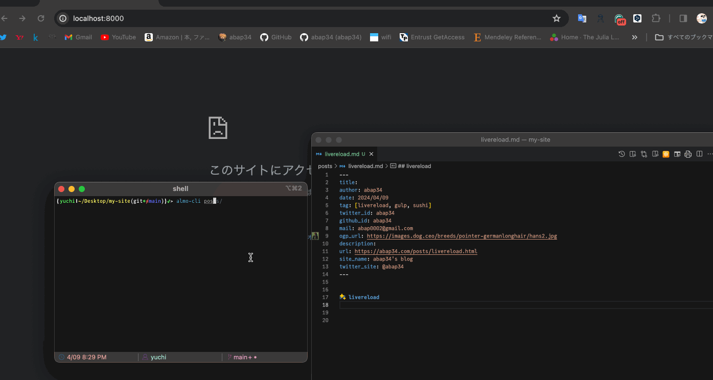

## livereload

[livereload](https://livereload.readthedocs.io/en/latest/) は Pythonのパッケージで、ファイルの変更イベントを検知していろいろ走らせることができます。


なのでコレをつかって [ALMO](https://github.com/abap34/ALMO) でリアルタイムにプレビューできる CLI ツールを作ります。

## 実装


```python
import argparse
import subprocess
import os
import socket
import sys
import yaml

import livereload

def info(message):
    print(f"\033[32m{message}\033[0m")


def get_free_port():
    for port in range(8000, 8100):
        with socket.socket(socket.AF_INET, socket.SOCK_STREAM) as s:
            if s.connect_ex(("localhost", port)) != 0:
                return port


class ALMOConfig():
    def __init__(self, target, config_path):
        self.target = target
        self.config = yaml.safe_load(open(config_path))

        self.args = {
            'output': '-o',
            'template': '-b',
            'theme':  '-t',
            'css': '-c',
            'editor_theme': '-e',
        }

        self.validate()

    def validate(self):
        for key in self.config.keys():
            if key not in self.args.keys():
                raise Exception(f"Invalid key: {key}")

    def add_config(self, key, value):
        self.config[key] = value

    def get_config(self, key):
        return self.config[key]
            
    def command(self):
        command = ["almo", self.target]
        for key, value in self.config.items():
            command.append(self.args[key])
            command.append(value)
        
        return " ".join(command)


def watch(target, config_path):
    config = ALMOConfig(target, config_path)
    config.add_config("output", "_almo_output/index.html")
    
    os.makedirs("_almo_output/", exist_ok=True)
    
    subprocess.run(config.command(), shell=True)

    port = get_free_port()
    server = livereload.Server()
    server.watch(target, livereload.shell(config.command(), shell=True))
    server.serve(port=port, root="_almo_output/", host="localhost")


def main():
    parser = argparse.ArgumentParser()

    parser.add_argument("target", help="Markdown file to be converted")
    parser.add_argument("config", help="Configuration file")

    args = parser.parse_args()

    watch(args.target, args.config)
    
    
if __name__ == '__main__':
    main()
```


`setup.py` を適当に書いて、コマンド一個で叩けるようにしておきます。

```python
from setuptools import setup, find_packages

setup(
    name='almo',
    version='0.1',
    packages=find_packages(),
    install_requires=[
        'livereload',
        'PyYAML'
    ],
    entry_points={
        'console_scripts': [
            'almo-cli=almo_cli.almo_cli:main [cli]',
        ],
    },
)
```


## 結果




いい感じにリアルタイムプレビューできるようになりました！ 


もうすでに VSCode拡張でリアルタイムにプレビューできていましたが、実際ブラウザで見ると微妙に表示が違ったり `WebViewPanel` は別ウィンドウで開けなかったりと色々と不満があったので、
ブラウザで見ることができるのはかなり便利です。


## 今日の一曲

*Cool*


<iframe width="560" height="315" src="https://www.youtube.com/embed/XEKPn3WbksE?si=ac7SmasFiL-TYLkM" title="YouTube video player" frameborder="0" allow="accelerometer; autoplay; clipboard-write; encrypted-media; gyroscope; picture-in-picture; web-share" referrerpolicy="strict-origin-when-cross-origin" allowfullscreen></iframe>


