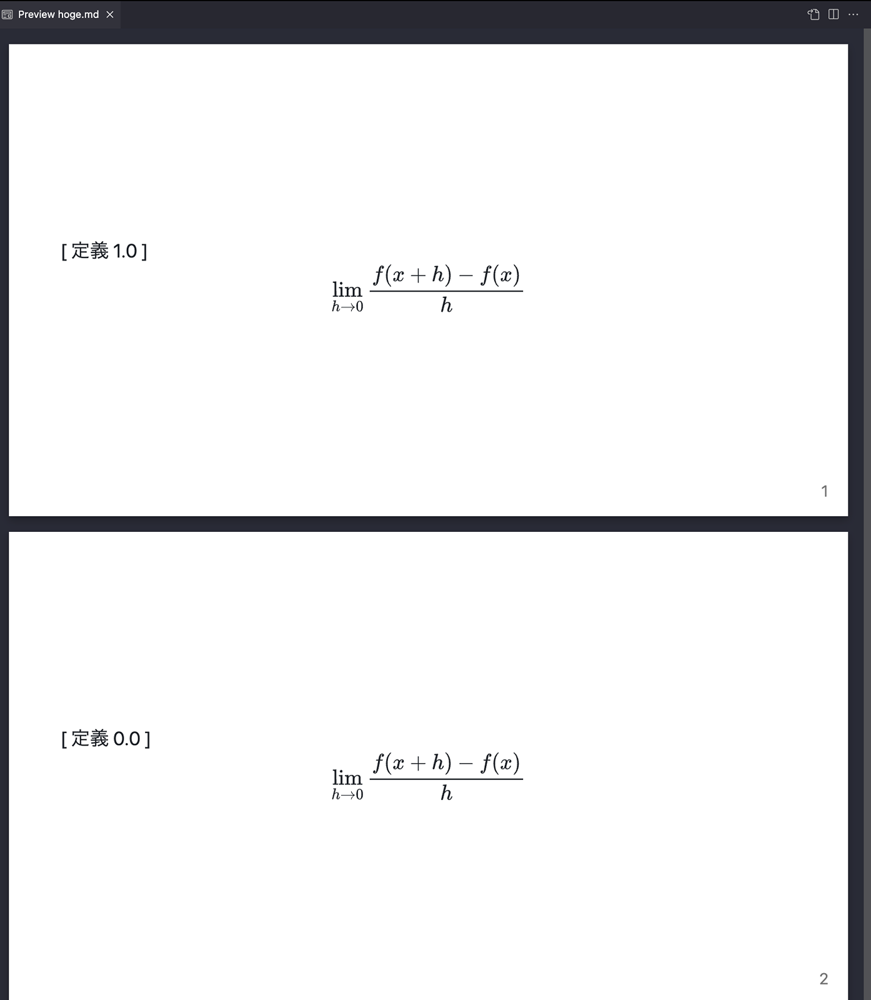

# marp で counter が使えない

普段は marp でスライドを作っています。

数学チックな長めなスライドを作っていたので定理に番号をつけたくなりテーマに counter を追加しました。

```css
body {
  counter-reset: def-counter;
}

.def {
  counter-increment: def-counter;
}
```


↑ こういうの

でもこれはうまく動きません



調べてみると、 marp は各ページが `foreignObject` で囲まれているので、 `counter` を `body` でリセットしても共有できないようです。

そんな....


諦めて手で書きましょう.


    