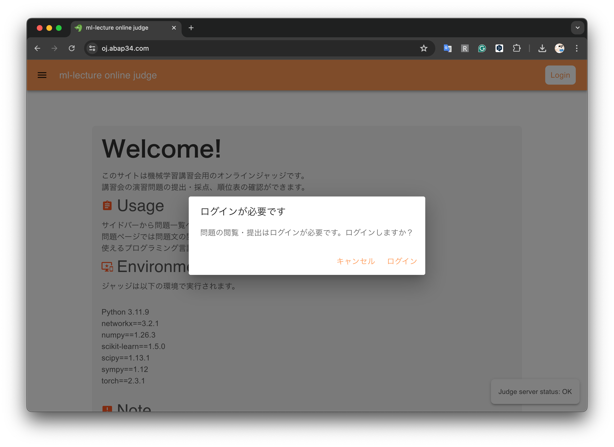
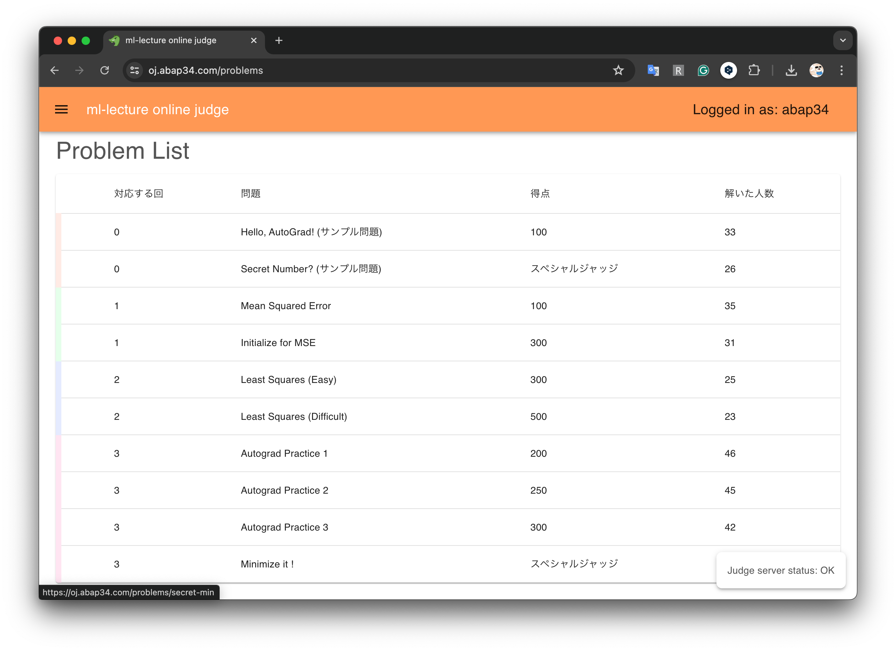
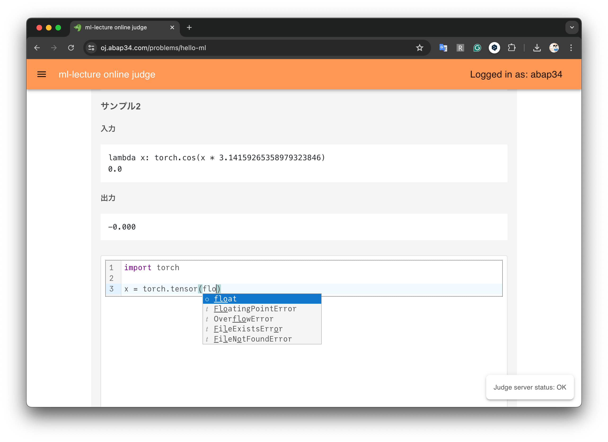
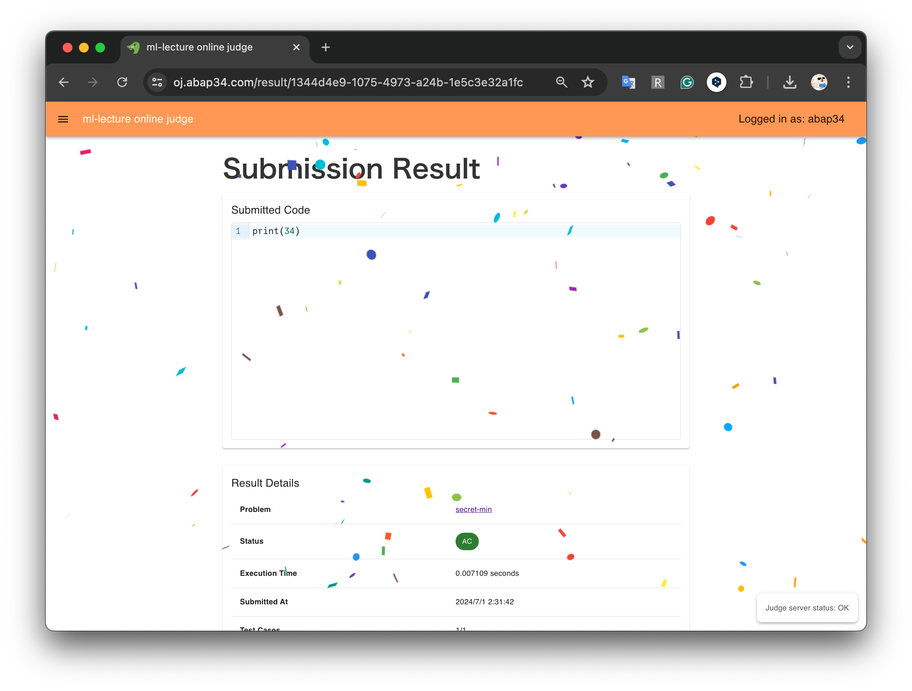
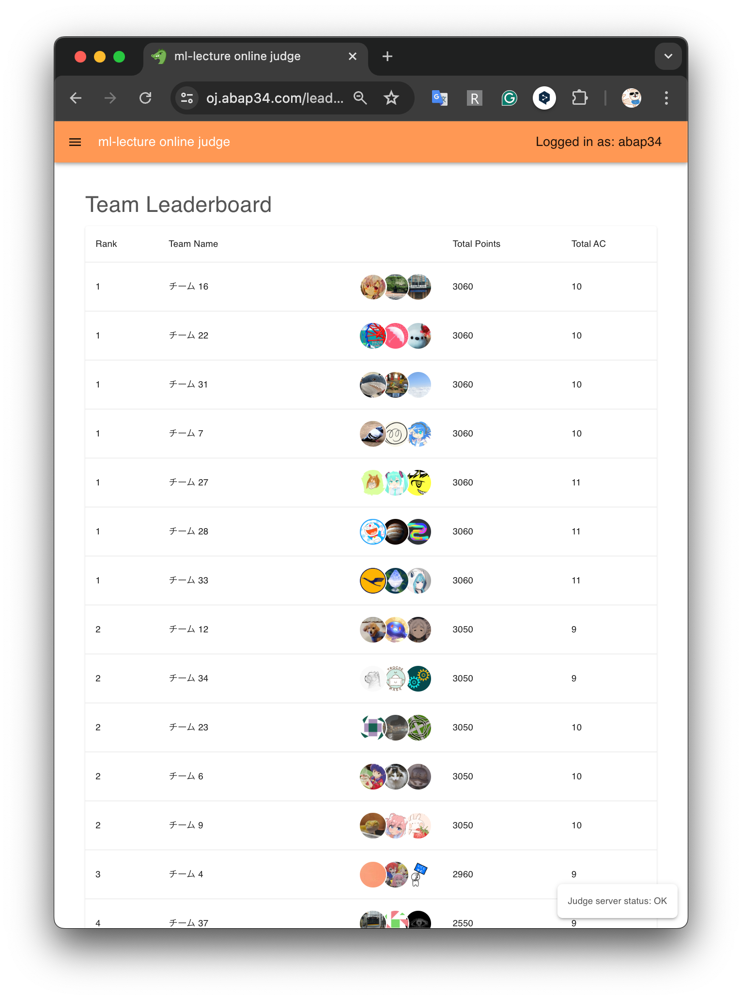

## あらすじ

エンジニアが作りがちなものとしてオンラインジャッジがあるとおもいます。

ご多分に漏れず作ってしまったので紹介しようと思います。

## 作ったもの

## 経緯

今年も traP で機械学習講習会をしているんですが、せっかくなので演習問題にジャッジがつけたくなりました。

既存の OSS になっているジャッジを使おうと思ったのですが、デプロイや実行環境の追加の仕方を調べるモチベーションがあまりなかったこと、
traPの認証との連携も面倒そうだったので、自分で作った方が早いだろういう判断で作りました。

## 技術スタック

### 概要

- フロントエンド: React (Vercel でホスティング) 
- バックエンド: FastAPI (家のサーバから ngrok でトンネリング)

### フロントエンドについて

React です。デザインのセンスまたは努力が足りていないので、Material-UI を甘んじて使っていますが、簡単に綺麗な見た目を作れて大感激です。

### バックエンドについて

FastAPI で書いています。 ジャッジは一旦ジョブを投げて待たせることが多いので非同期処理が多いです。
FastAPI だとその辺がかなり簡単にかけてすごいな〜と思いました。

また、性質上同時に大量に提出される場合があるので、適切にジョブをキューイングする必要があります。

幸いこの知識だけはあったので、 ジャッジのジョブはCelery と Redis を使ってキューイングして、適切な並列度で実行されるようになっています。
これによって大崩壊するほどの実行時間のブレを防ぐことができます。 (ちゃんとしたジャッジはもう少し真面目にやっていそうですが)

実際のコードの実行では、ユーザのコードをそのまま実行するわけにはいかないので、 Dockerを使ってサンドボックスを作り、その中で実行します。

コンテナランタイムの知識があまりないのでセキュリティに対して絶対の自信があるわけでは正直ないのですが、幸い Library Checker のジャッジシステムが公開されていて比較的読みやすかったので、
それを大いに参考にして実装した結果、ある程度典型的な攻撃は防げるようになりました。

## 最後に

今は認証が traP に依存しているので、その辺を独立させて OSS にする予定です。

## 今日の一曲

渋谷より東に進出できる男になりたい

<iframe width="560" height="315" src="https://www.youtube.com/embed/KYvq8-xY1Gg?si=xbxsze8kJfULjrbI" title="YouTube video player" frameborder="0" allow="accelerometer; autoplay; clipboard-write; encrypted-media; gyroscope; picture-in-picture; web-share" referrerpolicy="strict-origin-when-cross-origin" allowfullscreen></iframe>