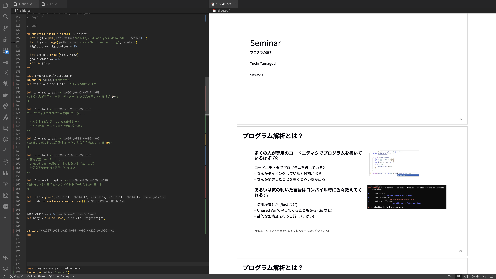
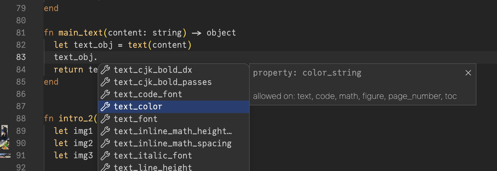
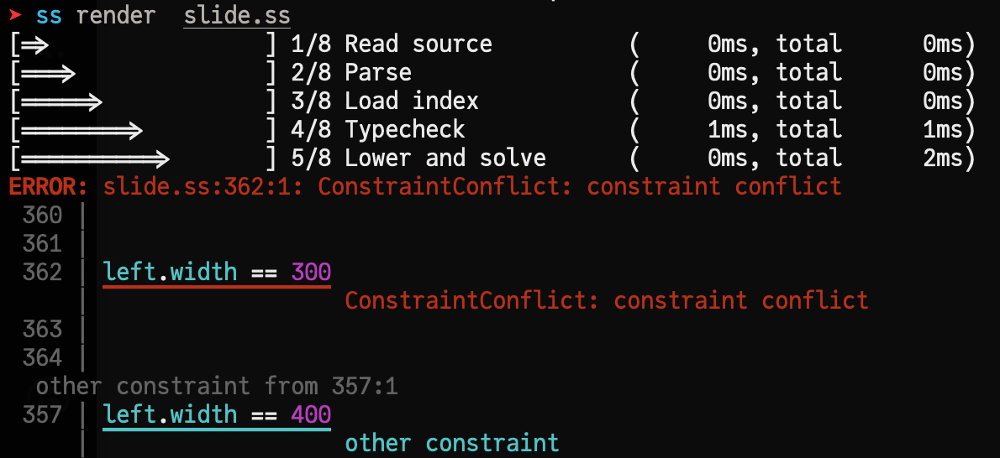
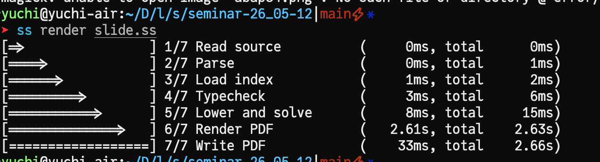

**※ 6/18 追記 この記事は古くなっています．現在は多段階計算は廃止され，代わりに標準的でない実行モデルの採用などにより変な言語へと進化しています．興味があるかたは GitHub の README を見てください．**
**こちらもどうぞ．**

<blockquote class="twitter-tweet"><p lang="ja" dir="ltr">最近作ってるものの宣伝 <br>かなりいろいろなことをしているスライド記述言語で、WYSIWYG で編集する機能を追加してみた <br><br>かつその結果はソースコード側に反映するようになっていて、ソースコード単体でスライドは完結する (テキストでの編集とGUI での調整を相互にできる😼) <a href="https://t.co/DuKzfuT8F0">https://t.co/DuKzfuT8F0</a> <a href="https://t.co/qP6Kj3FSkN">pic.twitter.com/qP6Kj3FSkN</a></p>&mdash; abap34 (@abap34) <a href="https://x.com/abap34/status/2067182072436072831?ref_src=twsrc%5Etfw">June 17, 2026</a></blockquote> <script async src="https://platform.x.com/widgets.js" charset="utf-8"></script>

## スライド記述言語 ss を作った

皆さん発表してますか？こんにちは abap34 です．

今日は，最近作っているスライド記述言語 ss について紹介します．

まだ作りました！ってツイートもしてないし周りの数人に見せてみてるくらいの段階ですが，
少しだけ説明の文章を置いておきたいと思います．


一応，すでに 60ページほどのスライドを作るのに不便がない程度にはなっています．


{@ogp https://github.com/abap34/ss}



スライド作成ツールは PowerPoint や Keynote, Canva などの WYSIWYG (What You See Is What You Get) なものが主流ですが，
marp (Markdown 風記法), Beamer (LaTeX) といったテキストを書いてスライドを生成するツールもあります．


自分は次のような事情でテキストベースのもの，とくに marp を好んで使っています．

- 慣れればかなり高速に書ける
- 数式やプログラムなどの多用するコンポーネントをそのまま書けるので楽
- エディターや LLM による支援を受けやすい
- 長い期間をかけてスライドを作る傾向にあり，差分を git などで管理できて嬉しい

一方で，いくらかの不満もありました． (marp はそういうものではないのでこれは不当な文句なのですが，)

- コンポーネントをまとめるのが大変
  - 例えば，スライド全体で共通のヘッダやフッタを定義したいときに，それをうまく表現できない．
- カスタム hook を作るのが大変．少なくとも marp の記述言語のレベルでコンパイルプロセスに介入するのは厳しい．
- html の制約に縛られたくない
  - marp は html に変換してスライドを作ります．そのため，html 側で不可能なことはできません．
- 数式は mathjax あるいは KaTeX によって実現されるので，ない記号が結構ある
  - 私が普段作るスライドは `\llbracket` や `\rrbracket`, `\bigsqcup` といった記号を多用しますが，最初のふたつは mathjax にはなく，最後のやつは KaTeX にはありません． 頑張って似た見た目のものを作ったり，Contribution するのもいいですが，流石にスライド作るたびにそのようなことをするのは辛いです


他にも Beamer などの選択肢がありましたが， LaTeX 自体のエラー報告や
コンパイル時間などの問題などに対処することにはあまりいい思い出がありませんでした．


そこで，自分が求めているものを備えている言語と処理系を作ることにしました．


ss はスライドを記述するためのプログラミング言語です．だいたい，以下のような感じでスライドを記述することができます．

```ss
import std:themes/academic
import lib.ss

page header
    title_page(
        "Seminar",
        "スライド記述言語 ss のコンパイラについて",
        "abap34",
        "2026-03-04"
    )
    page_no
end

fn analysis_example_figs(caption: string) -> object
  let fig1 = pdf("assets/demo1.pdf", 1.3)
  let fig2 = image("assets/demo2", 2)
  let caption = gray_small_text(caption)
  caption.top == fig2.bottom - 10
  let group = group(fig1, fig2, caption)
  group.width == 400
  return group
end

page program_analysis_intro
  let title = slide_title "コンパイル例"
  let t1 = main_text <<
  ss で作ったスライドの例 →
  >>

  let right = analysis_example_figs("デモ")
  t1.width == 600
  let body = two_columns(t1, right)

  page_no
end
```

このように，

- 関数によってコンポーネントの生成をまとめたり，依存関係にあるコンポーネントを表現できる
- `import` による他のファイルからの import ($\approx$ テーマ，コンポーネントライブラリ機能)
- レイアウト制約をいくらでも書ける

などができます．また，基本的な Markdown 記法もサポートされていて，ちょっとしたものは簡単に書けます


さらに重要なこととして，数式のレンダはローカルにある (本物の) TeX を呼び出しています．
これによって，あの記号がない，ということは基本的には起きないはずです．


また，レイアウトについて

**制約からのレイアウト生成は完全にこちら側で行い， pdf ライブラリでほぼ「ここにこれを書いてください」という指示だけの構成にする**

という重要な設計判断をしています．


多くのスライド作成ツールは html へトランスパイルして動作しています．
しかし，当然の話として html 側でユーザが求めているすべてのレイアウトや制約を表現するのは結構大変です．
(可能かどうかを考えるのはもっと大変です)

それについて消耗するくらいならこちらでソルバを書いてしまっていくらでも拡張可能にした方がスケールしそうだと考えています．


さらに，型解析に基づく補完やエラー検出，Page Overflow などの検査も行っています．
今のところ， ss 自体は停止性が保証されるように慎重に設計されているので， (例えば再帰はできないのと，有限個であることが明らかなオブジェクトに対する `foreach` しかない)
レイアウト解決などは (後述の機能で外部プロセスを呼び出さない限り) 問題なく常に停止します．




### コンパイルプロセスへの介入

さらに，コンパイルプロセスへの介入もかなり柔軟にできます．

```ss
@phase(after_pages)
fn refresh_section_agendas(doc: document) -> document
  foreach(objects_in_document(doc, "section_agenda"), refresh_section_agenda, doc)
  return doc
end
```

ss のコンパイルプロセスは複数のフェーズに分かれており，上のように `@phase` アノテーションをつけることで好きなフェーズの後に関数を呼び出すことができます．

上の関数は一通り実行や lowering がされた後に呼び出せるもので，これにより見出しページやページ番号，定理番号の採番といった処理を
簡潔にユーザ側で実現することができます．

(かなり自分の中での仕様の心づもりも不安定で，API も内部も相当変化する可能性はあります．
ただ，これらの機能をユーザレベルでどんどん実装できるようにしていくという方針は変わらないと思います．)


### VSCode 拡張

いちおう VSCode 拡張も備えています．
Live Preview, 補完，エラー表示などができます．


よくみると，ページごとに色を出してくれているのがわかると思います．目的のページにさっと飛べます．
理想的には pdf オブジェクトと行き来できると嬉しいです．

### ちょっとした工夫

エラーはかなりみやすいと思います．



また，シンタックスはまだかなり流動的で今後どうなるかはわからないですが，気に入っているものとして

```
text <<
...
>>
```

というものがあります．基本的には関数呼び出しの記法は一般的な `f(arg1, arg2, ...)` というスタイルですが，
スライド記述という特性上，関数は文字列引数一つのみを取ることが多いです．このような場合は
`func 文字列リテラル` という Sugar Syntax を用意しています．これによりカッコを入力しなくてよく
かなり書きやすいです． `<<` なのは個人的な好みです．


## 内部的な話

### 開発について

実装は Codex (GPT-5.5) を使いながら Zig で行っています．
深い理由は全然なく，単に Zig の構文や使い心地がどんなもんか見てみたいというだけです．
手で書いている割合は 1% くらい，コードもチェックしている割合は 10% くらいだと思います．

結構上手く書いてくれ，例えば Syntax Error などはほとんど出ません．
ただ，たまにセグフォして人間様によるデバッグが必要になったり，かなり冗長なコードを出してきてリファクタさせたりは全然あります．


### レイアウト制約のソルバ

基本的に，今サポートしている制約は

`<target>.<property> == <source>.<property> <op> <constant>`

という形のものだけです，例えば

```ss
title.left == page.left + 72
body.top == title.bottom - 24
author.right == page.right - 72
```

みたいな感じです． `page` との間に制約を書くことで固定レイアウトにできます．

基本的にオブジェクトの間に制約で双方向に辺を張り，伝播させていく構成になっています．


ざっくり動作を書くと，

1. まず，`page` と依存があるものに対して制約を伝播させて位置を確定させ，
2. その後も位置が確定しているノードと依存があるものに対して伝播させていく
3. もう伝播させれなくなったら，伝播されてないノードにはフォールバックの制約が追加される
   1. 基本的には普通に上のやつの少し下にあるという制約が追加される
   2. 絶対位置が未確定の連結成分をレイアウトのポリシーに従ってレイアウトするよう制約を追加する
4. すでに位置が確定しているのに満たさない制約が来たり，位置が確定しないノードがあったらエラーを出す

ここで，レイアウトのポリシーは上寄せ，とか中央寄せ，とかそういうものです．

### pdf の作成

ここだけはライブラリの使いやすさの問題で Python で書いています． (追記: 今は C です．)
fpdf2, pypdf を使っています．
Emoji の表示のために前者が必要で，　PDF 埋め込み (数式，図など) のために後者が必要という感じです．

## 今後について

このへんはやっていく予定です．

#### 1 コンパイルプロセスへ介入しやすくする

今は ss のレベルでコンパイルプロセスに介入する機構があんまり整備されていません．
そもそも staged な言語なわけですが，この辺ちゃんと整理と整備をやっていくつもりです．


**追記** やりました．上を参照してください．


#### 2 インクリメンタルなビルド

いまのところボトルネックはほぼ PDF の生成と書き込みです．



PDF はインクリメンタルに編集していくことができるので，変更があったページだけを再生成して書き込むようにすればかなり高速化できると思います．
そこはやっていくつもりです．

そのためには依存関係の解析などが必要なのでやや大変そうですが，やっていきたいと思います．

**追記**: やりました． [Add incremental PDF page rendering](https://github.com/abap34/ss/pull/3)．単純にレイアウトなどが解決された後の中間表現を比較し，差分があったページだけ再レンダリングする (コンポーネント間の依存関係などを解析しない） というだけですが，これでも十分高速でこれ以上複雑にやっても対して利益はなさそうです．

**さらに追記: レンダーも並列化して今はかなり早いです．60ページ近いスライドをコンパイルしたときの結果がこちら． (単位は ms)**

| Phase | 初回 | 初回 (並列) | 2回目 | 1箇所変更 |
|--------|:------|:------  |:------| :----|
| Typecheck | 35 | 37 | 36 | 34 |
| Evaluate  | 33 | 29 | 30 | 30 |
| Solve  | 188 | 177 | 179 | 184 |
| Render  | 2320 | 911 | 82 | 84 |


## 今日の一曲

<iframe width="560" height="315" src="https://www.youtube.com/embed/2I25AFSBm2g?si=oBzzoZstTSDgyGAK" title="YouTube video player" frameborder="0" allow="accelerometer; autoplay; clipboard-write; encrypted-media; gyroscope; picture-in-picture; web-share" referrerpolicy="strict-origin-when-cross-origin" allowfullscreen></iframe>
