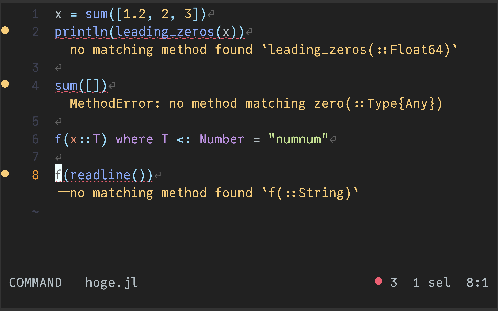
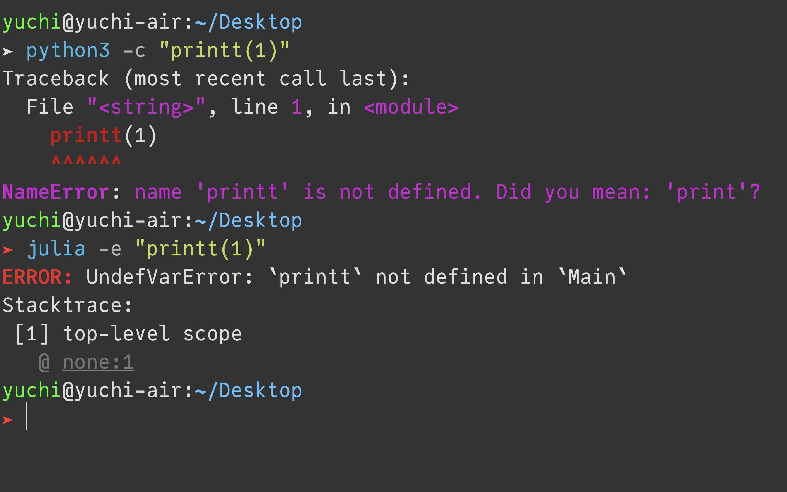

## あらすじ

Google Summer of Code に Proposal が採択されました！

<blockquote class="twitter-tweet"><p lang="ja" dir="ltr">Google Summer of Code で Julia に出していた Proposal が採択されました！ 🎉🥳<br><br>Julia の最新のコンパイラインフラを利用して、強力な静的解析を備えた新しい Language Server の機能開発をガシガシやっていきます！✊ <a href="https://t.co/aEBHcSAnXa">pic.twitter.com/aEBHcSAnXa</a></p>&mdash; abap34 (@abap34) <a href="https://twitter.com/abap34/status/1920609443131412630?ref_src=twsrc%5Etfw">May 8, 2025</a></blockquote> <script async src="https://platform.twitter.com/widgets.js" charset="utf-8"></script>

Julia の新しい Language Server の開発をやっていく予定です。

プロジェクトページ: [https://summerofcode.withgoogle.com/programs/2025/projects/9PZY6C2m](https://summerofcode.withgoogle.com/programs/2025/projects/9PZY6C2m)


この記事には具体的にやりたいことや準備の記録などを書いておきます。


### 先行研究

- [Google Summer of Code に参加した話 ─ Saza's blog](https://saza.hatenadiary.jp/entry/2022/12/24/011018)
- [GSoC (Google Summer of Code)で chromiumに採択された。 ─ momokaのブログ](https://momoka0122y.hatenablog.com/entry/2022/05/26/232604)
- [GSoC 2021 参加記 ─ shanpu-portal](https://www.shanpu.info/blogs/20211225_gsoc2021/)
- [Google Summer of Code2020に申し込んでみた ─ さんぽしの散歩記](https://sanposhiho.com/posts/gsoc2020/)

などなど (GSoC 参加記 などで検索すればたくさん出てきます)


## GSoC とは

他のブログに詳しい説明がたくさんあるので簡潔にまとめると、


- Google が主催するオープンソースプロジェクトへの参加を支援するプログラム
- 学生は開発したいものの Proposal を書いて参加組織に送る
- 参加組織は Proposal を審査して、採択の可否を決める [^1]
- 学生がオープンソースプロジェクトに参加して、開発を行う
- Google から報酬がもらえる (国とプロジェクト規模に応じて変わる. 日本で大規模プロジェクトだと今年は $.5400)
- 採択率は 8% くらい? [https://opensource.googleblog.com/2025/05/gsoc-2025-we-have-our-contributors.html](https://opensource.googleblog.com/2025/05/gsoc-2025-we-have-our-contributors.html)
  - ただ、おそらく大量のインド人が応募しているために実態より競争率が高く見えていると思います。

[^1]: 実際には参加組織は Proposal への順位づけのみをして、 Google がその組織に割り当てた枠の数より小さければ採択ということらしい (?) ですがあまりよくわかっていません。

というやつです。

開発したいもの、と書きましたが大抵の組織では Idea List が公開されていて、そこから選んで書くのが一般的です。

## 参加まで

昨年ごろから Julia の Language Server を作り直したいな〜 と漠然と考えていたのですが、
そのときたまたま Julia の Co-Founder である Jeff Bezanson さんとご飯を食べる機会がありました。


そこで Language Server の話になり、同席していた 
JET.jl の作者で Julia Hub の [aviatesk](https://github.com/aviatesk) さんにメンターを快諾していただいて、
最終的に aviatesk さんがかつて進めていた JET.jl を利用した Language Server の開発をやることになりました。


その後応募が始まった頃に Language Server の開発を GSoC の Idea List に載せてもらい、 Proposal の執筆を開始しました。

目次は以下のような感じです。

```
Abstract                                               
Technical Description	                                  
 [1] Analyzing required information from the codebase	 
 [2] Presenting information clearly and effectively	   
 [3] Achieving good performance	                             
Current State of Project	                             
Implementation Plan	                                   
Background and Relevant Experience	                   
Related Software Projects	                             
Availability	                                        
```


内容は ⬇︎ で公開しています。


<div class="responsive-card">
    
    <div style="margin: 0 10px 0 10px;">
         <a href="https://docs.google.com/document/d/1rk39WzYwvI1jEx9FtYwAynwVmjyjwjo_F9RExQBD3J8/edit?usp=sharing"">(public ver) proposal for GSoC 2025: JETLS  - Google Docs</a>
    </div>
</div>


## 具体的にやりたいこと

Proposal に詳しく書いてありますが、せっかくなので日本語でいくらかまとめておこうと思います！

(細かい話は Proposal を見てください)

### LanguageServer.jl の課題

今、 Julia では [LanguageServer.jl](https://github.com/julia-vscode/LanguageServer.jl) がメジャーですが、
LanguageServer.jl はいくらか課題を抱えていました。 

主要なものを挙げるとしたら以下のような感じでしょうか。

#### Missing References が頻発する

Language Server の主要な機能として、 Go To Definition や Find References などがあります。


これは実装箇所や仕様箇所に飛べる便利な機能ですが、 LanguageServer.jl ではこれらがうまく働かないことが非常に多いです。

("Missing" で Issues を検索した結果: [https://github.com/julia-vscode/LanguageServer.jl/issues?q=is%3Aissue%20state%3Aopen%20Missing](https://github.com/julia-vscode/LanguageServer.jl/issues?q=is%3Aissue%20state%3Aopen%20Missing)) 


#### コードベースが複雑化してメンテナンスが難しくなっている

Language Sever Protocol 自体が多くのことを要求するという事情もありますが、コードベースが複雑になってしまっていて、
全体を把握しているメンテナーの方がほとんどいなくなってしまいました。 [ref: コミット列](https://github.com/julia-vscode/LanguageServer.jl/commits/main/)

#### (課題?) 型エラーなどの高度な解析が行われない

これは課題というよりかは設計思想とかの範疇だと思いますが、 LanguageServer.jl はそこまで高度な解析を行いません。

例えば

```julia
function foo(x::Int)
    return x + 1
end

foo(2.0)
```

はもちろんエラー (実行時例外ですが！)　になります。 が、LanguageServer.jl は基本的に赤線は引いてくれません。


### 🆕 Language Server

新しい Language Server は以下のような特徴を持っています (もしくは持つ予定です)


1. JET.jl を利用して、複雑な型エラーやパフォーマンスの問題を検出・警告する
2. Julia の最新のコンパイラインフラを利用して、メンテナンス性と開発効率を向上させる

#### JET.jl を利用して、複雑な型エラーやパフォーマンスの問題を検出・警告する

JET.jl は aviatesk さんが開発している Julia の静的解析ツールで、型エラーやパフォーマンスの問題を検出することができます。


<div class="responsive-card">
    
    <div style="margin: 0 10px 0 10px;">
         <a href="https://github.com/aviatesk/JET.jl"">GitHub - aviatesk/JET.jl: An experimental code analyzer for Julia. No need for additional type annotations.</a>
    </div>
</div>


例えば 

```julia
sum([])
```

はエラーになりますが、 (`[]` は `Any` 型の配列で、 `zero(::Type{Any})` は定義されていないため) JET.jl はこれを検出してくれます。

```julia
julia> @report_call sum([])
═════ 1 possible error found ═════
┌ sum(a::Vector{Any}) @ Base ./reducedim.jl:982
│┌ sum(a::Vector{Any}; dims::Colon, kw::@Kwargs{}) @ Base ./reducedim.jl:982

     (中略)
    
    ││┌ zero(::Type{Any}) @ Base ./missing.jl:106
    │││ MethodError: no method matching zero(::Type{Any}): Base.throw(Base.MethodError(zero, tuple(Base.Any)::Tuple{DataType})::MethodError)
```

このようなエラーを検出して Diagnostics として提供します。




他にも型不安定性の表示や、そもそもの型推論結果の表示 (Types on Hover) などに取り組みたいと思っています。

#### Julia の最新のコンパイラインフラを利用して、メンテナンス性と開発効率を向上させる

Julia の パース・lowering [^2] は FemtoLisp で書かれたものが長く稼働していたのですが、現在パーサは Julia自体で書かれたものが使われていて、
lowering も Julia で書かれたものの開発が進んでいます。


Julia 製のものに変わることで、以前と比べると Julia コンパイラ以外のソフトウェアからも比較的利用しやすくなります。
これらを利用することで、 Lanuage Server 側で Julia コンパイラの最新の機能に追従するコストが下がることが期待されています。


また、これらの新しいツールチェインは位置情報をよく保存するようにできていて、
他の現代的なプログラミング言語のような「バイトレベル」のエラーを出せるようになると思います。



#### 他にもあるよ

他にもいろいろな機能について議論していますが、長くなるので Proposal を見てください 🤲

## がんばります

自分の周りでも最近は Rust を書いている人がずいぶんたくさんいるのですが、その理由の一つには rust-analyzer などの強力なエディタ支援があると思います。
Julia でも同じようなことができるように頑張っていきたいと思います。

自分より遥かにできる方たちにメンターしてもらいながらチャレンジングなソフトウェアが書けるのは本当に楽しみです！
楽しい夏にしていきたいと思います！

(生活費をくださる Google 様に圧倒的感謝🙏🙏🙏)

## 今日の一曲

<iframe width="560" height="315" src="https://www.youtube.com/embed/LZ4PJky8agg?si=Ac94NmO-V6Bw6FaH" title="YouTube video player" frameborder="0" allow="accelerometer; autoplay; clipboard-write; encrypted-media; gyroscope; picture-in-picture; web-share" referrerpolicy="strict-origin-when-cross-origin" allowfullscreen></iframe>


[^2]: surface-AST を最適化などのために適した IR に変換する処理のことです