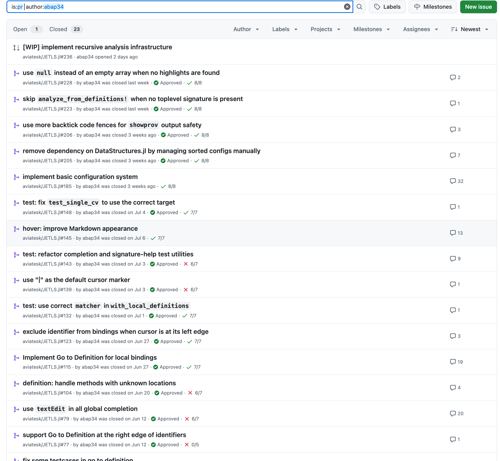

## GSoC 2025 最終レポート

このブログは，
Google Summer of Code 2025 において私が取り組んだ [Development of a New Language Server for Julia](https://summerofcode.withgoogle.com/programs/2025/projects/9PZY6C2m) の最終レポートです．

## プロジェクトの概要

Google Summer of Codeでは、「Julia向けの新しい言語サーバーの開発」というプロジェクトに取り組みました。

これは、Juliaの最新のコンパイラ基盤を活用し、
強力な静的解析を提供する全く新しい言語サーバーを構築するという、
非常に刺激的なプロジェクトです。

この新しい言語サーバーは、JET（私のメンターであり、このプロジェクトも主導している門脇修平氏が開発）、
JuliaSyntax.jl、JuliaLowering.jlといったツールを効果的に活用します。

これにより、潜在的なバグをより効果的に検出し、正確かつ迅速な診断結果を報告し、
そして高い保守性を維持できる言語サーバーを開発できます．

## 取り組んだ成果

このプロジェクトは非常に早期の段階なので，
プロポーザルではメンターと協議して臨機応変に様々なタスクに取り組むことにしていましたが，実際に私が取り組んだものは様々な細かいものが多くなりました．

画像は私が JETLS 本体に open した PR の一部です．

そのコメントの数からわかるように，非常に多くの努力を払って私の貢献をサポートしてくれた
メンターの aviatesk 氏をはじめとしたコミュニティの皆さんにとても感謝しています．

### 特に大きな貢献

私の貢献のうち機能として大きなものはいくらかあります．

- [local binding の Go to Definition の実装](https://github.com/aviatesk/JETLS.jl/pull/115)
  - まさに JuliaLowering が素晴らしい役割を果たしているものです！
  
<!-- <video controls width="600">
  <source src="https://github.com/user-attachments/assets/cb924339-4475-4171-b390-db3c88ddc257" type="video/mp4">
  Your browser does not support the video tag.
</video> -->

- [method の Go to Definition の実装](https://github.com/aviatesk/JETLS.jl/pull/61)
  - JETLS はマクロによって定義された関数へのジャンプもできます :)
  

- [LaTeX Symbol, emoji の Completion の実装](https://github.com/aviatesk/JETLS.jl/pull/31)

<!-- <video controls width="600">
<source src="https://github.com/user-attachments/assets/0ee649ae-5404-4553-8b12-fe0858cd60fc" type="video/mp4">
Your browser does not support the video tag.
</video> -->

- [基本的な Configuration System の実装](https://github.com/aviatesk/JETLS.jl/pull/185)

<!--  -->

- [再帰的な解析機能の実装 (WIP ですが終わりが近いです．この blog が publish される頃には完了しているかもしれません)](https://github.com/aviatesk/JETLS.jl/pull/236)

<figure>

<figcaption>図: 再帰的な解析機能のデモ</figcaption>
</figure>

#### そのほかの詳細

概要でも述べたように，この Language Server は Julia の新しいコンパイラインフラを活用しています．
これらは非常に素晴らしく， Language Server 開発において本当に素晴らしいものです．

これらも依然として活発に開発が行われている最中であり，まだ不安定なところもあります．
Language Server の開発を通してこれらへの理解を深められたことも私にとっては素晴らしいことでした．

プロジェクトの最中には， Language Server の開発中に気がついた複数のバグの修正パッチを送信できたこと [https://github.com/c42f/JuliaLowering.jl/pull/37](https://github.com/c42f/JuliaLowering.jl/pull/37), [https://github.com/c42f/JuliaLowering.jl/pull/41](https://github.com/c42f/JuliaLowering.jl/pull/41) は非常に良かったと思います．

他にも， Julia コンパイラおよび JET.jl についても非常に理解が深まりました．
とくに，この LS における 「グローバルな実行」について aviatesk 氏と多く議論できたことは LS 開発において非常に重要なことでした．

#### LS の現状

⚠️ このセクションは私の貢献だけではなく，この LS に興味を持ってくれた人のための LS 全体の進歩について書いたものです．

[README.md のロードマップ](https://github.com/aviatesk/JETLS.jl?tab=readme-ov-file#roadmap) にあるように， 
JETLS はすでに様々な機能をサポートしています．エラーの検出はもちろん，フォーマットや素晴らしいテストランナーも組み込まれています．

実用にはまだパフォーマンスや安定性で非常に大きな課題がありますが，多くの進歩がう